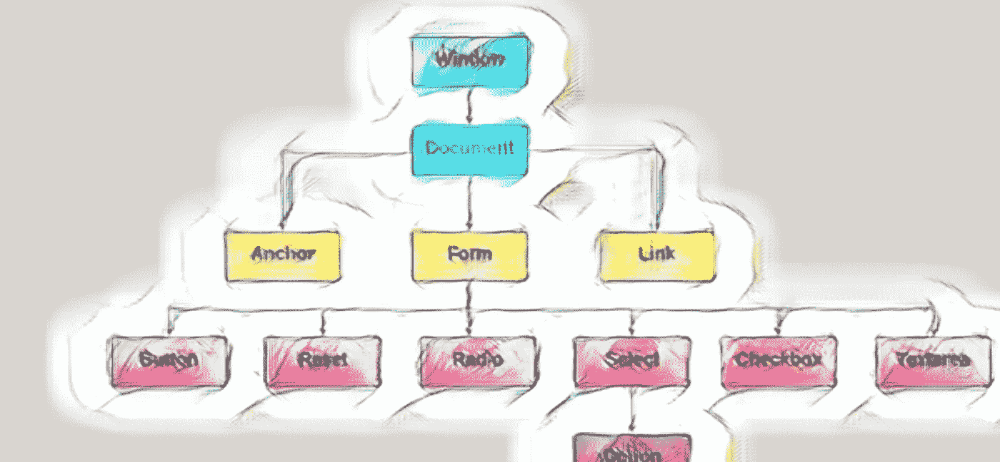
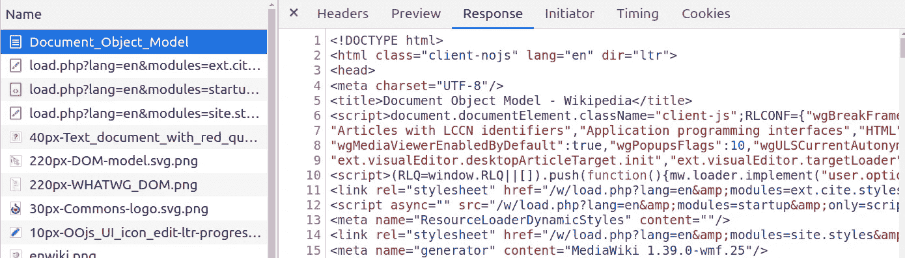
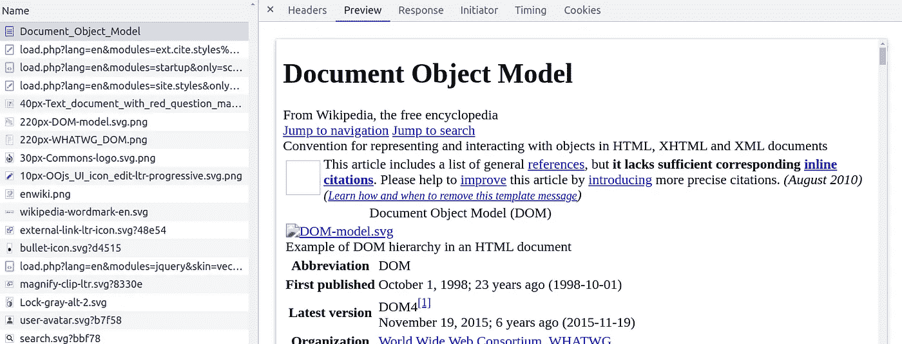
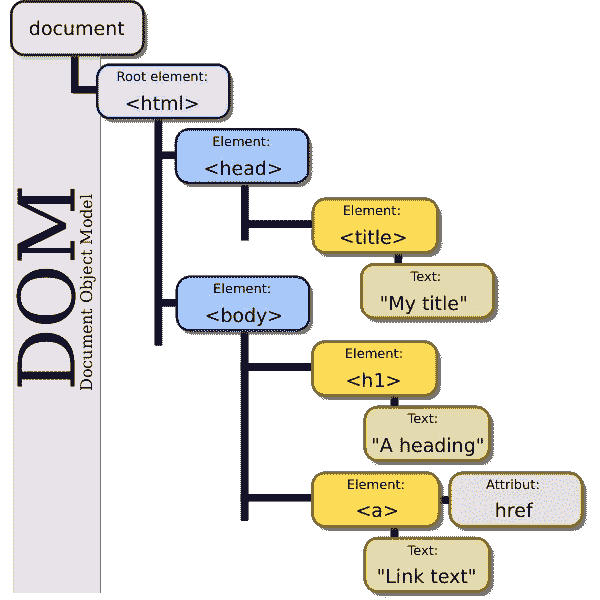

# JavaScript 中的 DOM 是什么？

> 原文：<https://javascript.plainenglish.io/what-is-dom-in-javascript-c95531731367?source=collection_archive---------6----------------------->

## DOM 概述以及 DOM 中每个节点所代表的内容。你将不再问 JavaScript 中的 DOM 是什么。

以下是 DOM 的简明定义:

文档对象模型(DOM)是对象的数据表示，这些对象构成了例如网站的 web 上的文档的结构和内容。

通俗地说，**DOM 代表了你网站的结构**。

一旦你理解了 DOM，你可能想了解影子 DOM 和虚拟 DOM 之间的[差异](https://medium.com/p/b51a480d2c70)(用于 React 和 Vue)。



The DOM represents the structure of your website.

# DOM 来自哪里？

理解下面的步骤会更容易掌握 DOM 的概念。

1.  你导航到网站上的一个页面。
2.  您的**浏览器将该页面的 HTML** 文档下载到本地内存中。
3.  **浏览器加载页面，创建该页面的文档对象模型**，它是 HTML 文档的表示。
4.  DOM 充当 JavaScript 和 HTML 文档本身之间的中介。
5.  我们可以使用 JavaScript、Python 和其他脚本语言来交互和操作 DOM

## 自己看吧！

我鼓励你[打开开发者控制台](https://developer.chrome.com/docs/devtools/dom/)并查看网络选项卡内部。下载的第一个文件是文档类型，是 HTML 文档！

不要被 HTML 文档的名称所欺骗！

下图中，该文档被称为 *Document_Object_Model* ，因为它是关于 DOM 上的维基百科页面的。

当您查看 response 选项卡时，您会看到一个简单的 HTML 文件。



Navigating the Response tab of the [Wikipedia HTML document](https://en.wikipedia.org/wiki/Document_Object_Model) on the DOM

我们可以预览 HTML 文件。这是 HTML 文件的样子。



Navigating the [Wikipedia HTML document](https://en.wikipedia.org/wiki/Document_Object_Model) on the DOM

只有在这之后，浏览器才加载创建文档对象模型的页面。

# DOM 看起来像什么？

当浏览器加载页面时，它将 DOM 创建为一个代表底层 HTML 文档的[树形结构](https://en.wikipedia.org/wiki/Document_Object_Model#JavaScript)。



Representation of the [DOM tree](https://en.wikipedia.org/wiki/Document_Object_Model).

树的每个分支都以一个节点结束。每个节点可以

*   包含对象
*   附加事件处理程序

## 包含对象的节点

换句话说，每个节点都可以包含可以通过编程方式访问的 HTML 元素。

DOM 接口允许对树的编程访问。使用它们，您可以更改文档的结构、样式或内容。

下面是一些 DOM 接口的例子:

*   **文档**:表示网页本身，它是所有内容所在的 DOM 树的入口点。通过使用类似于`querySelector()`的方法，可以获得文档中匹配指定选择器的第一个元素节点。还有很多[方法](https://developer.mozilla.org/en-US/docs/Web/API/Document#methods)。
*   **Element** :表示元素的所有对象的子类
*   **窗口**:表示一个包含 DOM 文档的窗口。上面提到的文档界面就是指这个窗口里面的文档。

## 带有事件处理程序的节点

上面介绍的相同接口具有可以触发 DOM 操作的事件处理程序。

*   **文档—** [**车轮事件**](https://developer.mozilla.org/en-US/docs/Web/API/Document#events) **。**当用户旋转滚轮时，触发滚轮事件
*   **元素—** [**错误事件**](https://developer.mozilla.org/en-US/docs/Web/API/Element#events) 。当资源无法加载或无法使用时激发。
*   **窗口—** [**调整大小事件**](https://developer.mozilla.org/en-US/docs/Web/API/Window#events) **。**窗口调整大小时触发。

所有可用于操作和创建网页的属性、方法和事件都被组织到对象中。 [MDN](https://developer.mozilla.org/en-US/docs/Web/API/Document_Object_Model/Introduction#what_is_the_dom) 。

# JavaScript 中的 DOM 是什么？

在这一点上，应该清楚 DOM 不是 JavaScript 或 Python，也不是一种编程语言。问“JavaScript 中的 DOM 是什么？”毫无意义。

DOM 被设计成独立于任何特定的编程语言。

由于这个选择，您可以用 Python 和 JavaScript 等语言访问 DOM。通常，它们被写在可由程序或浏览器执行的脚本中。

HTML 文档中的 JavaScript 脚本可能是这样的:

```
<!DOCTYPE html>
<html>
  <head>...</head>
  <body> <h1>A nice title here</h1>
    <p id="test"></p> <script>
      document.getElementById("test").innerHTML = "Hello!";
    </script></body>
</html>
```

一般来说，您希望将页面结构(HTML)与 DOM 操作(JavaScript)分开。

因此，`<script>`元素要么包含脚本语句，就像上面的例子一样，要么通过`src`属性指向外部脚本文件。

现在你已经了解了虚拟 DOM 和影子 DOM 之间的差异。

# 关键要点

*   DOM 是 HTML 页面的结构和内容的表示。
*   DOM 逻辑树的每个分支都以一个节点结束。
*   每个节点都可以包含对象或具有事件处理程序。
*   DOM 独立于任何特定的编程语言。
*   我们可以使用编程语言来访问和操作 DOM。

[](https://medium.com/@lorenzozar/membership) [## 通过我的推荐链接加入 Medium-Lorenzo Zarantonello

### 如果这个有价值，直接支持我！我的文章大多是免费的。考虑成为会员以示支持…

medium.com](https://medium.com/@lorenzozar/membership) 

*更多内容看* [***说白了。报名参加我们的***](https://plainenglish.io/) **[***免费周报***](http://newsletter.plainenglish.io/) *。关注我们关于* [***推特***](https://twitter.com/inPlainEngHQ)[***LinkedIn***](https://www.linkedin.com/company/inplainenglish/)*[***YouTube***](https://www.youtube.com/channel/UCtipWUghju290NWcn8jhyAw)*[***不和***](https://discord.gg/GtDtUAvyhW) *。*****