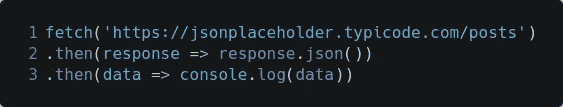
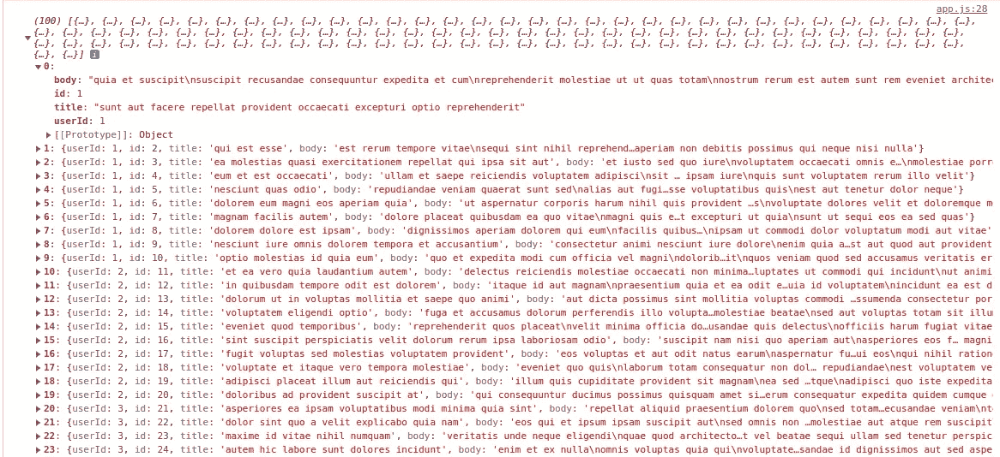
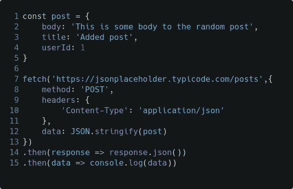
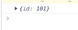

# JavaScript 中的 Fetch API 是什么，它是如何工作的？

> 原文：<https://javascript.plainenglish.io/what-is-fetch-api-in-javascript-and-how-it-works-50ff57ca1240?source=collection_archive---------5----------------------->

## 通过互联网发送和接收请求，无需 AJAX 和 jQuery

Clip-art from — [http://clipart-library.com/clipart/217124.htm](http://clipart-library.com/clipart/217124.htm)

JavaScript 的 Fetch API 是旧的 AJAX 和 jQuery 的强大且易于使用的替代品。

通过使用 Fetch API，您拥有了一个易于使用的 API，并摆脱了臃肿和不受欢迎的 jQuery 代码，相比之下使应用程序变得更加轻便。

在本文中，我们将讨论如何实现和使用 Fetch API。

# 什么是获取 API

根据 MDN 文档，

*`[*Fetch API*](https://developer.mozilla.org/en-US/docs/Web/API/Fetch_API)`*提供了获取资源的接口(包括跨网络)。使用过**`[*XMLHttpRequest*](https://developer.mozilla.org/en-US/docs/Web/API/XMLHttpRequest)`*的人似乎都很熟悉，但是新的 API 提供了更强大、更灵活的特性集。***

# **获取 API 的工作原理**

**`fetch()`方法采用一个强制参数，即资源的路径。它返回一个承诺，解析对请求的响应——只要服务器用头响应——即使服务器响应是一个`HTTP`错误状态。**

# **获取正在运行的 API**

**对于本文，我们将使用一个 [JSON 占位符 API](https://jsonplaceholder.typicode.com/) 来模拟使用实际的 API。**

**一个基本的获取请求很容易建立。下面是一个例子:**

****

**GET method in fetch()**

**默认情况下，`fetch()`方法执行一个`GET`方法。结果/回应如下。**

****

**GET method result**

**`fetch()`方法还接受另一个可选参数，`init` object，带有关于请求的附加信息/选项。[点击此处](https://developer.mozilla.org/en-US/docs/Web/API/fetch)详细了解这些选项。**

**`POST`方法需要`init`对象。**

****

**POST method in fetch()**

**结果为我们提供了新创建的帖子的 id。**

****

**POST method result**

**同理，我们可以使用`PATCH`、`DELETE`、`PUT`等。方法。**

**有关更多信息和示例，请参考 [MDN 文档以使用 Fetch](https://developer.mozilla.org/en-US/docs/Web/API/Fetch_API/Using_Fetch) 。**

**链接到我的其他文章:**

** [## 创建你的第一个 React 应用程序

### 了解 React 的基础知识，以及它如何创建一个全功能的待办事项列表应用程序来添加和删除任务…

paragwebdev.medium.com](https://paragwebdev.medium.com/create-a-to-do-list-app-with-react-introduction-to-react-62b00c78c2ae)  [## 向您的网站添加对象检测的简单方法

### 用 ml5js 实现浏览器中的对象检测

paragwebdev.medium.com](https://paragwebdev.medium.com/object-detection-in-browser-with-ml5-js-9f61da9aaedc) 

*更多内容看* [***说白了。报名参加我们的***](https://plainenglish.io/) **[***免费周报***](http://newsletter.plainenglish.io/) *。关注我们关于*[***Twitter***](https://twitter.com/inPlainEngHQ)*和*[***LinkedIn***](https://www.linkedin.com/company/inplainenglish/)*。加入我们的* [***社区***](https://discord.gg/GtDtUAvyhW) *。*****