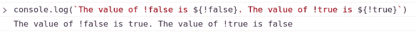
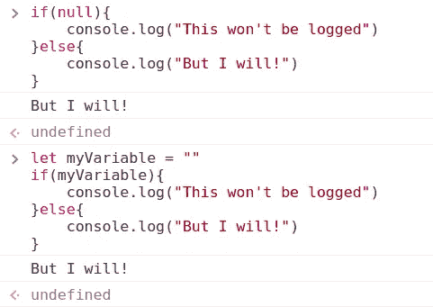
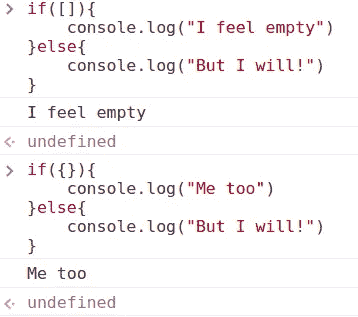
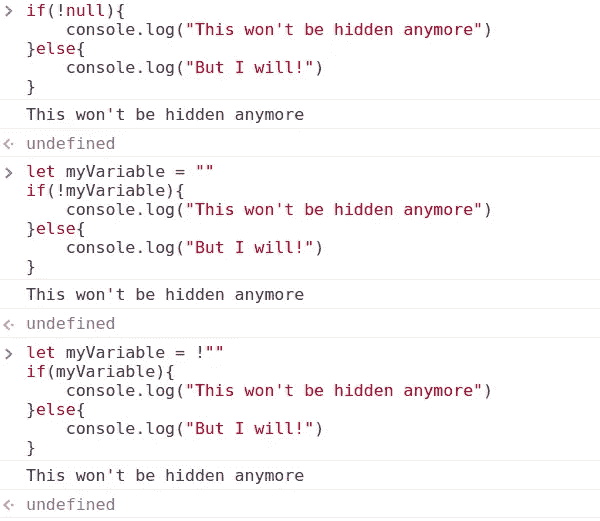

# 什么是！!'用 JavaScript？

> 原文：<https://javascript.plainenglish.io/what-is-in-javascript-876ce1a197c5?source=collection_archive---------7----------------------->

## 不是不是，梆梆，双惊叹号。随你怎么叫。但是什么呢！!'用 JavaScript 做？


Photo by [Martin Zaenkert](https://unsplash.com/@mossphotography?utm_source=medium&utm_medium=referral) on [Unsplash](https://unsplash.com?utm_source=medium&utm_medium=referral)

TL；博士:**！！将任意类型的值转换为** `**true**` **或** `**false**`。

# 怎么会！!'在 JavaScript 中工作

首先，值得一提的是，双重否定不是一个 JavaScript 操作符，而只是一个序列中的两个否定。

让我们试着分解一个简单的例子。

```
!!myVariable
```

正如在 [MDN](https://developer.mozilla.org/en-US/docs/Web/JavaScript/Reference/Operators/Logical_NOT#double_not_!!) 中所报道的，您可以“*使用几个 NOT 操作符来显式地强制将任何值转换成相应的布尔原语*”。

换句话说，double-NOT 将我们示例中的`myVariable`转换为布尔值。结果布尔值取决于`myVariable`的原始值。

## 后退一步:NOT 运算符

简单来说，NOT(！)运算符将布尔值从`true`转换为`false`，反之亦然。



Value of !false and !true

但是如果初始值不是布尔值`true`或者`false`呢？

我们需要引入真与假的概念。

## 真理和谬误

一个[假值](https://developer.mozilla.org/en-US/docs/Glossary/Falsy)为

*   `null`；
*   `NaN`；
*   `0`；
*   空字符串(`""`或`''`或````)；
*   `undefined`。

JavaScript 将这些值解释为`false`。有关 falsy 值的完整列表，请查看链接。

凡是不虚假的都被解释为`true`。

让我们看一些例子:



Falsy values are interpreted as false

falsy 值被解释为`false`，因此 JavaScript 执行`else`语句中的代码。

注意，空对象和空数组被认为是`true`。



Empty objects and empty arrays are considered `true`

## NOT 与 Falsy & Truthy 一起使用

让我们把目前所学的东西混合起来。

我将使用上面的例子，并将 NOT 运算符添加到`null`和`""`中。



Use the NOT operator with falsy values

请注意，在上一个示例中，我在将`""`赋值给`myVariable`时应用了 NOT 运算符。

这很好，但是`myVariable`被解释为`true`，因此，我从 if 语句中移除了 NOT 操作符。

# 进入！！

现在我们知道，变量前面的 NOT 运算符，比如`!myVariable`，根据`myVariable`的原始值将`myVariable`转换为布尔值。

JavaScript 在解释`!myVariable`时遵循以下步骤:

1.  将`myVariable`转换为布尔值。
2.  在生成的布尔值前应用`!`。
3.  转换成相反的。

## 如果再加一个 NOT 运算符呢？

简而言之，它再次转换它！

按照上面的步骤，我们重复步骤 2 和 3！

1.  将`myVariable`转换为布尔值。
2.  在结果布尔前面应用`!`。
3.  转换成相反的。
4.  在生成的布尔值前应用`!`。
5.  转换成相反的。

因此，`!!`通常用于返回 truthy、falsy 或表达式的布尔值。

就好比说:“**给我这个表达式**的布尔值”，不管这个表达式是什么。它可以是函数、函数的结果、对象等。


Photo by [Pete Pedroza](https://unsplash.com/@peet818?utm_source=medium&utm_medium=referral) on [Unsplash](https://unsplash.com?utm_source=medium&utm_medium=referral)

# 该不该用？

这是最后一个问题。

这取决于你。我没有资格评判你的选择。

但是，请考虑以下几点:

*   许多人可能对它不熟悉
*   `Boolean(myVariable)`做类似的工作，更容易理解

## 好奇其他 JS 怪癖？

*   [JavaScript？。可选链接](/javascript-optional-chaining-7a2bce30c450)
*   [JavaScript？？(无效合并)运算符](/javascript-operator-5d3bd92e835e)
*   [JavaScript 三元运算符](/javascript-ternary-operator-b76a02c90850)

在 Medium 或 [Twitter](https://twitter.com/lorenzozar) 上关注我。

*更多内容请看*[***plain English . io***](https://plainenglish.io/)*。报名参加我们的* [***免费周报***](http://newsletter.plainenglish.io/) *。关注我们关于*[***Twitter***](https://twitter.com/inPlainEngHQ)*和*[***LinkedIn***](https://www.linkedin.com/company/inplainenglish/)*。查看我们的* [***社区不和谐***](https://discord.gg/GtDtUAvyhW) *加入我们的* [***人才集体***](https://inplainenglish.pallet.com/talent/welcome) *。*