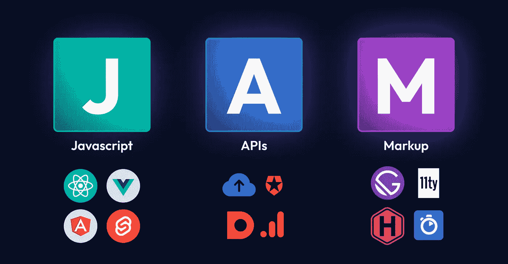

# 什么是 Jamstack:构建内容网站的最佳方式？

> 原文：<https://javascript.plainenglish.io/what-is-jamstack-the-best-way-to-build-content-sites-ae381d8a92da?source=collection_archive---------3----------------------->

## 在这篇博客中，我们来看看 Jamstack，这是一个现代的 web 架构，它使得构建内容驱动的网站变得很容易。

近年来，客户机-服务器体系结构通过允许构建者使用数据库存储内容和客户机从服务器请求数据而席卷了 web 开发界。随着 React、Angular 和 Vue 的发展，诸如虚拟 DOM、JSX、重新渲染、双向绑定等概念成为了行业术语。

这些概念使得 web 应用程序更加强大，有许多技术和工具可以与数据库和服务器集成在一起。

这就是创建 web 应用程序的过程变得更具挑战性的地方，因为开发人员必须安装和配置许多工具。所有这些都需要大量的开发工作，推迟了产品的发布。

拥有一套最佳实践和行业标准架构可以简化这一过程，这导致了一种称为 Jamstack 的现代自以为是的架构的发展。

像 Next.js、Gatsby 和 Hugo 这样的框架很好地利用了这种架构，并带来了新的想法，包括[增量站点再生](https://blog.locofy.ai/what-the-heck-is-web-rendering)、类型脚本支持、智能捆绑和路由预取。

# 探索 jam stack——一种现代 Web 架构

由于[杰基尔](https://jekyllrb.com/)和其他相关技术，静态网站在 2015 年开始流行起来。同年，来自 Netlify 的 Mathias Biilmann 和 Chris Bach 提出了“Jamstack”这个术语。

什么是 Jamstack？

根据 Mathias biil Mann(Netlify 的首席执行官兼联合创始人)的说法，Jamstack 是“一种基于客户端 JavaScript、可重用 API 和预建标记的现代 web 开发架构”。

简而言之，Jamstack 处理 JavaScript、API 和标记。

你可能在 JavaScript、API 和标记的帮助下建立了很多网站，所以就技术而言它一点也不新；相反，这是一种结合使用它们的新方法。

Jamstack 不同于 React & Angular，因为它不是一个框架，而是一种架构方法，将 web 体验层从数据和业务逻辑中分离出来。它允许通过使用 API 轻松添加定制逻辑和第三方集成。

# 理解 Jamstack 的技术细节

让我们深入了解支持 Jamstack 的技术:

## Java Script 语言

这是构建 Jamstack 网站的第一个要素。

如果您是一名 web 开发人员，您可能知道 JavaScript 用于为网站提供动态行为和逻辑，从而提供出色的用户体验。同样的想法也适用于 Jamstack。

与前端技术与数据库和服务器捆绑在一起的传统架构相比，Jamstack 将所有内容解耦，允许完全的自由。

Jamstack 中的 J 代表 JavaScript，但你可以使用任何 JavaScript 框架，甚至 Python 或 Go。

因此，就您可能使用的前端技术而言，Jamstack 更加灵活。

## 应用程序接口

连接客户机和服务器的一种常用技术是应用编程接口(API)。我们可以通过 GRPC、GraphQL 甚至 REST 来实现。

您可以将它视为传递客户端请求和服务器响应的便捷通道。

我们举个例子。

当用户询问书的数据时，服务器用 JSON 数据响应，如上图所示。

服务器端的动作被抽象成可重用的 API，并通过 JavaScript over HTTPS 进行访问，就像 API 在 Jamstack 中的工作方式一样。为此，您可以使用自己的自定义功能或第三方服务。

这就是为什么服务器不再需要执行繁重的工作；现在一切都在客户端处理。而且，随着 API 变得更加广泛可用，它们可以被用作微服务来轻松集成和链接以提供各种功能。

## 利润

Jamstack 的第三个元素是标记。

内容请求通常由用户发送到服务器。服务器按照一个长序列查找适当的信息，然后做出响应。用户不应该等那么久。

这就是标记发挥作用的地方。

Jamstack 使用预先构建的标记，而不是依赖服务器为每个请求构建内容。让我们再深入一点。

静态站点生成器将数据或信息作为输入，对其进行评估，然后生成预构建的 HTML。这些预建的标记或 HTML 页面托管在 CDN 上，使访问者可以轻松获得所需的内容。

有超过 [300 个静态站点生成器](https://jamstack.org/generators/)可供选择。

# Jamstack 与传统架构有何不同？

在 HTML、CSS 和 JavaScript 出现之前，网站完全是静态的；然而，在他们首次亮相后，开发人员开始创建动态网页，然后由服务器提供服务。

本质上，当用户需要信息时，客户端向服务器请求内容，服务器检索指定的内容，应用一些逻辑，然后交付内容。

但是随着 web 开发变得更加复杂，出现了一些注释模式和架构。

Jamstack 这个术语就是从那里诞生的。

在这里，开发人员使用 javascript 或另一个 JavaScript 框架来编写代码，然后将代码推送到像 [Git](https://git-scm.com/) 这样的源存储库。从那里，文件被自动发送到内容交付网络(CDN)，使我们能够访问 Jamstack 的预渲染功能。

CDN 可以被认为是位于世界各地的一组服务器，用于快速有效地加载网站。

# Jamstack 的优势

1.  **静态站点**

首先，Jamstack 不仅用于创建静态网站；你也可以开发动态网站，但它们将显示为静态页面。这是 Jamstack 区别于其他 web 开发框架的地方。

因为静态网站是在构建时构建的，所以速度更快，对 SEO 也更友好。

**2。更快的性能**

静态站点生成器接收一组内容或模板作为输入，然后提供结果，这实质上是分发到 CDN 的预构建标记。

因此，当用户请求信息时，来自 CDN 的页面形式的输出可以立即交付，使得该过程更容易和更快。

CDN 将网站内容分发到许多服务器组，这样当有人请求内容时，它就会从最近的服务器发送，从而实现更快的通信。

**3。高性价比，经济实惠**

Jamstack 网站和 web 应用程序不托管在原始服务器上；相反，它们是通过 CDN 直接提供的，这大大降低了成本。

升级网站或网络应用程序的过程通常是自动化的，这大大简化了工作流程。

甚至像 Cloudflare 这样的 cdn 也提供了慷慨的免费试用，并且 Github 支持 CI/CD 管道。这使得 Jamstack 成本低廉。

**4。更安全**

传统的服务器端应用容易受到各种攻击，因为它们使用许多 API 将内容传输到原始服务器。

由于 CDN 只包含只读文件，没有活动连接，因此被黑客利用的可能性要低得多。

**5。可扩展**

我们在 Jamstack 中没有物理服务器，甚至更新网站也主要是自动化的，这就是为什么我们必须基于我们使用的技术栈来更新网站。

没有复杂的逻辑可以缓存，因为网页保存在 CDN 中，不需要运行服务器&通过自动部署，扩展这些网站很简单。

# 你的下一个项目应该考虑 Jamstack 吗？

有了 Jamstack 带来的所有好处，它可以成为内容密集型项目的理想选择。由于 Jamstack 可以用多种技术开发，包括框架和 API，所以学习曲线很浅。

事实上，如果你熟悉 React 和 GraphQL，你可以开始使用 Jamstack。即使您熟悉其他一些技术，您也可以遵循相同的步骤来整合它们。

最后，Jamstack 让你的网站运行良好，加载快速，安全，可伸缩。

使用 Jamstack 的两个著名框架是 Gatsby 和 Next.js。使用 [Locofy.ai](https://locofy.ai/) 插件，你可以直接从 [Figma](https://figma.com/) 和 [Adobe XD](https://www.adobe.com/in/products/xd.html) 设计中生成像素完美且高度可扩展的代码。

使用这个插件，你可以把你的设计分解成需要道具的组件，这样就可以很容易地插入你选择的 CMS 并构建一个 Jamstack 应用。

希望你喜欢。

就这样——谢谢。

[*如果你喜欢看这样的故事，并想帮助我成为一名作家，考虑成为一名中等成员*](https://nitinfab.medium.com/membership) *。每月花费 5 美元，你可以无限制地访问媒体内容。如果你通过我的链接注册，我会得到一点佣金。*

*原载于*[*https://blog . locofy . ai*](https://blog.locofy.ai/jamstack-the-best-way-to-build-content-sites)*。*

*更多内容请看*[***plain English . io***](https://plainenglish.io/)*。报名参加我们的* [***免费周报***](http://newsletter.plainenglish.io/) *。关注我们* [***推特***](https://twitter.com/inPlainEngHQ) ，[***LinkedIn***](https://www.linkedin.com/company/inplainenglish/)*，*[***YouTube***](https://www.youtube.com/channel/UCtipWUghju290NWcn8jhyAw)*，* [***不和***](https://discord.gg/GtDtUAvyhW) *。对增长黑客感兴趣？检查出* [***电路***](https://circuit.ooo/) *。*