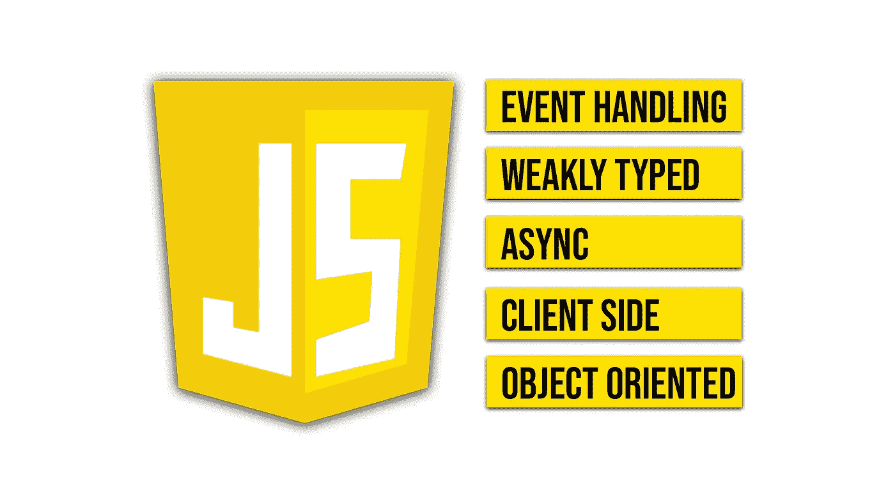

# JavaScript 是什么？定义这种神奇语言的 5 个基本特征

> 原文：<https://javascript.plainenglish.io/what-is-javascript-5-basic-features-that-define-this-amazing-language-9e12d273da8?source=collection_archive---------5----------------------->

## 如果你想成为一名 JavaScript 开发者，你需要知道的 5 个基本特征。

[Image](https://www.pexels.com/es-es/foto/internet-tecnologia-ordenador-texto-4164418/) from [Pexels](https://www.pexels.com/es-es/foto/internet-tecnologia-ordenador-texto-4164418/)

昨天我和另一个开发者谈论编程语言。我告诉他，我的公司在整个技术栈中使用 JavaScript。他说他在个人项目中使用了 4-5 种不同的技术，因为每种语言和技术都有其功能。

这次谈话让我意识到**我真的不知道什么时候该用什么时候不该用 JavaScript** 。我意识到我不知道我所使用的语言的特点。

因为这个原因，我开始学习，今天我要告诉你关于他们的事情，这样发生在我身上的事情就不会发生在你身上。

你准备好了吗？我们开始吧。

# 为什么是 JavaScript？

JavaScript 是当今最流行的语言之一。这是一种不可思议的语言，它生来就是一种 web 开发语言，但是用它可以做越来越多的事情。此外，语言特性让我们在开发过程中更有效率，它的学习曲线也非常有价值。

如果你也喜欢这种语言，或者你正在开始使用它，让我来发现 JavaScript 的一些**基本特征(我说的是 JavaScript vanilla，无类型脚本，Node.js，React……)。**

# 我真的需要学习 JavaScript 特性吗？

你想更有效率吗？你想用更少的努力实现更多的目标吗？你想为你的公司省钱吗？

如果你对上面的任何一个问题都回答了**是**，那么答案就是**是**，**你需要学习 JavaScript 特性。**让我用一个简单的例子向你解释为什么。

想象一下，你要在家里挂一面镜子。在你的工具箱里，你有一把锤子和一把电钻。然而，你并不太了解这个练习。你总是用锤子工作，这是你最喜欢的工具。这面镜子又大又重。

你能用锤子在墙上打出必要的洞来挂镜子吗？当然啦！你可以用锤子把螺丝敲进墙里。但是这将花费你更多的时间和精力，而且你可能会比用钻子更容易把墙敲碎，因为在墙上钻孔的工具是钻子而不是锤子。

[Image](http://Foto de energepic.com: https://www.pexels.com/es-es/foto/juego-de-herramientas-sobre-tabla-175039/) from [Pexels](http://Foto de energepic.com: https://www.pexels.com/es-es/foto/juego-de-herramientas-sobre-tabla-175039/)

然而，由于你不知道什么是真正的钻头和它的特点是什么，你更喜欢使用锤子。因为这个原因，你会**花更多的时间和精力去得到一个更差的结果**。

编程语言也是如此。编程语言是我们用来开发功能的工具。每种语言都有一些独特的特征，使它在某些方面比其他语言更好。并且**选择正确的语言**将**为我们节省大量的时间、金钱和精力**。但是如果我们想要做出选择，我们必须了解语言的特征。

你觉得听起来好吗？完美！以下是 JavaScript 的特性:

## JavaScript 的特征

JavaScript 的一些基本特性，我认为你必须知道的是…

*   **事件处理**。JavaScript 使我们能够处理事件并生成自定义事件(例如，当用户点击按钮时，事件就会发生)。
*   **弱类型化**。我们不必在声明变量时指明它的类型。它有一些优点和缺点(以后我会写一篇关于这个的文章)。
*   **异步处理**。JavaScript 支持使用承诺和异步函数的异步行为。它允许我们创建一个并行执行的系统。
*   **客户端语言**。JavaScript(不是 NodeJS 和其他语言，我在本文顶部警告过你这是普通的 JavaScript)实际上是一种客户端语言。这意味着它需要一个客户端(比如 web 浏览器)来执行代码，并且它不与服务器端交互。
*   **面向对象支持**。在 JavaScript 中，您可以使用一些面向对象的原则，比如封装或继承。因此，了解您是否考虑在客户端使用面向对象视角是很重要的。

5 Basic Features of JavaScript

如果您想了解更多关于 JavaScript 的知识，请不要忘记查看以下文章:

 [## 最终理解 JavaScript 中的箭头函数

### 了解如何声明箭头函数，成为更好的 web 开发人员。

javascript.plainenglish.io](/finally-understanding-the-arrow-functions-in-javascript-a47eb1f4dbae)  [## 5 个对初学者有用的 JavaScript 一行程序

### 在短短几分钟内，您将能够减少您必须编写的代码行数，并提高您的…

javascript.plainenglish.io](/5-useful-javascript-one-liners-for-totally-beginners-56e678d9a314) 

# 最后的想法

JavaScript 已经成为一种有趣的语言，可以让你在网络开发领域有所作为。它创造了一种语言，这种语言提高了我们的生产率和可读性，用它工作和学习也很有趣。然而，它并不完美，你不能在你的项目中使用它。为此，你需要了解和理解语言的特点。

在这篇文章中，我们已经讨论了五个基本特性，我认为如果你想作为一个 JavaScript 开发者提高自己的水平，你需要知道这些特性。此外，当我们为下一个项目选择技术时，了解更多的语言可以让我们**做出更好的决定**。

例如，如果您知道 JavaScript 是一种客户端语言(至少是 JavaScript vanilla)，您就不会考虑将它作为管理数据库的语言。

你以前用过 JavaScript 吗？你知道其他语言特征吗？

# 结论👋

谢谢大家！非常感谢您阅读这篇文章。我很想知道你对此的看法，所以不要写在评论里，我会读给你听。

反过来，如果这篇文章已经帮助你记住了，你可以为它鼓掌，并与你的同志分享。如果你不想错过我的任何一篇文章，别忘了关注我。

# 关于作者🤓

我的两个爱好是技术和交流，所以我抓住一切机会谈论或写关于技术的东西。

# 想要连接吗？📲

📩**jesuslagaresgalan@gmail.com**

📸 [**Instagram**](https://instagram.com/jesuslagares_)

💼 [**LinkedIn**](https://www.linkedin.com/in/jesus-lagares/)

📹 [**Youtube**](https://www.youtube.com/c/Jes%C3%BAsLagares)

🐦 [**推特**](https://twitter.com/jesuslagares_)

谢谢！❣️

*更多内容请看*[***plain English . io***](https://plainenglish.io/)*。报名参加我们的* [***免费周报***](http://newsletter.plainenglish.io/) *。关注我们关于*[***Twitter***](https://twitter.com/inPlainEngHQ)[***LinkedIn***](https://www.linkedin.com/company/inplainenglish/)*[***YouTube***](https://www.youtube.com/channel/UCtipWUghju290NWcn8jhyAw)*[***不和***](https://discord.gg/GtDtUAvyhW) *。***