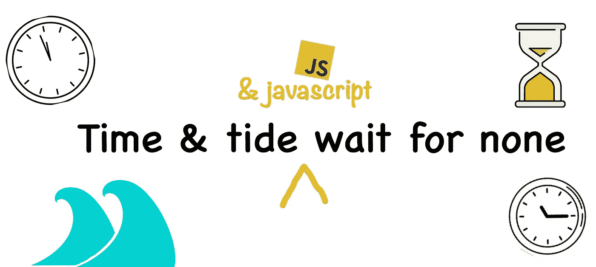
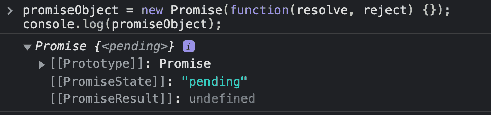
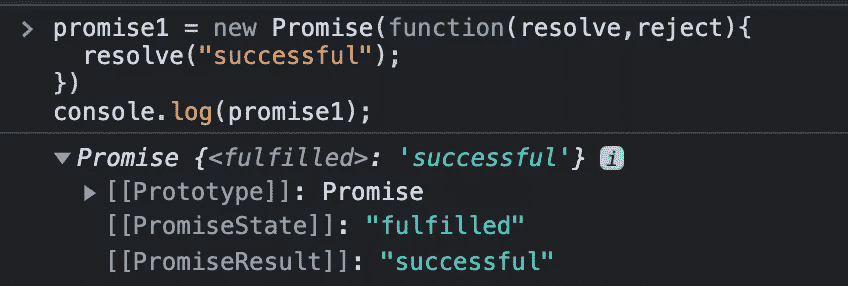
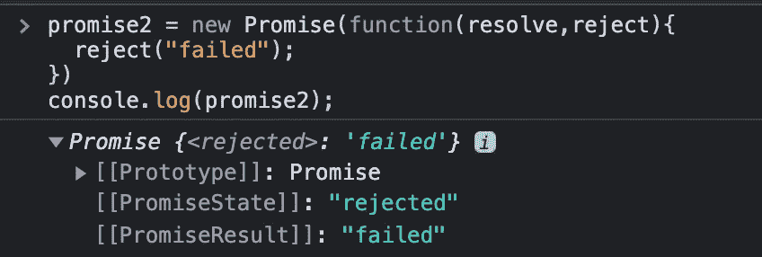
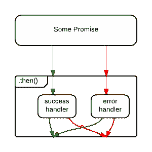
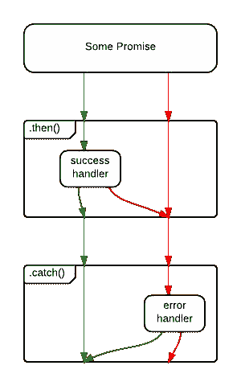
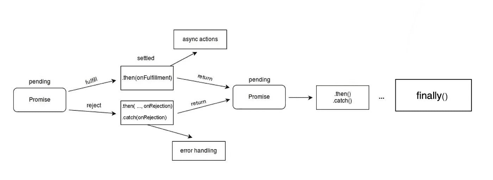

# 面向初学者的 JavaScript Promise 介绍

> 原文：<https://javascript.plainenglish.io/what-is-javascript-promise-7b5e03d06bdf?source=collection_archive---------9----------------------->

## 什么是 JavaScript Promise？它表示异步操作的最终完成(或失败)及其结果值。

不要被击碎😟在定义上。我可以 ***承诺🤝*** 你最后会明白这个定义的。

我们现在去 in🤿潜水吧，因为。



A proverb in JS style

是的，JavaScript 是一种同步单线程语言。因此，它不会等到 ajax 请求完成。我们用 JavaScript 泡个茶来理解这个问题。

让我们用 JavaScript 做一个 tea🫖。

```
function makeTea(){
   TakeWater();
   boilIt();
   AddTeaPowder();
   ServeItInTheGlass();
}function TakeWater(){ 
   console.log("Take water💧 in a bowl🥣 ");
}function boilIt(){ 
  console.log("Boil the water🔥");
}function AddTeaPowder(){ 
  console.log("Add your favourite Tea powder");
}function ServeIt(){ 
  console.log("Serve the Tea in a pot🫖☕️");
}
```

但是在这种情况下，AddTeaPowder()& ServeItInTheGlass()步骤不会等到水烧开🤦。

为了解决这个问题，我们可以在完成请求后使用回调来执行函数。在回调函数中，该函数也将作为参数传递。

现在，试着用同样的茶来回拨。

```
function makeTea(){
   TakeWater();
   boilIt(AddTeaPowder,serveIt); 
}function TakeWater(){ 
  console.log("Take water💧 in a bowl🥣 ");
}function boilIt(nextFunction,lastFunction){ 
  console.log("Boil the water🔥");
  // after boiling
  nextFunction(lastFunction);   //nextFunction(ServeIt())
}function AddTeaPowder(nextFunction){ 
  console.log("Add your favourite Tea powder");
  // After adding Tea powder
  nextFunction();   //ServeIt()
}function serveIt(){ 
  console.log("Serve the Tea in a pot🫖☕️");
}makeTea();
```

如果你有很多功能，那就像

**T5【第一功能(第二功能(第三功能(第四功能(第五功能……………)..)))))，**

什么鬼……是啊，所以我们叫它 [**回调地狱**](http://callbackhell.com) **。**

为了避免这种回调地狱，在 [Javascript ES6](https://medium.com/@udhaykumarbala/what-is-es6-5691a98811c0) 中引入了 Promise。现在试试同样的茶。

```
function makeTea(){
   TakeWater()
   .then(boilIt())
   .then(AddTeaPowder())
   .finally(serveIt())
}makeTea();
```

我们可以添加尽可能多的函数，我们也有参数来处理任何错误，这样更好！🤩

好吧，让我们看看承诺里面有什么。

承诺对象有:

*   承诺的现状
*   承诺**值**(或)承诺**结果**



Structure of Promise Object

承诺将处于**未决状态**并且**承诺结果**在发起时未定义。

承诺有三种不同的状态:

*   **待定** —承诺的**初始状态**。
*   **完成**——代表**成功**操作的承诺状态。
*   **拒绝** —代表**操作失败**的承诺状态。

可以通过调用以下命令来修改承诺结果和承诺状态:

*   [**解决(值)**](https://developer.mozilla.org/en-US/docs/Web/JavaScript/Reference/Global_Objects/Promise/reject) —将承诺更改为**履行状态****将值存储在承诺结果中。**

****

**Promise Object on Fulfilment**

*   **[**拒绝(值)**](https://developer.mozilla.org/en-US/docs/Web/JavaScript/Reference/Global_Objects/Promise/resolve) —将承诺更改为**拒绝状态****将值存储在承诺结果中。****

********

****Promise Object on Rejection****

******承诺一旦兑现或拒绝，就不可改变(即永远不能再改变)。******

****成功或失败后，一个承诺会返回一个新的承诺，可以调用下一个函数。这被称为承诺链****

****我们有三个选项来链接承诺中的功能，即:****

*   ******然后(** onFulfillment()、onRejection() **)******
*   ******catch(**on rejection()**)******
*   ******最后(**功能() **)******

## ****然后(完成时，弹出时)****

****有两个参数都是函数，第一个参数将在完成时执行，第二个参数将在拒绝时执行。****

********

****Flow of then()****

```
**makeTea().then(
  handleSuccess,
  handleError
);**
```

## ****捕捉(弹射时)****

****你可能会问，我们在 then()方法上有成功和错误处理程序，那么为什么我们需要 [catch()](https://developer.mozilla.org/en-US/docs/Web/JavaScript/Reference/Global_Objects/Promise/catch) 方法。****

****但是如果 **handleSuccess()** 抛出一个错误会怎么样呢？承诺从。那么()将被拒绝，但是这里没有任何东西来捕捉拒绝。我们需要一个只接受错误处理程序的方法。****

****顾名思义，catch()捕捉错误& bug。****

****出于这个原因，有些人认为上面的代码是反模式的，并建议使用下面的代码:****

```
**makeTea()
  .then(handleSuccess)
  .catch(handleError)
;**
```

****这种差别很微妙，但很重要。在第一个例子中，源于`save()`操作的错误将被捕获，但源于`handleSuccess()`函数的错误将被接受。****

********

****Flow of catch()****

****没有。catch()，成功处理程序中的错误未被捕获。****

****在第二个例子中，`.catch()`将处理来自`save()`或`handleSuccess()`的拒绝。****

## ****最后(功能)****

****最后😜最后，[()](https://developer.mozilla.org/en-US/docs/Web/JavaScript/Reference/Global_Objects/Promise/finally)也接受一个函数，该函数将在成功和拒绝的情况下被执行。一旦`Promise`处理完毕，无论承诺是成功履行还是被拒绝，这都为代码的运行提供了一种方式。****

****这有助于避免在 promise 的`[then()](https://developer.mozilla.org/en-US/docs/Web/JavaScript/Reference/Global_Objects/Promise/then)`和`[catch()](https://developer.mozilla.org/en-US/docs/Web/JavaScript/Reference/Global_Objects/Promise/catch)`处理程序中重复代码。****

********

****Promise control flow****

****比如，解决和拒绝，我们有其他的方法，比如 [all()，race()…](https://developer.mozilla.org/en-US/docs/Web/JavaScript/Reference/Global_Objects/Promise)****

****我相信，现在你能理解这个承诺了。****

****通过这种方式，我们将尝试找到本系列中许多 JavaScript 面试问题的答案。订阅以在本系列的下一篇文章发布时获得通知。****

```
**ReadBlog().then(
  handleSuccess,
  handleError
);function handleSuccess(){
   // 50 claps👏👏👏👏👏
}function handleError(){
   // 49 claps😜😜😜😜😜
   // comment your feedback
}**
```

****鼓掌**👏👏👏**要欣赏这篇文章，请不吝赐教💬这就去。****

******JavaScript Q & A 系列:******

1.  ****[JavaScript ES6 是什么？](https://medium.com/@udhaykumarbala/what-is-es6-5691a98811c0)****
2.  ****什么是 JavaScript Promise？****

*****更多内容看* [***说白了。报名参加我们的***](http://plainenglish.io/) **[***免费周报***](http://newsletter.plainenglish.io/) *。在我们的* [***社区不和谐***](https://discord.gg/GtDtUAvyhW) *获得独家获取写作机会和建议。*******