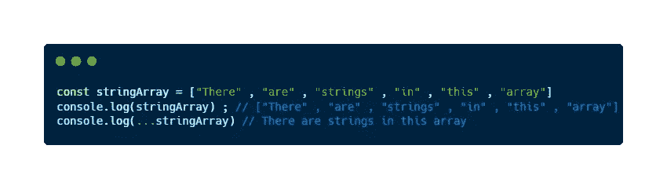
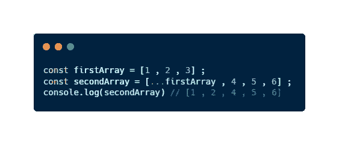
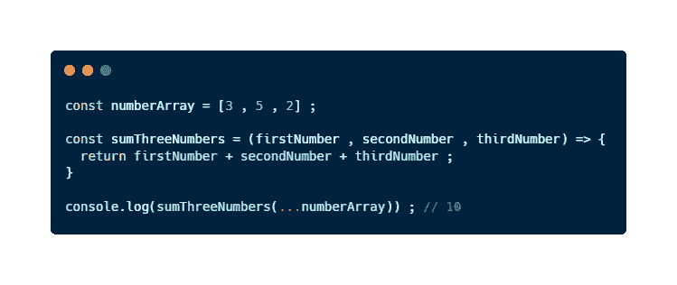
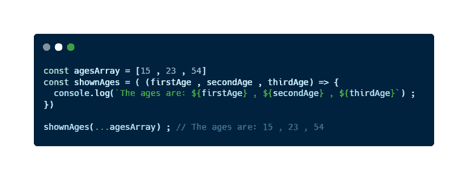

# 什么是 JavaScript Spread 运算符？

> 原文：<https://javascript.plainenglish.io/what-is-javascript-spread-operator-an-understandable-and-short-guide-de3a4fa34c00?source=collection_archive---------11----------------------->

## 关于什么是 JavaScript spread 操作符及其用例的简短指南。这个特性可以帮助你成为一个更高效的开发者。

最近我开始了一份新工作，在一家公司做后端开发人员。出于这个原因，这些天我学到了很多关于 JavaScript 的知识。我想成为这门语言的大师，我正在从这门语言的基础到最深的部分，成为一名伟大的 JavaScript 开发者。

为此，我正在撰写一系列文章，在这些文章中，我发现了世界上一些**好奇的 JavaScript 特性**。许多开发人员不知道这些特性，这在许多情况下会导致**时间浪费**，或者导致**糟糕的实现**。

箭头函数、一行程序、数组方法或**扩展操作符**就是其中的一些功能。使用这些，我们可以在更少的时间内产生更高质量的代码，减少我们必须编写的代码行数。

你想成为更好的 JavaScript 开发者吗？让我们发现传播算子。

# JavaScript 中的 spread 运算符是什么？

**扩展操作符**或**扩展语法**，是一个 JavaScript 特性，它允许我们**使用数组表达式作为它的值，而不是作为数据结构**。它将一个数组或一个对象转换成其中包含的一组值。它的标志有三点: **…**

例如，如果我们有一个数组 **arr = [1，2，3]** ，我们做了一个 **console.log(…arr)，**输出将是 **1，2，3** ，而不是 **[1，2，3]** ，就好像我们做了 **console.log(arr)** 。一开始可能有点复杂，但通过一些例子，你会完全理解它。

# 使用扩展运算符的一些真实示例

在 JavaScript 中使用 spread 操作符，我们可以做很多令人兴奋的事情。一些例子是:

## 将字符串数组显示为纯字符串

An example of the use of the spread operator

## 将一个数组复制到另一个数组中

Copying all elements in an array to another array using the spread operator

## 传递一个参数而不是多个参数

Giving only one argument using the spread operator

## 向对象添加属性

Concreting properties of an object using the spread operator

## 访问不带索引的数组元素

Using array elements with the spread operator

你想了解更多关于 JavaScript 的知识吗？那么你不能跳过这些有趣的文章:

 [## JavaScript 是什么？定义这种神奇语言的 5 个基本特征

### 如果你想成为一名 JavaScript 开发者，你需要知道的 5 个基本特性。

javascript.plainenglish.io](/what-is-javascript-5-basic-features-that-define-this-amazing-language-9e12d273da8)  [## 5 个对初学者有用的 JavaScript 一行程序

### 在短短几分钟内，您将能够减少您必须编写的代码行数，并提高您的…

javascript.plainenglish.io](/5-useful-javascript-one-liners-for-totally-beginners-56e678d9a314) 

# 最后的想法

**Spread 运算符**是 JavaScript 的一个奇特特性，是在 [**ES6**](https://www.w3schools.com/js/js_es6.asp) 中引入的。使用这个操作符，我们可以**简化管理数据结构**的值的过程。然而，如果我们想在代码中正确使用它，我们必须完全理解它是如何工作的。

出于这个原因，我们已经学习了 Spread 操作符，并且已经看到了一些例子来很好地理解这个概念。一开始可能会有点困惑，但通过练习，你会掌握它的。

使用 JavaScript 功能作为**扩展操作符**或[箭头**函数**](https://medium.com/javascript-in-plain-english/finally-understanding-the-arrow-functions-in-javascript-a47eb1f4dbae) 可以让我们**成为更高效的开发人员**。虽然看起来很复杂，但是在日常工作中有很多例子可以使用 spread 运算符来减少需要编写的行数。所以，我鼓励你试一试，并不断寻求改进。

*你之前知道点差运营商吗？你知道 JavaScript 的一些让我们提高生产力的特性吗？*

# 结论👋

谢谢大家！非常感谢您阅读这篇文章。我很想知道你对此的看法，所以不要写在评论里，我会读给你听。

反过来，如果这篇文章已经帮助你记住了，你可以为它鼓掌，并与你的同志分享。如果你不想错过我的任何一篇文章，别忘了关注我。

# 关于作者🤓

我的两个爱好是技术和交流，所以我抓住一切机会谈论或写关于技术的东西。

# 想要连接吗？📲

📩**jesuslagaresgalan@gmail.com**

📸 [**Instagram**](https://instagram.com/jesuslagares_)

💼 [**领英**](https://www.linkedin.com/in/jesus-lagares/)

📹 [**Youtube**](https://www.youtube.com/c/Jes%C3%BAsLagares)

🐦 [**推特**](https://twitter.com/jesuslagares_)

谢谢！❣️

*更多内容请看*[***plain English . io***](https://plainenglish.io/)*。报名参加我们的* [***免费周报***](http://newsletter.plainenglish.io/) *。关注我们关于*[***Twitter***](https://twitter.com/inPlainEngHQ)[***LinkedIn***](https://www.linkedin.com/company/inplainenglish/)*[***YouTube***](https://www.youtube.com/channel/UCtipWUghju290NWcn8jhyAw)*[***不和***](https://discord.gg/GtDtUAvyhW) *。对增长黑客感兴趣？检查* [***电路***](https://circuit.ooo/) *。***