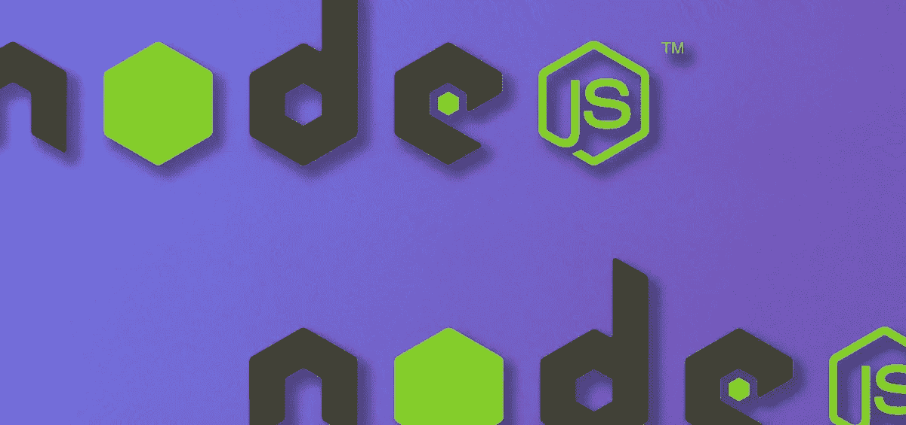
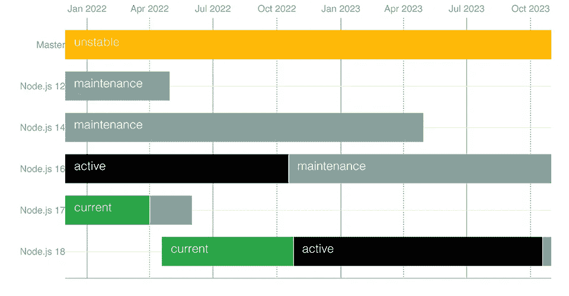

# Node.js 18 的新特性是什么

> 原文：<https://javascript.plainenglish.io/what-is-new-in-node-js-18-456c9ea652eb?source=collection_archive---------0----------------------->

## 了解 Node.js 最新版本中的新特性。



Photoillustration by David Fekke

*原发布于*[*https://fek . io*](https://fek.io/blog/what-is-new-in-node-js-18/)*。*

Node.js 基金会刚刚发布了 Node [v18.0.0](https://github.com/nodejs/node/blob/master/doc/changelogs/CHANGELOG_V18.md#18.0.0) 的第一个版本。Node.js foundation 维护多个版本，包括当前版本和长期支持(LTS)版本。当前的 v18 版本将在 2022 年 10 月的某个时候成为 LTS 版本。这是节点的正常发布时间表。



# 取得

备受关注的新特性之一是新的`fetch` API。Fetch 在浏览器中已经存在了一段时间，并且是一个可以通过运行`npm install node-fetch`添加到 Node.js 项目中的模块。有人抱怨这两者不能完全互操作。

> *fetch()已经在 Node 中发布，现在人们抱怨它不能像 node-fetch 一样工作🤦‍♂️.然而，每个人都说他们希望 Node.js 提供更多符合标准的 API*
> 
> *-马泰奥·科里纳(@ Matteo Collina)*[*2022 年 4 月 22 日*](https://twitter.com/matteocollina/status/1517617719838973953?ref_src=twsrc%5Etfw)

Fetch API 为基于客户机的 HTTP 请求提供了一个简单的基于 promise 的 API。以前，您必须使用`XMLHttpRequest` API 来发出 HTTP 请求，这需要编写多行代码来发出请求。现在，使用 Fetch API，可以像下面的示例一样简单地发出 HTTP 请求:

```
const response = await fetch('https://swapi.dev/api/people/1');
const data = await response.json();
console.log(data);
```

# HTTP 超时

Node.js v18 中的`http.server`超时已经更改。默认情况下，`headersTimeout`设置为 60000 毫秒(60 秒)，`requestTimeout`设置为 300000 毫秒(5 分钟)。`headersTimeout`是允许解析 HTTP 请求报头的时间。`requestTimeout`是用于 HTTP 请求的超时。

# 测试转轮模块

虽然在 Node.js 中有很多流行的单元测试选项，但是 Node 从来没有内置的测试运行器。节点 v18 现在包括一个`node:test`模块。下面的例子显示了如何设置测试和断言。

你可以在 https://nodejs.org/dist/latest-v18.x/docs/api/test.html[的文档中读到更多关于新测试的信息。](https://nodejs.org/dist/latest-v18.x/docs/api/test.html)

# Web 流 API

新的 Web Streams API 现在在全局范围内全局公开。虽然流从一开始就是 Node.js API 的一部分，但这个 API 是在浏览器和 Node.js 之间共享的，尽管这被认为是 Node 中的一个实验性功能。

Web 流支持 ReadableStream 和 WriteableStream 读取器、写入器和控制器。这些可以与新的`fetch` API 结合使用。

以下 API 对象现在在节点 v18 中全局可用:

*   可读流
*   ReadableStreamDefaultReader
*   ReadableStreamBYOBReader
*   readablestreamboyobrequest
*   ReadableByteStreamController
*   ReadableStreamDefaultController
*   转换流
*   TransformStreamDefaultController
*   可写流
*   WritableStreamDefaultWriter
*   WritableStreamDefaultController
*   ByteLengthQueuingStrategy
*   对策
*   TextEncoderStream
*   TextDecoderStream
*   压缩流
*   解压缩流

# V8 10.1

V8 10.1 有三个显著的变化。其中一个新增功能是寻找数组的最后一个元素和索引的新数组方法:

V8 的另一个改进是国际化支持。添加了`Intl.Locale`和`Intl.supportedValuesOf`函数后，您现在可以检索某个位置的日历、货币、编号以及时区数据，如下例所示:

V8 引擎在提高类字段和私有类方法的性能方面也取得了长足的进步。`v8.serialize`函数的数据格式已经改变，不会向后兼容 Node.js 的早期版本。

# 工具链和编译器

Node 的 Linux 版本现在构建在 Red Hat Enterprise Linux 上，与 glibc 2.28 或更高版本兼容。macOS 的预构建二进制文件不需要 macOS 10.15 (Catalina)或更高版本。现在，AIX 支持的最低架构是 Power 8。

由于 V8 更新，32 位 Windows 的预构建二进制文件目前不可用，但如果 32 位支持重新添加到 V8，可能会恢复。

# 结论

Node.js 的 18 版本包含了一些简洁的特性，在 LTS 发布之前应该会有更多的特性。由于 V8 运行时升级了新特性，Node 在新版本的 V8 中获得了这些特性。我期待着 10 月份 LTS 的发布，因为我相信其他节点开发者也会如此。

*更多内容请看*[***plain English . io***](https://plainenglish.io/)*。报名参加我们的* [***免费周报***](http://newsletter.plainenglish.io/) *。关注我们关于*[***Twitter***](https://twitter.com/inPlainEngHQ)*和*[***LinkedIn***](https://www.linkedin.com/company/inplainenglish/)*。加入我们的* [***社区不和谐***](https://discord.gg/GtDtUAvyhW) *。*