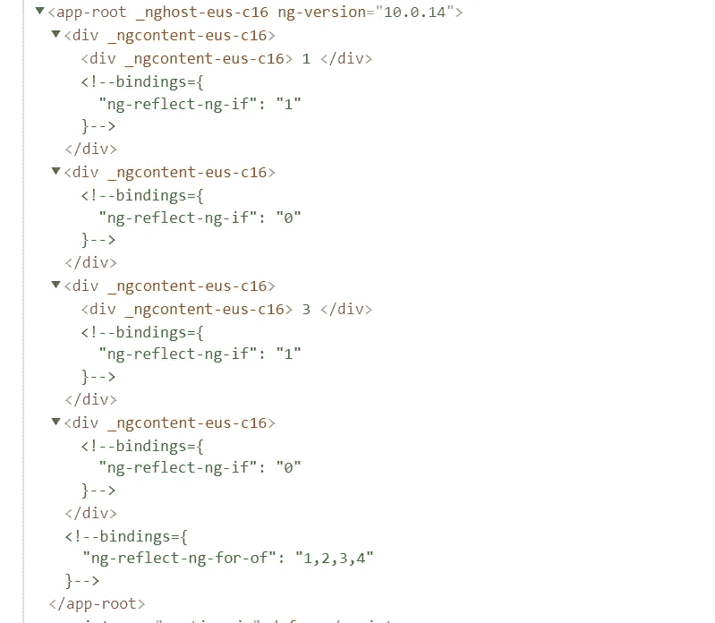
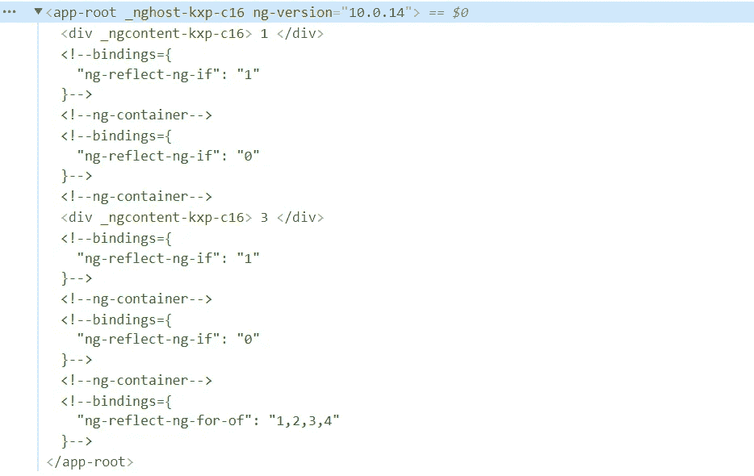

# 面向初学者的 ng-container 介绍

> 原文：<https://javascript.plainenglish.io/what-is-ng-container-cce9f880abd2?source=collection_archive---------5----------------------->

## 什么是 ng-container，为什么使用它？


Photo by [Alessandro Bianchi](https://unsplash.com/@ale_s_bianchi?utm_source=medium&utm_medium=referral) on [Unsplash](https://unsplash.com?utm_source=medium&utm_medium=referral)

如果你一直在研究 Angular，那么毫无疑问你一定使用了结构指令(例如*ngFor，*ngIf)。

你有没有遇到过这样的情况，为了实现功能，你必须同时使用两个结构指令。

以下面的基本场景为例，我们正在迭代一个数字数组，并且只想显示奇数。

一种简单的方法是:

```
<div *ngFor="let i of [1, 2, 3, 4]" *ngIf="i % 2">{{ i }}</div>
```

但是一旦我们尝试这样做，就会出现一个可怕的错误。

```
Template parse errors:
Can't have multiple template bindings on one element. Use only one attribute prefixed with * ("<div *ngFor="let i of [1, 2, 3, 4]" [ERROR ->]*ngIf="i % 2">
  {{ i }}
</div>
```

这个错误用外行人的话来说就是我们不能在同一个 DOM 元素上使用两个结构化指令。

那么，我们剩下的解决方案是，简单地添加一个额外的 HTML 标签。我不会说谎，但这是我做的😏是的，它会起作用。

```
<div *ngFor="let i of [1, 2, 3, 4]"><div >{{ i }}</div></div>
```

但这是一种好的做法吗？毫不犹豫的回答是一个大大的否定。

## **为什么？**

因为从长远来看，你正在使 DOM 变得庞大，如果有多个这样的场景，后果可能是添加不必要的 HTML 标签和不必要的 CSS 来实现 UX。

观察这种情况下产生的 DOM。



DOM without ng-container

可能看起来有点复杂，但这里值得注意的一点是 div 中存在 div，并且我们已经复合了许多 div 元素。
想象一下在应用程序的多个地方都有这样的场景😱。

现在，我们理解了这个问题，但是解决方案是什么呢？

解决方案是使用一个 ***ng 容器*** 。

基本上，ng-container 可以用在任何地方的 Angular 应用程序中，我们希望在其中进行一些计算，比如对任何结构指令进行评估，并且我们不希望将元素与 DOM 相关联。

基本上，ng-container 就像一个 ghost 标签，完成一些计算，然后就不存在了。因此，任何与 ng-container 相关的东西，比如样式/id/类等等。也变得不存在。

让我们试着用 ng-container 重写上面的例子，并理解其中的区别。

```
<ng-container *ngFor="let i of [1, 2, 3, 4]"><div *ngIf="i % 2">{{ i }}</div></ng-container>
```

所以，这里我们没有使用 div，而是使用了 ng-container。结果将保持不变。

在这种情况下，观察计算出的 DOM:



DOM With ng-container

只有当 div 只出现在我们要显示的元素上时，DOM 看起来更整洁。

我希望从下一次开始，你将不再使用 div 标签，而是使用 ng-container，这将使 DOM 成为其他标签更干净的地方😏。

简而言之，这是关于 ng-container 的基本用法。希望这篇文章对你有用。如果你有任何疑问，请告诉我，我会尽力回答，或者如果有任何反馈，请告诉我。

*更多内容请看*[***plain English . io***](http://plainenglish.io/)*。报名参加我们的* [***免费周报***](http://newsletter.plainenglish.io/) *。在我们的* [***社区***](https://discord.gg/GtDtUAvyhW) *获得独家获得写作机会和建议。*