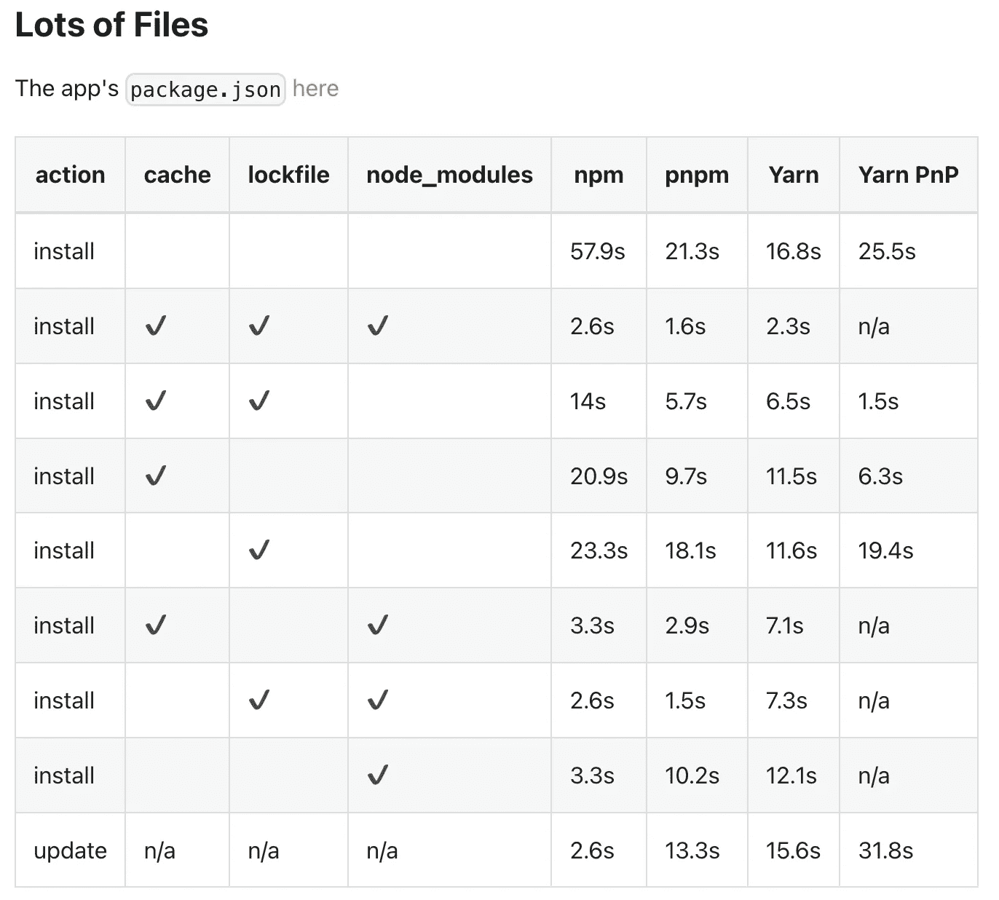

# 什么是 PNPM &为什么你应该作为一个前端开发人员尝试它

> 原文：<https://javascript.plainenglish.io/what-is-pnpm-why-you-should-try-it-as-a-frontend-developer-69a3a7b34f5b?source=collection_archive---------4----------------------->

## 认识 pnpm——NPM/yarn 的替代方案，了解它的优势、依赖性管理和用法。


Photo by [Gary Bendig](https://unsplash.com/@kris_ricepees?utm_source=medium&utm_medium=referral) on [Unsplash](https://unsplash.com?utm_source=medium&utm_medium=referral)

为什么要用 pnpm，它的学习点是什么？

# pnpm 是什么？

根据官方[文件](https://pnpm.io/)，

**Pnpm 是一个快速、节省磁盘空间的包管理器。**

# 优势

## 1.快的

以下是几种工具的对比:

可以看出，`pnpm`作为黄色部分，在大多数场景下，包安装的速度明显优于`npm/yarn`，速度会比`npm/yarn`快 2 倍。



我们来看看基准数据，主要对比`pnpm`和`yarn`:


总体来说，`pnpm`的包安装速度还是明显优于`yarn`。

## 2.有效利用磁盘空间

在内部，`pnpm`使用一个内容可寻址文件系统来存储磁盘上的所有文件。这个文件系统的优点是:

同一个包不会重复安装。使用`npm/yarn`时，如果 1000 个项目依赖`lodash`，那么`lodash`很可能安装 1000 次，这部分代码就写在磁盘的 1000 个地方。但是使用`pnpm`的时候只会安装一次，磁盘上只有一个地方可以写。再用的话就直接用`hardlink`了。

即使一个包有不同的版本，`pnpm`也大量重用了以前版本的代码。比如`lodash`有 1000 个文件，更新版本后还有一个文件，那么磁盘不会重写这 1001 个文件而是保留原来 1000 个文件的`hardlink`，只写新的。文档。

## 3.高度安全

之前使用`npm/yarn`时，由于`node_module`的扁平化结构，如果 A 依赖 B and B 依赖 C，那么 A 可以直接使用 C，但问题是 A 并没有将 C 声明为依赖。因此，出现了这种非法访问。但是`pnpm`脑洞非常大，创造了一套依赖管理方法，很好的解决了这个问题，保证了安全性。

# PNPM 依赖性管理

回想一下`npm/yarn`为什么要扁平化`node_modules.`难道不是因为相同的依赖项会被复制多次，而且路径太长？

不复制怎么办，比如通过链接？

首先我来介绍一下`link`，也就是软硬`link`。这是操作系统提供的机制。硬链接是同一文件的不同引用，而软链接是创建一个新文件，并且文件的内容指向另一个路径。当然，这两个链接在使用上是相似的。

如果不复制文件，只需将`npm`包的内容保存在全局存储库中，并链接其余的地方。

这样就不会浪费多份拷贝的磁盘空间，也不会出现路径过长的问题。因为路径太长的限制是目录层次不能太深的关键，所以现在它是每个位置的目录的链接，而不是同一个目录，所以没有长度限制。
没错，`pnpm`就是通过这个思路实现的。

然后删除 node_modules，再用`pnpm`重新安装，执行`pnpm` install。

你会发现上面印着这样一句话:

```
pnpm install
```


展开`.pnpm`看一看:


所有的依赖关系都在这里列出，从全局存储中硬连线，然后通过`softlinks`组织包到包的依赖关系。

例如，`.pnpm`下的快递，这些都是软链接，


也就是说，所有的依赖都是从全局存储到`node_modules/.pnpm`的硬链接，然后通过软链接相互依赖。

官方给出了示意图，大家一起看看就明白了:


# 使用

## pnpm 安装

## pnpm 更新

根据指定的范围将包更新到最新版本。

## pnpm 卸载

```
// Remove axios
npm install axios --filter package-a
```

## pnpm 链接

将本地项目链接到另一个项目。请注意，使用的是硬链接，而不是软链接

```
pnpm link ../../axios
```

可以看出`pnpm`虽然做了很多复杂的设计，但是用户是察觉不到的，使用起来非常友好。

# 最后

**感谢阅读。**我期待着您的关注和阅读更多高质量的文章。


[omgzui](https://medium.com/@omgzui?source=post_page-----69a3a7b34f5b--------------------------------)

## Java Script 语言

[View list](https://medium.com/@omgzui/list/javascript-48bfc7b5f93c?source=post_page-----69a3a7b34f5b--------------------------------)57 stories

[omgzui](https://medium.com/@omgzui?source=post_page-----69a3a7b34f5b--------------------------------)

## 更好的编程

[View list](https://medium.com/@omgzui/list/better-programing-9b4c9bb174aa?source=post_page-----69a3a7b34f5b--------------------------------)109 stories

*更多内容看* [***说白了。报名参加我们的***](https://plainenglish.io/) **[***免费周报***](http://newsletter.plainenglish.io/) *。关注我们关于* [***推特***](https://twitter.com/inPlainEngHQ)[***LinkedIn***](https://www.linkedin.com/company/inplainenglish/)*[***YouTube***](https://www.youtube.com/channel/UCtipWUghju290NWcn8jhyAw)*[***不和***](https://discord.gg/GtDtUAvyhW) *。*****