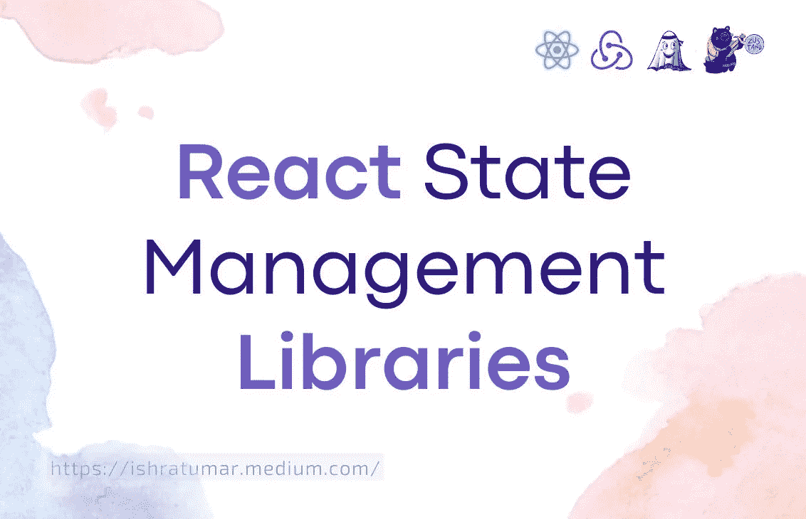
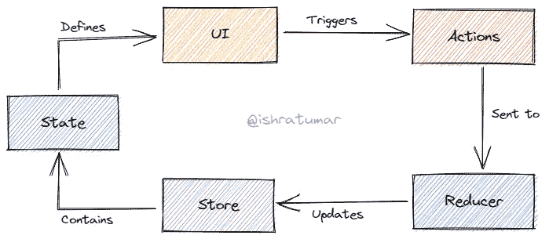
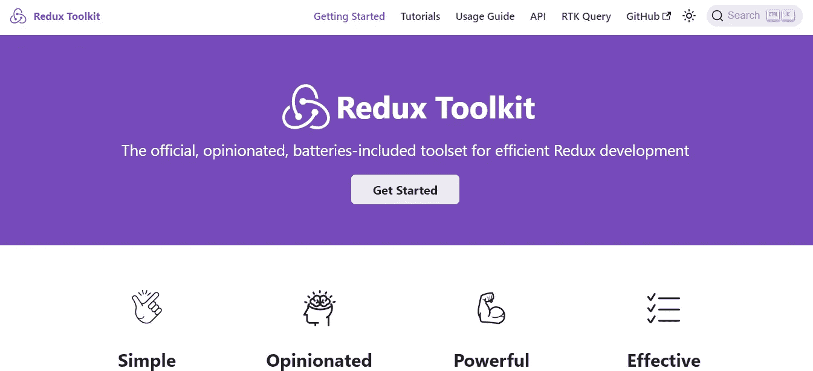
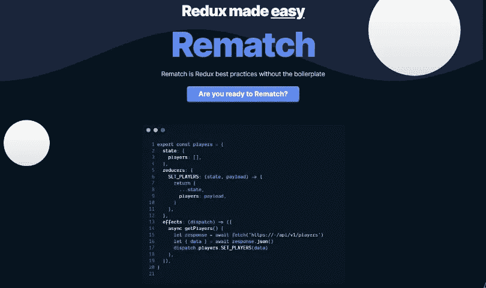
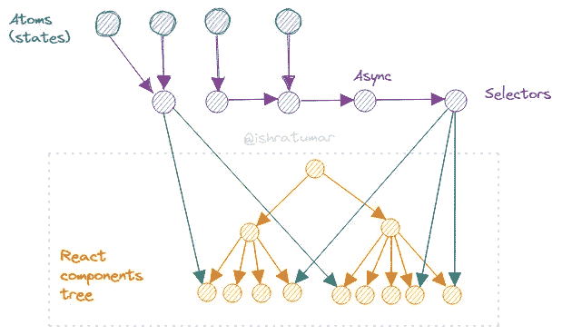
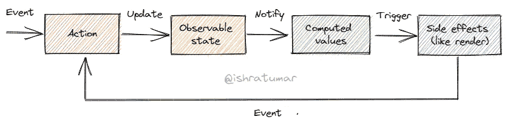

# 什么是反应状态管理？

> 原文：<https://javascript.plainenglish.io/what-is-react-state-management-1937c49de5c4?source=collection_archive---------6----------------------->

## 8 个超级有用的 React 状态管理库——了解你应该使用哪一个



React State Management Libraries

## 什么是反应状态管理？

React 组件有称为状态的内置对象。反应状态类似于 JavaScript 数据结构。组件使用状态来存储可重用资产。组件的状态可能会经常改变，这就要求组件在状态改变时重新呈现。谈到管理 React 状态，它不像使用简单的 React 挂钩(如 useState 或 useReducer)那样简单。


Photo by [Tim Mossholder](https://unsplash.com/@timmossholder?utm_source=medium&utm_medium=referral) on [Unsplash](https://unsplash.com?utm_source=medium&utm_medium=referral)

有大量的状态，也有大量的状态管理库可用，而且这个数量每天都在扩大。因此，最好的方法是选择一个最能满足你需求的，并了解它们，以防有更好的出现。

**一些最受欢迎的 RSM 库列表**

## **1。Redux**

在选择任何库之前，您应该知道您遇到了什么样的问题。不要因为有人告诉你就用。在使用它之前，做你的功课。不是所有的 app 都需要 Redux。当本地管理状态变得混乱时，应该使用 Redux。使用 Redux 需要你学习更多的概念，编写更多的代码。

请参见下图，了解 Redux 的工作原理:



Redux

Redux 的一些优势是它的社区支持、服务器端呈现、易于调试和状态持久化。您可以将 Redux 与 React 或任何其他库一起使用。包括依赖项在内，它只有 2 KB 重。

redux 开发人员之一 Dan Abramov 表示:

> 我想修改这一点:不要使用 Redux，直到你有香草反应的问题。

**链接⬇**

[](https://redux.js.org/) [## redux-JavaScript 应用程序的可预测状态容器。|还原

### JS Apps Redux 的可预测状态容器帮助您编写行为一致的应用程序，运行在不同的…

redux.js.org](https://redux.js.org/) 

## **2。Redux 工具包**

开发 redux 应用时，推荐使用 Redux 工具包。它使你的代码变得更好。Redux Toolkit 结合了我们建议的最佳实践，简化了大多数 Redux 任务，防止了常见错误，并使编写 Redux 应用程序变得更容易。

**安装:**

```
# NPM
npm install @reduxjs/toolkit
```

```
# Yarn
yarn add @reduxjs/toolkit
```

> 链接:[https//:redux-toolkit . js . org/](https://redux-toolkit.js.org/)



Redux Toolkit

## **3。复赛**

复赛是 Redux 的最佳做法。Switch 语句、thunks、操作类型和操作创建者已被删除。

作为 Redux 的替代品，Rematch 有很多很棒的功能。

Rematch 消除了样板文件，是轻量级的(小于 2 KB)，不需要配置，并且支持 TypeScript 和 React devtools。

此外，它支持 React Native，实施最佳实践，具有热重载，动态添加 reducers，允许您设置多个存储，可通过插件扩展，并且易于使用。



Rematch

**链接⬇**

[](https://rematchjs.org/) [## 复赛|复赛

### 自动智能感知与打字稿类固醇，自动完成一切，避免回归。在一个文件中，您可以…

rematchjs.org](https://rematchjs.org/) 

## **4。反冲**

反冲是一个由脸书开发的开源反应状态管理库。更类似于 React。在整个应用程序中，状态通过原子和选择器传递。这减少了不必要的重新渲染并提高了性能。反冲是一种先进的反应状态管理方法。

请参见下图，了解后坐力的工作原理:



Recoil

**链接⬇**

[](https://recoiljs.org/) [## 报应

### 一个 React 状态管理库。添加一些到…

recoiljs.org](https://recoiljs.org/) 

## **5。挂钩状态**

基于 React hook 的最小、最简洁、最快速的状态管理库。

**功能:**

*   灵活的 API
*   简单易学
*   难以置信的快
*   更好的性能
*   支持类型脚本
*   可通过插件扩展

**链接⬇**

 [## Hookstate:增压 React.useState hook | Hookstate

### 基于 React state hook Small core 的最简单、可扩展且速度惊人的状态管理…

hookstate.js.org](https://hookstate.js.org/) 

## **6。约泰**

Jotai 是一个极简但灵活的库，用于管理简单的 React 全局状态。

与反冲相比，Jotai 有许多特点。根据我对反冲和 Jotai 的了解，如果你从这两个库中选择一个，选择 Jotai。反冲有内存泄漏的问题。反冲的性能优于 Jotai，有更少的样板文件和更小的核心 API 等。

Jotai 的一些主要特性:

*   聚焦于打字稿
*   没有额外的重新渲染
*   没有动作
*   没有商店
*   没有减速器
*   没有调度员

> 如果你想了解更多，请阅读这篇文章并观看免费的课程。

**链接⬇**

[](https://jotai.org/) [## Jotai，React 的原始而灵活的状态管理

### Jotai 采用自下而上的方法，通过受反冲启发的原子模型来反应状态管理。一个人可以建立国家…

jotai.org](https://jotai.org/) 

## **7。祖斯坦德**

毫无疑问，Redux 是管理全局状态最流行的库。尽管如此，像 Zustand 这样的库管理全局状态更加实用和直接。

**功能:**

*   可扩展且快速
*   它不需要样板文件
*   与 Redux 相比，它没有那么复杂
*   更少的代码行
*   开发商对此反应积极

> 欲了解更多信息，请阅读本文[使用 Zustand 管理 React 状态](https://blog.logrocket.com/managing-react-state-zustand/)

[](https://docs.pmnd.rs/zustand/getting-started/introduction) [## Zustand 文档

### 一个小型、快速和可伸缩的 bearbones 状态管理解决方案。Zustand 有一个基于钩子的舒适的 api。它不是…

docs.pmnd.rs](https://docs.pmnd.rs/zustand/getting-started/introduction) 

## **8。MobX**

这是一个简单明了的状态管理库，应用了反应式函数编程。该库是轻量级的，只需编写最少的代码，并且没有样板文件。它提供了架构上的自由和毫不费力的最佳渲染。

请参见下图，以便更好地理解 MobX 的概念。



MobX

> 链接:【https://mobx.js.org 

## 包裹

非常感谢您的阅读。如果你觉得它有帮助，请鼓掌，分享，并留下评论让我知道。

如果您有兴趣阅读更多内容，请关注我，不要忘记订阅我的时事通讯，以便在您的收件箱中收到这些故事。

享受你的时间。快乐学习:)

> s**social:**[**Medium**](https://ishratumar.medium.com/)**|**[**Twitter**](https://twitter.com/ishratUmar18)**|**[**GitHub**](https://github.com/ishratUmar18/)**|**[**hash node**](https://hashnode.com/@ishratUmar18)**|**[**dev . to**](https://dev.to/ishratumar)

## *更多内容请看*[***plain English . io***](https://plainenglish.io/)*。*

## *报名参加我们的* [***免费周报***](http://newsletter.plainenglish.io/) *。关注我们上* [***推特***](https://twitter.com/inPlainEngHQ) ， [***领英***](https://www.linkedin.com/company/inplainenglish/) ***，***[***YouTube***](https://www.youtube.com/channel/UCtipWUghju290NWcn8jhyAw)***，以及****[***不和***](https://discord.gg/GtDtUAvyhW) *

## ****想看看你的软件启动规模*** *？检查* [***电路***](https://circuit.ooo/?utm=publication-post-cta) *。**