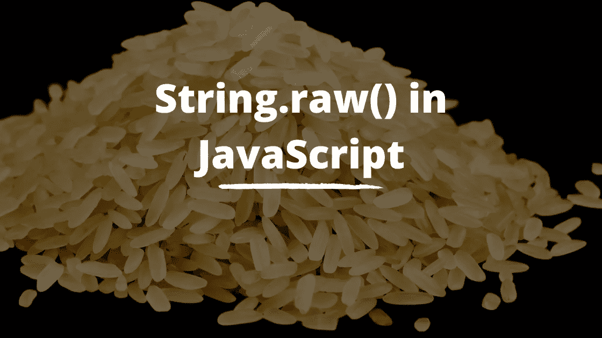

# JavaScript 中的 String.raw()是什么？

> 原文：<https://javascript.plainenglish.io/what-is-string-raw-in-javascript-6642add8b64?source=collection_archive---------0----------------------->

## 了解如何在 JavaScript 中使用原始字符串方法



本文的视频演示可以在这里找到:

## 介绍

我以前写过一篇关于 JavaScript 中模板文字的文章，可以在这里找到。在本文中，我将介绍 JavaScript 中的原始字符串。

有时当我们使用模板文字时，我们用它们来转换字符。让我们用一个例子来阐明这一点。

```
console.log(`Monday\nTuesday\nWednesday`);//Returns --->
Monday
Tuesday
Wednesday
```

在上面的例子中，我们控制台记录了一个模板文字或模板字符串，其中包含*星期一*、*星期二*和*星期三*，每个都用换行符分隔。运行时，每个单词都打印在新的一行上。

## String.raw()

JavaScript 为我们提供了 String.raw()标记函数，使我们能够从模板文本中访问原始字符串。这意味着我们能够访问不处理转义字符的字符串。让我们用这个来扩展上面的例子。

```
String.raw`Monday\nTuesday\nWednesday`;
//Returns ---> 'Monday\nTuesday\nWednesday'
```

在上面的例子中，我们使用 String.raw()方法，并将模板文本作为参数传递。我们得到的是没有经过换行符处理的相同字符串。

## 插入文字

当使用 raw 方法时，任何插入到字符串中的内容都将被处理。让我们来看一个例子。

```
console.log(`Sum: ${4+5}`);
//Returns ---> Sum: 9
```

在上面的控制台日志示例中，我们使用字符串插值对 4 和 5 求和。我们得到返回总和的字符串。现在让我们尝试用 raw 方法来做这件事。

```
String.raw`Sum: ${4+5}`;
//Returns ---> 'Sum: 9'
```

在上面的例子中，我们使用 raw 方法，并传入带有插值和的模板文本。我们得到返回的字符串和完整的和，因为我们传入的任何要插值的内容都会被方法处理。

## 统一码

原始字符串方法的另一个有用之处是使用 unicode 字符。

```
console.log(`\u2605`);
//Returns ---> ★
```

在上面的例子中，我们使用 Unicode 字符访问一个星号，并返回给我们。现在让我们在这个模板文字上使用 raw 方法。

```
String.raw`\u2605`;
//Returns ---> '\\u2605'
```

我们继续使用传入 Unicode 字符的 raw 方法。不做任何处理，我们得到的是返回的原始字符串。

我希望你喜欢这篇文章。请随时发表任何评论、问题或反馈，并关注我以获取更多内容！

如果你有兴趣了解更多关于 ES6 的知识，我在这里有一个 Udemy 课程。

*更多内容请看*[***plain English . io***](https://plainenglish.io/)*。报名参加我们的* [***免费周报***](http://newsletter.plainenglish.io/) *。关注我们关于*[***Twitter***](https://twitter.com/inPlainEngHQ)*和*[***LinkedIn***](https://www.linkedin.com/company/inplainenglish/)*。查看我们的* [***社区不和谐***](https://discord.gg/GtDtUAvyhW) *加入我们的* [***人才集体***](https://inplainenglish.pallet.com/talent/welcome) *。*