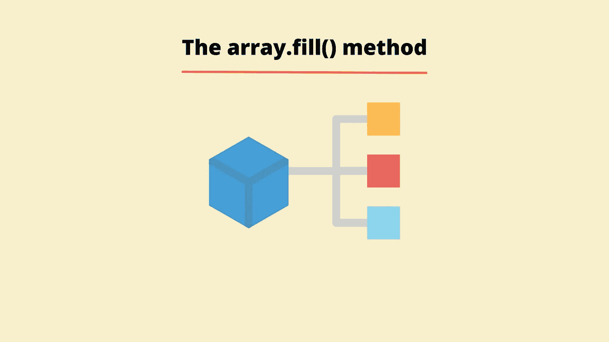

# 面向初学者的 array.fill()方法介绍

> 原文：<https://javascript.plainenglish.io/what-is-the-array-fill-method-in-javascript-873f3a2a0b11?source=collection_archive---------13----------------------->

## 学习 JavaScript 方法 array.fill()

array.fill()方法是什么？这是一种允许我们用静态值填充数组中特定元素的方法。



fill()方法允许我们用静态值填充数组的特定元素。该方法可以接受三个参数:

*   要填充数组的值。
*   起始索引(这是可选的，默认为 0)。
*   停止索引(这是可选的，默认为数组长度)。

该方法的返回值是带有填充值的变异(更改)数组。所以，澄清一下，这个方法确实改变了原始数组，当你使用这个方法时，有必要弄清楚这一点。让我们看一些例子。

```
const seasons = ["Spring", "Winter"];seasons.fill();//Returns ---> (2) [undefined, undefined]console.log(seasons);//Returns ---> (2) [undefined, undefined]
```

在上面的例子中，我们首先声明一个名为 *seasons* 的变量，然后我们给这个变量分配一个包含两个字符串元素 *Spring* 和 *Winter* 的数组。接下来，我们调用 seasons 数组上的 *fill* 方法，但是我们不向该方法传递任何参数。

返回值是一个数组，其中两个元素都是未定义的。如前所述，这个方法返回变异的数组，所以当我们控制台注销季节数组时，我们得到一个包含两个元素的数组，这两个元素都是未定义的。这是因为我们没有向该方法传递任何参数。

让我们看另一个例子，但是这次我们将传递一些参数给方法调用。

```
console.log(seasons);//Returns ---> (2) [undefined, undefined]seasons.fill("Winter");//Returns ---> (2)  ['Winter', 'Winter']console.log(seasons);
//Returns ---> ['Winter', 'Winter']
```

在上面的例子中，我们从包含两个元素的季节数组开始，*未定义的*和*未定义的*。这次我们使用 fill 方法并传入字符串 *Winter* 。我们不传入任何开始索引或停止索引。当我们调用该方法时，我们得到一个数组，其中两个元素现在都是 *Winter* 。如果我们只想改变其中一个元素呢？

让我们看另一个例子，但这次我们将传入一个开始索引。

```
console.log(seasons);
//Returns ---> ['Winter', 'Winter']seasons.fill("Spring", 1);
//Returns ---> ['Winter', 'Spring']console.log(seasons);
//Returns ---> ['Winter', 'Spring']
```

通过传入元素 *Spring* 但起始索引为 1，在上面的例子中，我们只用字符串 *Spring* 填充索引为 1 的元素。如果数组中有更多的元素， *Spring* 将被填充所有剩余的元素，直到数组结束。

## 非原始类型的数组呢？

当我们将一个对象传递给填充方法参数时，数组将被对该对象的引用填充。这意味着如果你改变一个元素，所有的元素都会改变。

当我们处理较大的数据集合时，从数据的角度来看，不将所有数据存储在变量本身中会更有效。相反，JavaScript 存储对数据集合(数组或对象)的引用。这与我们使用原始类型数据时相反，在原始类型数据中，数据本身将存储在变量中。对数据集合的引用实质上是数据在存储器中存储位置的地址。最终，这意味着如果这些元素中的一个被改变，那么所有的元素都将被更新。让我们看一个例子。

```
let arrayOfObjects = [{}, {}, {}];
arrayOfObjects.fill({person: "Bob"});//Returns ---> [{person: 'Bob'}, {person: 'Bob'}, {person: 'Bob'}]console.log(arrayOfObjects);//Returns ---> [{person: 'Bob'}, {person: 'Bob'}, {person: 'Bob'}]
```

在上面的例子中，我们首先声明一个名为 *arrayOfObjects* 的变量，我们给它分配一个包含三个空对象的数组。使用 fill 方法，我们用一个包含属性 *person* 的对象填充这些元素，其值为字符串 *Bob* 。让我们更新 *arrayOfObjects* 数组的第一个元素，这样 person 属性的值就是 *Santa* 。

```
arrayOfObjects[0].person = "Santa";//Returns ---> 'Santa'console.log(arrayOfObjects);//Returns ---> [{person: 'Santa'}, {person: 'Santa'}, {person: 'Santa'}]
```

当我们这样做时，数组中的每个元素也被更新了，这就是我们所说的所有元素都将被改变的意思。

我希望你喜欢这篇文章，请随时发表任何意见，问题或反馈，并关注我的更多内容！

*更多内容看* [***说白了。报名参加我们的***](http://plainenglish.io/) **[***免费周报***](http://newsletter.plainenglish.io/) *。在我们的* [***社区不和谐***](https://discord.gg/GtDtUAvyhW) *获得独家获取写作机会和建议。***