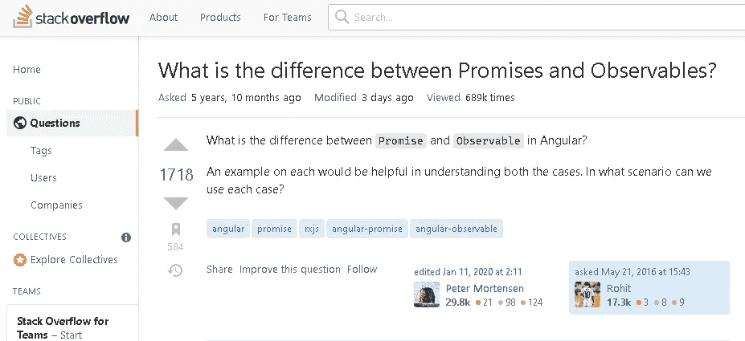

# 承诺和可观察的区别是什么？

> 原文：<https://javascript.plainenglish.io/what-is-the-difference-between-a-promise-and-observable-5ec45f857abb?source=collection_archive---------1----------------------->

## 粉刺-对像我这样的傻瓜的简单解释。


Photo by [Karsten Winegeart](https://unsplash.com/@karsten116?utm_source=medium&utm_medium=referral) on [Unsplash](https://unsplash.com?utm_source=medium&utm_medium=referral)

## 搞定这一点，你就能作为一名棱角分明的开发者实现能力的飞跃。

一个[承诺](https://developer.mozilla.org/en-US/docs/Web/JavaScript/Reference/Global_Objects/Promise)和一个[可观察到的](https://rxjs.dev/guide/observable)有什么区别？

你如何在不把你的思想弯曲成椒盐卷饼结的情况下掌握两者的区别？

就像你脸上的鼻子一样简单明了？


**顺便问一下，你知道吗，你不是唯一一个对承诺和可观察性有疑问的人？**

我最近注意到 StackOverflow 上有一个问题已经收到了成千上万人的投票，他们想知道承诺和可观察之间的区别。



有趣吧。

反应式和异步编程有办法绊倒我们开发人员，让我们趴在地上——至少我是这样。我已经犯了很多错误，并且看着其他开发人员做出错误的假设，这些错误和假设后来反过来狠狠的咬了我们一口。

😬 😬 😬


更不用说异步编程和反应式编程的混淆了。

是的，伙计，你不是唯一一个在这个充满观察和承诺的新世界里四处游荡并感到困惑的人。

# 它从一个故事开始…

不久前，我申请成为 GDE (Google 开发者专家)。

加入 GDE 项目从来都不是我真正梦想要做的事情，但在与另一位 GDE 通过电子邮件交谈后，我想为什么不试试呢——所以我申请了。

在我的申请被接受后，我必须通过两次面试才能被 GDE 录取。

1.  社区访谈
2.  技术面试

有人告诉我社区面试会很简单。换句话说，这不是一个技术性的讨论，而是一个关于我是否适合的讨论。所以我应该坐下来放松一下，因为这不会是一件困难的事情，或者我被告知如此。

“*听起来还不错*，我想。我想我可以在技术面试前复习一下，然后顺利通过。

男孩哦男孩。我错了吗！

在我们预定的面试中，我们首先开始聊我对 Angular 社区的贡献等，以及我为什么申请这样的闲聊。

我很有信心我正在粉碎它…

直到。

面试官。

求婚了。

"*对于新手来说，你如何解释承诺和可观察到的东西之间的区别？*

我眨了眨眼。

“呃……”

“嗯……嗯……”

“呃……”

“我想我从来没有被问过这个问题。让我想想……嗯……”

男孩，哦男孩。我完蛋了。


我设法磕磕绊绊地回答了这个问题，就像一个摇摇晃晃的醉汉在凌晨 2 点试图找到回家的路，但我非常肯定，我成为 GDE 的机会被撕碎了。当然，我可以在将来的某个时候再次申请。

但是现在，为什么不专注于学习承诺和可观察到的区别呢？😆

所以，首先要做的是。

# 什么是承诺？

> 承诺是代表异步操作最终成功或失败的对象。以及它的返回值。

你有没有注意到计算机编程是如何从普通语言中借用大量术语的？

在这种情况下，我们使用的是单词 *promise* ，在普通英语中的意思是*，根据词典[的解释，宣布某事将会或不会被做](https://www.dictionary.com/browse/promise)*。

当我们在 JavaScript 中谈论承诺时，我们谈论的是已经承诺的异步操作。这意味着 JavaScript 承诺是一个承诺的操作，它有各种状态，比如…

JavaScript Promise 是 JavaScript 中异步编程的支柱。它允许我们将异步任务作为*承诺*进行排队，并在等待承诺完成时处理其他事情。

# 什么是可观测的？

但是可观察的呢？

根据 RxJS 文档，可观测值是…

> *一个消费者的表现形式。一种类型，每种类型的通知可能有一些(或全部)处理程序:next、error 和 complete。拥有所有这三种类型的处理程序通常被称为“观察者”，如果它缺少任何一个通知处理程序，则可以被称为“部分观察者”。*

等等，什么？我很困惑。


回到字典，我们会注意到 [observable](https://www.dictionary.com/browse/observable) 这个词的意思是*能够或者容易被观察到；引人注目；可见；可辨。*

哼。😔 😔 😔

可观察的这个词来自观察这个词。

*观察:看到、观察、察觉或注意到。*

有意思。

首先，可观察到的和承诺不是一回事。它们是两种不同的动物。


让我看看我能否用简单的术语来解释这个问题，而不会把我们的大脑扭曲成椒盐卷饼结。

**可观察对象是订阅事件发射器并在每次新事件发出时触发的侦听器。**

换句话说，一个可观察对象观察你告诉它的任何东西，然后在满足特定条件时触发。

就像这个例子——我们*观察*对特定按钮的点击，然后登录到控制台。

```
var button = document.querySelector('button'); Rx.Observable.fromEvent(button, 'click').subscribe(() => console.log('Button clicked'));
```

有道理吗巴斯特？

可观察的事物和承诺真的没有那么复杂——如果你听了像我这样的伟大老师的话。😜

这就引出了本文中最重要的问题。

# 可观察到的和承诺的区别是什么？

想象一下，你赢得了一张世界最佳角度会议的门票。

你收拾好行李，跳上飞机，前往会议地点。当你出现在第一次演讲时，你发现 Angular 的父亲[miko he very](http://misko.hevery.com)本人正在做第一次演讲。

那你怎么办？

*   进来一会儿，只听他说一句话就走？
*   还是你会坐下来“观察”他说的和展示的一切？

显然，如果你像我一样，你会选择后者，对吗？

换句话说，如果你像一个 JavaScript 承诺，你会突然出现，抓住一个单词，然后“完成”或离开。

但是，既然你在 Angular 会议上投入了很多，你就要表现得像一个可观察的人，观察 miko he very 说的每一句话*。*

你正坐在那里听着，突然你的电话响了。你低头看着它，完全昏迷了 36 秒，直到你突然想起棱角之父在说话，你最好集中注意力。

你刚刚做了什么？

你退订了他的演讲。但是一旦你意识到你已经被你的手机分散了注意力，你就把它收起来，现在你表现得像一个“好”的观察者。

但是让我们更进一步。可观察到的和承诺之间还有哪些区别？

一个承诺是热切的。一旦你定义了它，里面的函数就会开始运行。

一个可观察的是懒惰的。在你订阅它之前什么都不会发生，然后每次一个观察者订阅就会发生一些事情(热可观察)。即使我们为我们的可观测量定义了相同的值，并承诺每个块的输出将是不同的，因为它们是在不同的时间执行的！

这是一个非常简单的现代概念:可观测性就是它听起来的样子。只能解决一次。承诺要灵活得多。您可以多次调用其。then()函数来检查您的承诺是否已经兑现，然后在以后的任务处理中使用这个结果。

当您编写 JavaScript 时，考虑进行异步调用时会发生什么是很重要的。换句话说，你会得到一个结果还是多个结果？你能取消这个电话吗？

答案是承诺处理一次性事件和数据流，而可观察对象处理随着时间推移会产生大量值的异步事件。简而言之:承诺是针对只发生一次的事件。可观察性用于在一段时间内多次处理事件(或者根本不处理事件)。

当然，一个可观察对象有如此多的其他特征，以至于一个承诺没有像转换和过滤操作符，等等…

# 我应该使用哪一个？

当您有一个异步事件要观察时，使用承诺。如果你在未来有多个可能发生也可能不发生的事件，使用一个可观察的。

Observables 有助于并发性，以及处理来自鼠标点击或计时器事件的事件。承诺一次处理一件事，这意味着它们更适合处理你想确保某件事只发生一次的情况。

承诺适用于一次性事件，可观察性适用于数据流。

# 退订时间？还是通话完毕？

所以总结一下…

请记住，承诺和可观察之间的显著区别是，可观察可以随着时间的推移订阅多个值，而承诺只能发出一个值。

你更喜欢用哪一个——可观察到的还是承诺？请在评论中告诉我。

如果你觉得这篇文章有用，请击碎它👏 👏 👏按钮！💥

**关注我:** [GitHub](https://github.com/dkreider) ，[传媒](https://dkreider.medium.com/)，[个人博客](https://danielk.tech/)


*最初发布于*[*https://danielk . tech*](https://danielk.tech/home/difference-between-a-promise-and-observable)*。*

*更多内容请看* [***说白了就是***](https://plainenglish.io/) *。报名参加我们的* [***免费每周简讯***](http://newsletter.plainenglish.io/) *。关注我们*[***Twitter***](https://twitter.com/inPlainEngHQ)*和*[***LinkedIn***](https://www.linkedin.com/company/inplainenglish/)*。加入我们的* [***社区不和谐***](https://discord.gg/GtDtUAvyhW) *。*