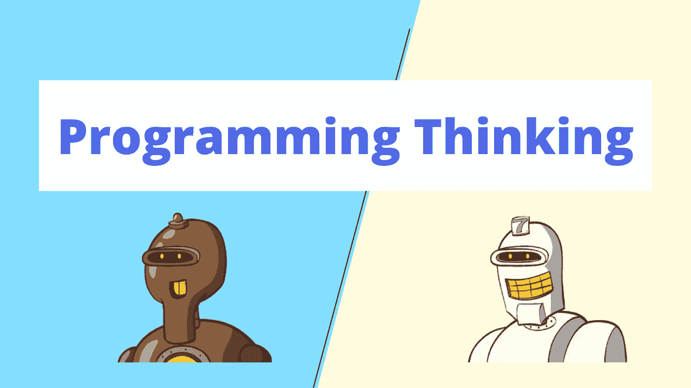
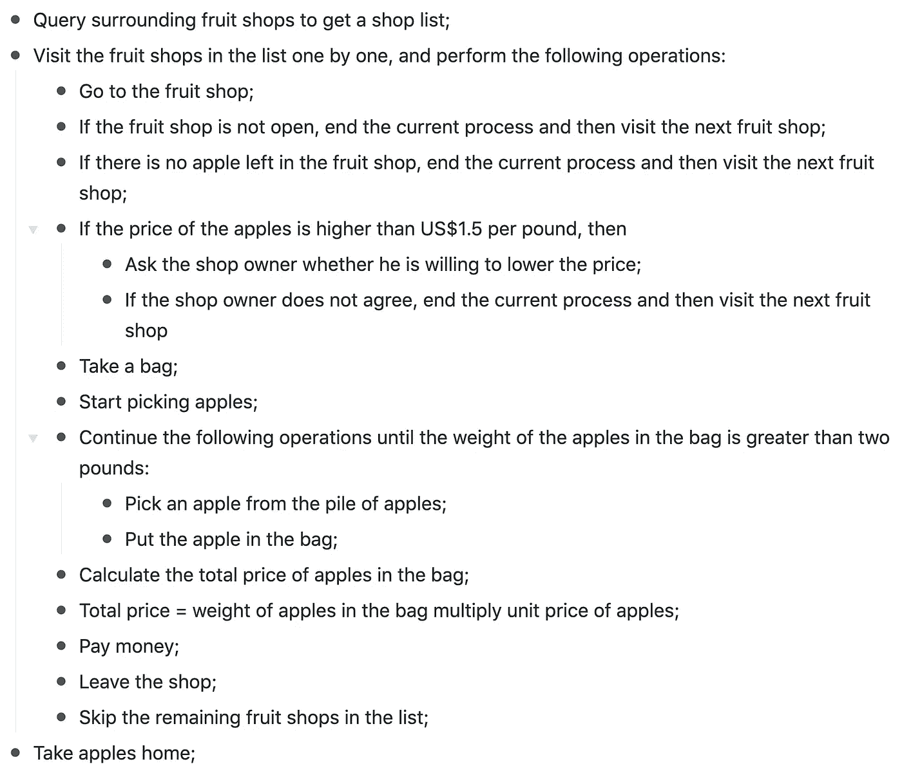

# 程序员和正常人的思维模式有什么区别？

> 原文：<https://javascript.plainenglish.io/what-is-the-difference-in-thinking-model-between-programmers-and-normal-persons-8ff8e2e9e94b?source=collection_archive---------16----------------------->

## 有趣的对比。

最近，我的一个朋友找到了我。他跟我说他想学编程，但是不知道自己适不适合这个职业。所以他问了我一个问题:程序员和正常人在思维模式上有区别吗？

我知道他之前没学过编程，向没有编码经验的人介绍编程思维是相当困难的。嗯，想了一会，打算换个方式解释一下问题。

我问他:如果你现在要买两斤苹果，你会怎么做？

他说:直接去水果店买。

我说:如果要程序化的表达买苹果的过程，可能是这样的。

首先，我们必须明确我们的需求，例如:

*   我打算买大约两磅苹果
*   我能接受的价格是每磅低于 1.5 美元

然后我们可以设计以下流程:

程序员需要严谨准确地考虑问题。

*   在上面的过程中，我们需要记录周围的水果店，所以需要用**定义变量** `friutShops`。
*   我们需要依次拜访不同的水果店，这叫做**遍历**。
*   然后需要判断边界条件，比如水果店不开怎么办？苹果的价格超出我的预期怎么办？
*   当我们摘苹果时，我们需要不断地把苹果放在袋子里，直到它超过两磅。这叫做**循环**。

这些是程序员考虑问题时最基本的步骤。

如果我们用伪代码来表示这个过程，可能是这样的:

听了我的描述，朋友说:嗯，你解释的不错，看起来很简单。

然后，我接着说:过程真的不复杂，但是在真正的开发中，我们要考虑很多东西。举个例子，在上面的案例中，只要我们发现一家苹果价格低于每磅 1.5 美元的商店，我们就会立即购买苹果。但是如果现在我们想找苹果价格最低的水果店。我们做什么呢

朋友说:太简单了。去每一家水果店询问价格。然后就可以找到价格最低的水果店了。

我说:但是我们很懒，不想走太多路。现在我们身边有 10 家水果店，分布在不同的位置。如果我们想在遍历这 10 家水果店的时候尽量少走，如何安排访问的顺序，使总路径最小化？

想了很久，朋友回答:嗯，这个问题听起来很复杂，我不知道。

我说:没事。这其实是编程中一个经典的算法问题。你一时半会儿想不到答案很正常。当程序员写代码时，他不仅要正确地解决问题，还要尽可能高效地解决问题。在开发过程中，我们正在逐一解决类似的问题。

然后我继续:而且我们在选择苹果的时候，都希望买更大更红的苹果。现在你需要从苹果堆中选择 N 个苹果。你需要确保它们是最好的苹果，并且它们的质量总和刚刚超过 2 磅。你如何选择？

朋友:嗯，还是有点难。

我说:有的人会先把苹果堆按照质量排序，然后选出最好的苹果，但是苹果堆怎么快速排序又是另外一个问题。

朋友:好了，别说了，脑子有点晕。看来我还是不适合做程序员。

我说:哈哈，没事。我有点饿了。让我们先买些苹果。^_^^_^