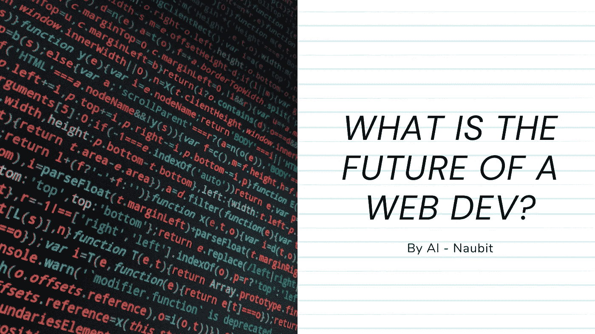

# 一个网页开发者的未来是怎样的？你的命运是什么？

> 原文：<https://javascript.plainenglish.io/what-is-the-future-of-a-web-dev-what-is-your-destiny-c136cbf8c9f6?source=collection_archive---------2----------------------->

## 我知道，你可能想知道我在说什么，什么关于未来的废话。但是让我解释一下。

在互联网文化中，至少在 web 开发文化中，有一种关于 Javascript 框架的迷因。

我们每周都有新的框架出现。我们也有公司要求**有 2 年、3 年或更多年的工作经验**(*wtf*)。

但这不是这里的问题。

**问题是没有标准。**

或者，至少，*不够*。

当然，你可以使用 Angular 并为项目设计一个模式。但是**让我们关注一下典型前端开发人员生活中使用最多的技术**。让我给你一个需要知道的事情的清单:

*   React.js
*   Typescript ( *显然是*)
*   Next.js ( *并且您应该开始检查 Next.js 13* 中的以下更改
*   顺风
*   一个 UI 工具包会很棒；也许查克拉 UI，梅伊，曼特尼…
*   一些测试系统，比如 Cypress

现在，有了这些，你就有了基础。你甚至可以只使用 Tailwind 而不使用 UI 工具包。

但是，学习更多的选择是有好处的。对于 React，您也想探索 Vue。对于 Next.js，你可以探索 **Remix.js** 。对于 Tailwind，您可以使用 CSS 模块，或者集成 Tailwind 元素，像使用 UI 工具包一样使用 Tailwind。对于 UI 套件，**你有几十个选择**，在它们里面，有不同的主题和基于它们的**子库**。诸如此类。

我不会说替代方案不充分。我喜欢每个周末测试新技术。所以用不同的方法来达到同样的效果是没有坏处的，比如使用 Tailwind 类，UI 工具包组件，或者 CSS 模块中的普通 CSS。

对于一个有几年经验的前端开发者来说，这是一件很酷的事情。

但是新人和新人会对所有的选择感到不知所措。当他们开始探索一个并决定转向另一个时，他们需要学习一种不同的模式来发展。

让我们不要谈论每一个 NPM 图书馆的不同发展。

我喜欢选择。但是我不认为解决问题的方法是创建一个新的库。至少不总是这样。也许你可以参与其中一个开源项目，并在那里实现那些解决方案。

但是我有兴趣听听你，读者，和我的开发者伙伴们的意见。你对框架和库的当前和未来状态有什么看法？

*更多内容请看*[***plain English . io***](https://plainenglish.io/)*。报名参加我们的* [***免费周报***](http://newsletter.plainenglish.io/) *。关注我们关于*[***Twitter***](https://twitter.com/inPlainEngHQ)[***LinkedIn***](https://www.linkedin.com/company/inplainenglish/)*[***YouTube***](https://www.youtube.com/channel/UCtipWUghju290NWcn8jhyAw)*[***不和***](https://discord.gg/GtDtUAvyhW) *。对增长黑客感兴趣？检查* [***电路***](https://circuit.ooo/) *。***