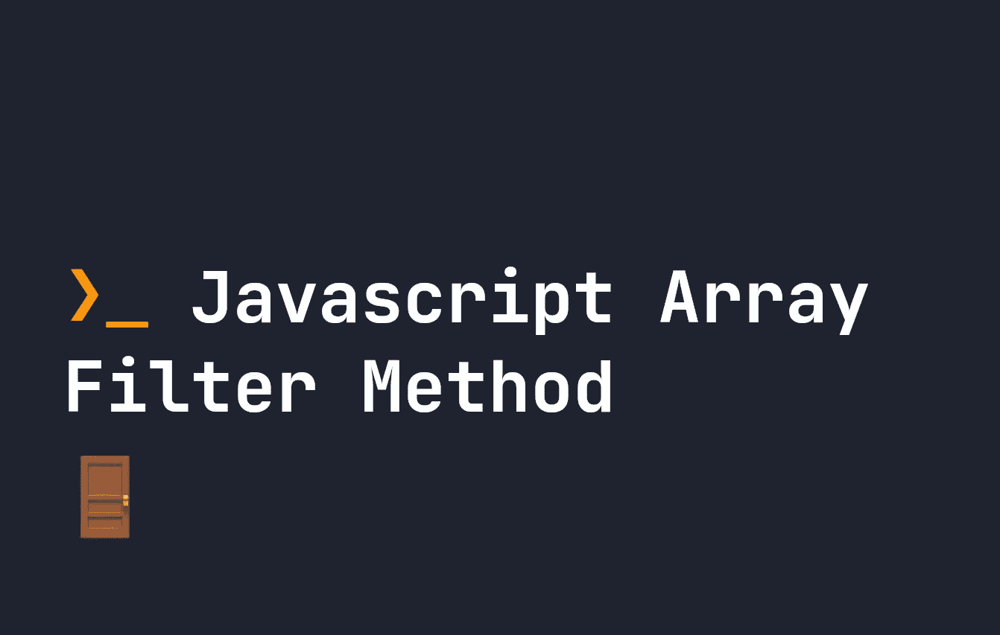

# JavaScript Array.filter()方法是什么？

> 原文：<https://javascript.plainenglish.io/what-is-the-javascript-array-filter-method-13800c2f6488?source=collection_archive---------12----------------------->

## filter()方法用于过滤一个数组并返回该数组的一个子集。下面是 filter()方法的工作原理。



JavaScript 中的 filter 方法创建了一个数组的浅层副本，并根据许多条件对其进行过滤。它接受回调函数。`filter`产生的数组通常是原始数组的缩小版。下面是一个基本的例子:

```
let myArray = [ '⚡️', '🔎', '🔑', '🔩' ];
let filteredArray = myArray.filter((element) => {
    return (element == '🔑' || element == '🔩'))
});console.log(filteredArray); // [ '🔑', '🔩' ]
```

如您所见，如果元素返回`true`，filter 方法将允许该元素位于新的过滤后的数组中。它有效地遍历每个元素，并对其运行测试，以查看应该留下什么。由于 arrow 函数在一行中隐式返回 true，您可能会看到如下代码的简化版本:

```
let myArray = [ '⚡️', '🔎', '🔑', '🔩' ];
let filteredArray = myArray.filter(element => element == '🔑' || element == '🔩');console.log(filteredArray); // [ '🔑', '🔩' ]
```

# filter 方法回调函数

如上所述，`filter`接受回调函数。回调函数由 3 个参数组成:

```
Array.filter((element, index, array) => {
    // Filter the array
});
```

让我们来看看它们各自的功能

# 元素

这是`filter`正在检查的当前元素。`filter`遍历数组中的每一项，测试它是否应该存在于新的过滤后的数组中。

# 指数

这是我们正在处理的数组项的从零开始的索引。例如，如果我们正在查看数组中的第一个元素，这将是`0`。

# 排列

这是整个数组，如果你想对原始数组做些什么的话。

# 在筛选方法中改变数组

因为 filter 使用了回调函数，所以有可能改变我们正在检查的原始数组。例如，我们可以在每次筛选一个项目时，将新项目推送到数组中:

```
let myArray = [ '⚡️', '🔎', '🔑', '🔩' ];
let filteredArray = myArray.filter((element) => {
    myArray.push('⚡️');
    return true;
});console.log(filteredArray); // [ '⚡️', '🔎', '🔑', '🔩' ]
```

您可能已经意识到，这将产生一个无限循环。幸运的是，就像在 [reduce](https://fjolt.com/article/javascript-reduce) 中一样，Javascript 不允许这种情况发生——相反，以这种方式添加到数组中的任何新元素都会被忽略。然而，现有元素的突变完全没问题:

```
let myArray = [ '⚡️', '🔎', '🔑', '🔩' ];
let filteredArray = myArray.filter((element, index) => {
    myArray[index + 1] = '⚡️';
    return (element == '⚡️');
});console.log(filteredArray); // [ '⚡️', '⚡️', '⚡️', '⚡️' ]
```

# 过滤对象数组

过滤对象数组遵循与数组相同的约定。我们可以使用`.`符号过滤数组中对象的子属性。例如，如果我想通过`age`过滤下面的数组，其中年龄应该是> 18，我会这样做:

```
let myArray = [ { age: 4 }, { age: 12 }, { age: 19 }, { age: 21 } ];
let filteredArray = myArray.filter((element, index) => {
    return (element.age > 18);
});
console.log(filteredArray); // [ { age: 19 }, { age: 21 } ]
```

# 按搜索标准过滤数组

`filter`的一个常见用途是获取一个值数组，并基于一个搜索词对它们进行搜索。这可以用`includes`或`regex`来完成。例如:

```
let myArray = [ 'cat', 'catdog', 'dog', 'fish', 'fishcat' ]
let filteredArray = myArray.filter((element, index) => {
    return element.match(/cat/)
});
console.log(filteredArray); // ['cat', 'catdog', 'fishcat']
```

# Filter 生成数组的浅层副本

虽然看起来`filter`制作了原始数组的新副本，但事实并非如此。事实上，`filter`对原始数组做了一个**浅拷贝**，这意味着如果我们改变数组中的对象，原始数组也会改变。为了理解这一点，让我们再次看看我们的年龄例子:

```
let myArray = [ { age: 4 }, { age: 12 }, { age: 19 }, { age: 21 } ];
let filteredArray = myArray.filter((element, index) => {
    return (element.age > 18);
});console.log(filteredArray); // [ { age: 19 }, { age: 21 } ]filteredArray[0].age = 50;
filteredArray[1] = { age: 40 };console.log(filteredArray); // [ { age: 50 }, { age: 40 } ]
console.log(myArray); // [ { age: 4 }, { age: 12 }, { age: 50 }, { age: 21 } ]
```

如您所见，使用`filteredArray[0].age`符号修改过滤后的数组也会修改原始数组——但是**等一下**！`filteredArray[1] = { age: 40 }`只改变过滤后的数组。这是因为尽管 Javascript 将`.`符号解释为更新两个数组，但它将方括号符号`[]`解释为在过滤后的数组的第二个位置设置一个新值。

这只是 Javascript 的另一个怪癖，可能会令人困惑，但知道它非常有用！

# 结论

filter 方法被广泛使用，并且是一种基于特定标准更改和创建新数组子集的简单方法。需要注意的是，只有原始数组的浅层副本，所以以某些方式修改数组会影响原始数组。

*更多内容看* [***说白了。报名参加我们的***](https://plainenglish.io/) **[***免费周报***](http://newsletter.plainenglish.io/) *。关注我们上* [***推特***](https://twitter.com/inPlainEngHQ) ， [***领英***](https://www.linkedin.com/company/inplainenglish/) ***，***[***YouTube***](https://www.youtube.com/channel/UCtipWUghju290NWcn8jhyAw)***，以及****[***不和***](https://discord.gg/GtDtUAvyhW)*** *对成长黑客感兴趣？检查出* [***电路***](https://circuit.ooo/) ***。***