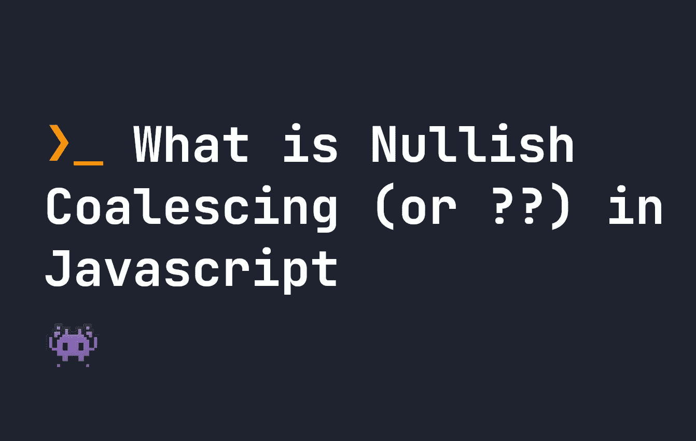

# 什么是零聚合(或？？JavaScript 中的)运算符

> 原文：<https://javascript.plainenglish.io/what-is-the-nullish-coalescing-or-operator-in-javascript-465419a44269?source=collection_archive---------12----------------------->

## 在 Javascript 中，nullish 合并运算符，或？?'运算符可用于定义默认值。让我们看看它是如何工作的。



在 Javascript 中，每当左侧为`null`或`undefined`时，nullish 合并操作符或`??`操作符用于返回右侧。为了更好地理解，我们来看几个例子:

```
// Is set to 0
let x = 0 ?? "hello";// Is set to goodbye
let y = undefined ?? "goodbye";// Is set to hello
let z = null ?? "hello";// Is set to false
let a = false ?? "goodbye";
```

**nullish 合并**操作符在某些情况下很有用，可以作为`null`或`undefined`返回，帮助我们精简代码。例如，在某些情况下返回 undefined 的函数可以提供一个默认的**值:**

```
let myFunction = (a) => {
    if(a >= 5) {
        return "hello world";
    }
}// Will return "goodbye world", since `myFunction(4)` returns undefined.
let runFunction = myFunction(4) ?? "goodbye world";
```

# 逻辑或运算符之间的区别

过去，我们通常使用逻辑运算符**或** ( `||`)在 Javascript 中设置默认的值。它具有相同的功能，如果左边的第一个值不满足特定的标准，它就会设置一个值。然而，如果左边的值是任何值 **falsy** ，那么`||`操作符将返回右边的值，并且有很多 **falsy** 值，如下表所示。

# 虚伪的价值观

*   `false`
*   `0`或`-0`或`0n`
*   任何空字符串，即`""`
*   `null`
*   `undefined`
*   `NaN`

**就像**一样，使用`||`操作符意味着如果一个函数返回值`0`，而我们确实想使用`0`值，我们将无法使用——因为`0`是 falsy。使用无效合并运算符(`??`)，`0`是一个有效值，因为它仅在值为`null`或`undefined`时触发:

```
// Is set to 0
let x = 0 ?? 5;// Is set to 5
let y = 0 || 5;
```

类似地，如果一个字符串是空的，`||`操作符将默认位于右边——这并不总是我们想要的行为。操作符让我们避免了这种情况:

```
// Is set to ""
let x = "" ?? "default text";// Is set to "default text"
let x = "" || "default text";
```

# 链接零化合并运算符

还可以链接 nullish 合并运算符，如下所示:

```
// Is set to "default text"
let x = null ?? undefined ?? "default text";
```

但是不能用逻辑运算符`||`将它链接起来，除非用括号:

```
// Errors out:
let x = 0 || undefined ?? "default text";// Returns "default text";
let y = (0 || undefined) ?? "default text";
```

这就是了。感谢您的阅读。

*更多内容尽在* [***说白了. io***](https://plainenglish.io/) *。报名参加我们的* [***免费周报***](http://newsletter.plainenglish.io/) *。关注我们关于* [***推特***](https://twitter.com/inPlainEngHQ)**和*[***LinkedIn***](https://www.linkedin.com/company/inplainenglish/)*。查看我们的* [***社区不和谐***](https://discord.gg/GtDtUAvyhW) *加入我们的* [***人才集体***](https://inplainenglish.pallet.com/talent/welcome) *。**