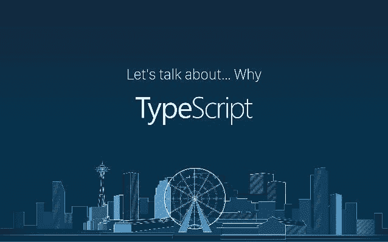
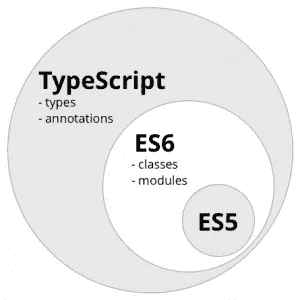
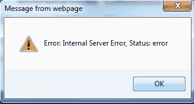

# 什么是 TypeScript，为什么要使用它？

> 原文：<https://javascript.plainenglish.io/what-is-typescript-and-why-should-you-use-it-bb16d0c1ac77?source=collection_archive---------6----------------------->

## TypeScript 是 JavaScript 的超集，主要提供可选的静态类型、类和接口。



[*TypeScript*](http://www.typescriptlang.org/) *是 JavaScript 的超集，主要提供可选的静态类型、类和接口。最大的好处之一是使 ide 能够提供一个更丰富的环境，在您键入代码时发现常见的错误。*

任何工具都可能是好的，这取决于你的团队、当前项目、客户团队等。好吧，但为什么是打字稿？因为它可以帮助你的项目或你的团队。让我们来看看它的核心特性，并了解它如何帮助您。

# TL；吉斯特博士

TypeScript—JavaScript 的超集，符合最新的 ECMAScript 标准，并向下编译为符合其中一个 es 标准的 JavaScript。

它提供:

1.  **支持现代 JavaScript 特性**
2.  **高级类型系统**
3.  **增强的开发人员工具支持**
4.  **严格的空值检查**
5.  **与 JavaScript 的互操作性**

关于采用和流行的一些事实:

*   在 [2017 StackOverflow 开发者调查](https://insights.stackoverflow.com/survey/2017#technology)中，TypeScript 是最受欢迎的 JavaScript transpiler(总排名第 9)，并在最受喜爱的编程语言类别中获得第三名。
*   在[2018 js 状态调查](https://2018.stateofjs.com/javascript-flavors/conclusion/)中，TypeScript 被宣布为 JavaScript 风格类别中的两大赢家之一(另一个是 ES6)。
*   在 [2019 StackOverflow 开发者调查](https://insights.stackoverflow.com/survey/2019)中，TypeScript 在专业开发者中最受欢迎的语言中排名第九，超过了 C 和 C++。它再次成为最受欢迎的语言中的第三名。
*   在 2020 年 StackOverflow 开发者调查中，TypeScript 是第二受欢迎的技术。
*   在 2020 年 js 调查中，TypeScript 被宣布为 JavaScript 风格类的赢家。

同时，很高兴知道这是一种由微软开发和维护的语言。你也可以在微软网站上了解更多信息。

[](https://docs.microsoft.com/en-us/shows/web-wednesday/what-is-typescript) [## 什么是 TypeScript？

### TypeScript 是 JavaScript 的超集，旨在帮助简化 JavaScript 的编写。但是它到底是什么…

docs.microsoft.com](https://docs.microsoft.com/en-us/shows/web-wednesday/what-is-typescript) 

下面的图表可能清楚地描述了 TypeScript 和 JavaScript 之间的关系。如果你不知道什么是 ES，那就是 JavaScript 符合的一个标准。



JavaScript 是一种由 ECMA 技术委员会开发的编程语言，该委员会由许多不同的利益相关者组成。TC39 是由 [ECMA](https://www.ecma-international.org/) 主持的委员会:一个内部标准组织。JavaScript 有许多不同的实现，由许多不同的供应商提供(例如，Google、Microsoft、Oracle 等。).JavaScript 的目标是成为网络的通用语言。

TypeScript 是 JavaScript 语言的超集，它只有一个开源编译器，主要由一个供应商开发:微软。**TypeScript 的目标是通过类型系统帮助及早发现错误，并使 JavaScript 开发更加高效**。

# TL；速度三角形定位法(dead reckoning)

JavaScript 已经停滞了很长一段时间，直到 2015 年发布了一个新标准，俗称 ES6。从那以后，新的标准每年都会发布，并且很快会被浏览器跟进。但是，您不必担心 TypeScript 支持。尽管一些现代浏览器支持 typescript 调试，但您的浏览器看不到 TypeScript。TypeScript 在发布之前被编译成普通的 JavaScript 或 ES 模块。

以下是一些人收集的引语和观点:

[](https://dev.to/thejaredwilcurt/quotes-about-typescript-2ohf) [## 关于 TypeScript 的引用

### 我在这个行业已经有一段时间了，有幸与不同公司的许多人交谈过，在…

开发到](https://dev.to/thejaredwilcurt/quotes-about-typescript-2ohf) 

对于大多数高级前端开发人员来说，TypeScript 似乎限制了像 JavaScript 这样的松散类型语言的真正潜力，或者是可以通过良好的测试实践来避免的不必要的复杂性。尽管大多数后端开发人员或来自其他语言的开发人员认为 TypeScript 是他们的救星——最终他们可以使用 JavaScript 而不用太担心。

显然，TypeScript 也有它的优势。随着应用程序的增长，这些是显而易见的。其中包括:

*   严格的空值检查 —空值是最臭名昭著的错误来源。
*   静态类型——这在某种意义上让 JavaScript 失去了松散的类型需求。例如，您可以在一个 JavaScript 数组中存储多种类型的变量，但 TypeScript 会抱怨这一点。但是这也防止了你无意中的错误，并使你的代码更具可读性。
*   静态类型声明大有帮助——它们是使用您代码的其他人的自然文档。他们可以很容易地看到你的函数所期望的参数。所以，你不必出去记录变量`a`应该是一个数字，而`b`应该是一个字符串，等等。
*   静态类型使您的 ide 更加智能。在类型信息的帮助下，ide 可以更好地进行智能感知，发现错误等。
*   TypeScript 也支持注释
*   TypeScript 可以与 JavaScript 互操作，但是，对于某些 JS 库，您可能需要正确的类型定义，才能将它们用于 TypeScript。
*   但是在大多数情况下，您可以安全地一起使用 TypeScript 和 JavaScript，并逐步进行迁移

如果您习惯于没有类型的 JavaScript，最初熟悉 TypeScript 确实会有些困难。但这是值得的。

# TypeScript 是如何实现其目标的？

基本上，TypeScript 通过三种方式实现其目标:

1.  **支持现代 JavaScript 特性**—JavaScript 语言(而非运行时)通过 [ECMAScript](https://en.wikipedia.org/wiki/ECMAScript) 标准实现标准化。并非所有的浏览器和 JavaScript 运行时都支持所有 ECMAScript 标准的所有特性。TypeScript 允许使用许多最新的 ECMAScript 特性，并将它们翻译成您选择的旧 ECMAScript 目标(参见`--target`编译器选项下的[编译目标](https://www.typescriptlang.org/docs/handbook/compiler-options.html)列表)。这意味着您可以安全地使用新特性，如模块、lambda 函数、类、spread 运算符和析构，同时保持与旧浏览器和 JavaScript 运行时的向后兼容。
2.  **高级类型系统** —类型支持不是 ECMAScript 标准的一部分，并且可能永远不会是由于 JavaScript 的解释性质而不是编译性质。TypeScript 的类型系统非常丰富，包括接口、枚举、混合类型、泛型、联合/交集类型、访问修饰符等等。TypeScript 的[官网](https://www.typescriptlang.org/)给出了这些特性的概述。Typescript 的类型系统与大多数其他类型语言不相上下，而且在某些情况下可能更强大。
3.  **开发人员工具支持** — TypeScript 的编译器可以作为后台进程运行，以支持增量编译和 IDE 集成，这样您可以更轻松地导航、识别问题、检查可能性并重构您的代码库。

# TypeScript 是一个安全的选择:TypeScript 与其他 JavaScript 目标语言的关系


与编译成 JavaScript 的其他语言相比，TypeScript 有一种独特的理念。JavaScript 代码是有效的类型脚本代码；TypeScript 是 JavaScript 的超集。您几乎可以将您的`.js`文件重命名为`.ts`文件，并开始使用 TypeScript(参见下面的“JavaScript 互操作性”)。TypeScript 文件被编译成可读的 JavaScript，因此可以向后迁移，理解编译后的 TypeScript 一点也不困难。TypeScript 建立在 JavaScript 的成功之上，同时改进了它的缺点。

一方面，您拥有面向未来的工具，这些工具采用现代 ECMAScript 标准，并将其编译成旧的 JavaScript 版本，其中 Babel 是最流行的版本。

另一方面，有些语言可能与针对 JavaScript 的 JavaScript 完全不同，比如 CoffeeScript、Clojure、Dart、Elm、Haxe、Scala.js，以及更多其他语言(参见这个[列表](https://github.com/jashkenas/coffeescript/wiki/List-of-languages-that-compile-to-JS))。尽管这些语言可能比 JavaScript 的未来更好，但它们面临着更大的风险，即无法找到足够多的应用来保证它们的未来。你可能也很难找到有经验的开发人员来开发这些语言，尽管你会发现他们可能更有热情。与 JavaScript 的互操作性也可能更复杂一些，因为它们与 JavaScript 的实际情况相去甚远。

TypeScript 位于这两个极端之间，因此平衡了风险。从任何标准来看，TypeScript 都不是一个冒险的选择。如果您熟悉 JavaScript，那么很容易就能适应，因为它并不是一种完全不同的语言，具有出色的 JavaScript 互操作性支持，并且几年来已经被广泛采用。

# 尽早捕捉 bug:可选的静态类型和类型推断


JavaScript Bugs can be hard to catch

JavaScript 是动态类型的。这意味着 JavaScript 不知道变量是什么类型，直到它在运行时被实例化。这也意味着可能为时已晚。TypeScript 为 JavaScript 添加了类型支持，并在编译 JavaScript 的过程中捕捉类型错误。如果你处理得当(你键入代码的严格程度或者你是否键入代码完全取决于你)，由某些变量是某种类型的错误假设引起的错误可以被完全根除。

通过使用类型推断，TypeScript 使键入变得简单了一些，也不那么显式了。例如:TypeScript 中的`var x = "hello"`与`var x : string = "hello"`相同。类型只是从它的用途推断出来的。即使您没有显式地对类型进行类型化，它们仍然存在，以避免您做一些否则会导致运行时错误的事情。

默认情况下，可以选择键入 TypeScript。例如，`function divideByTwo(x) { return x / 2 }`是 TypeScript 中的一个有效函数，可以用*任何*类型的参数调用，即使用字符串调用它显然会导致*运行时*错误。就像你在 JavaScript 中习惯的那样。这是可行的，因为当没有显式分配类型并且无法推断类型时，如在 divideByTwo 示例中，TypeScript 将隐式分配类型`any`。这意味着 divideByTwo 函数的类型签名自动变成了`function divideByTwo(x : any) : any`。有一个编译器标志不允许这种行为:`--noImplicitAny`。启用此标志可以提高安全性，但也意味着您将需要输入更多内容。

# 额外的努力是值得的

类型有与之相关的成本。首先，有一个学习曲线，其次，当然，使用适当的严格类型建立一个代码库会花费你更多的时间。在你与他人分享的任何严肃的代码库上，这些成本都是完全值得的。[Github](https://cs.uwaterloo.ca/~m2nagapp/courses/CS846/1171/papers/ray_fse14.pdf)中对编程语言和代码质量的大规模研究表明*“一般来说，静态类型的语言比动态类型更不容易出现缺陷，在这方面，强类型比弱类型更好”。*

有趣的是，这篇论文发现，TypeScript 比 JavaScript 更不容易出错:

对于那些具有正系数的语言，我们可以预期，在其他条件相同的情况下，这种语言会有更多的缺陷修复。这些语言包括 C、C++、 JavaScript *、Objective-C、Php 和 Python。Clojure、Haskell、Ruby、Scala 和* TypeScript *这些语言都有负系数，这意味着这些语言比平均水平更不可能导致缺陷修复提交。*

# 增强的 IDE 支持

与 JavaScript 相比，TypeScript 的开发体验是一大进步。TypeScript 编译器实时通知 IDE 其丰富的类型信息。这提供了几个主要的优势。例如，使用 TypeScript，您可以安全地在整个代码库中进行像重命名这样的重构。通过代码完成，您可以获得关于库可能提供的任何函数的内联帮助。不再需要记住它们或在网上查阅它们。当您忙于编码时，编译错误会直接在 IDE 中用红色曲线报告。总而言之，与使用 JavaScript 相比，这可以显著提高生产率。人们可以花更多的时间编码，花更少的时间调试。


有各种各样的 ide 都非常支持 TypeScript，比如 Visual Studio Code、WebStorm、Atom 和崇高。

# 严格的 null 检查

表单`cannot read property 'x' of undefined`或`undefined is not a function`的运行时错误通常是由 JavaScript 代码中的错误引起的。



现成的类型脚本已经降低了这类错误发生的概率，因为人们不能使用类型脚本编译器不知道的变量(除了`any`类型变量的属性)。但仍有可能错误地使用设置为`undefined`的变量。但是，在 2.0 版的 TypeScript 中，您可以通过使用不可为空的类型来完全消除这些类型的错误。其工作原理如下:

在启用严格空值检查的情况下(`--strictNullChecks`编译器标志)，TypeScript 编译器将不允许将`undefined`分配给变量，除非您明确声明它是可空类型。例如，`let x : number = undefined`将导致编译错误。这完全符合类型理论，因为`undefined`不是一个数字。可以将`x`定义为`number`和`undefined`的和类型，以更正:`let x : number | undefined = undefined`。

一旦知道一个类型是可空的，这意味着它的类型也可以是值`null`或`undefined`，TypeScript 编译器就可以通过基于控制流的类型分析来确定您的代码是否可以安全地使用一个变量。换句话说，当您通过例如`if`语句检查变量为`undefined`时，TypeScript 编译器将推断代码控制流的该分支中的类型不再可为空，因此可以安全地使用。这里有一个简单的例子:

```
let x: number | undefined;
if (x !== undefined) x += 1; // this line will compile, because x is checked.
x += 1; // this line will fail compilation, because x might be undefined.
```

在构建过程中，TypeScript 2016 会议联合设计师安德斯·海尔斯伯格对该功能进行了详细的说明和演示:[视频](https://channel9.msdn.com/Events/Build/2016/B881)(44:30-56:30)。

# 汇编

要使用 TypeScript，您需要一个编译过程来编译成 JavaScript 代码。构建过程通常只需要几秒钟，当然这取决于项目的大小。TypeScript 编译器支持增量编译(`--watch`编译器标志)，因此所有后续更改都可以以更快的速度编译。

TypeScript 编译器可以将源映射信息内联到生成的。js 文件或创建单独的。地图文件。Chrome DevTools 和其他 ide 之类的调试工具可以使用源映射信息将 JavaScript 中的行与 TypeScript 中生成它们的行联系起来。这使您可以在运行时直接在 TypeScript 代码上设置断点和检查变量。

源映射信息工作得很好，在 TypeScript 之前很久就有了，但是调试 TypeScript 通常不如直接使用 JavaScript 时好。以`this`关键字为例。由于自 ES2015 以来围绕闭包的`this`关键字的语义发生了变化，`this`实际上可能在运行时作为一个名为`_this`的变量存在(参见[本答案](https://stackoverflow.com/questions/30056593/visual-studio-shows-wrong-value-for-this-in-typescript/30070859#30070859))。这可能会让您在调试过程中感到困惑，但如果您了解它或检查 JavaScript 代码，这通常不是问题。应该指出的是，巴别塔遭受完全相同的问题。

TypeScript 编译器还可以做一些其他的技巧，比如基于[decorator](https://stackoverflow.com/q/29775830/1860591)生成拦截代码，为不同的模块系统生成模块加载代码，以及解析 [JSX](https://github.com/Microsoft/TypeScript/wiki/JSX) 。但是，除了 Typescript 编译器之外，您可能还需要一个构建工具。例如，如果您想要压缩您的代码，您将不得不在您的构建过程中添加其他工具来这样做。

有适用于 [Webpack](https://github.com/TypeStrong/ts-loader) 、 [Gulp](https://www.npmjs.com/package/gulp-typescript) 、 [Grunt](https://www.npmjs.com/package/grunt-typescript) 和几乎所有其他 JavaScript 构建工具的类型脚本编译插件。TypeScript 文档中有一节是关于[与构建工具](https://www.typescriptlang.org/docs/handbook/integrating-with-build-tools.html)集成的，涵盖了所有这些工具。如果你想要更多的构建时间检查，一个[棉绒](https://www.npmjs.com/package/tslint)也是可用的。也有大量的种子项目将帮助您结合 Angular 2、React、Ember、SystemJS、Webpack、Gulp 等其他技术开始使用 TypeScript。

# JavaScript 互操作性

由于 TypeScript 与 JavaScript 的关系非常密切，因此它具有很强的互操作性，但是在 TypeScript 中使用 JavaScript 库还需要做一些额外的工作。[需要类型脚本定义](https://www.typescriptlang.org/docs/handbook/namespaces.html)，以便类型脚本编译器理解像`_.groupBy`或`angular.copy`或`$.fadeOut`这样的函数调用实际上不是非法语句。这些功能的定义放在`.d.ts`文件中。


定义可以采取的最简单的形式是允许以任何方式使用标识符。例如，当使用 [Lodash](https://lodash.com/) 时，一个单行定义文件`declare var _ : any`将允许你在`_`上调用任何你想要的函数，但是，当然，你仍然可能出错:`_.foobar()`将是一个合法的类型脚本调用，但是，当然，在运行时是一个非法的调用。如果你想要正确的类型支持和代码完成，你的定义文件需要更加精确(见 [lodash 定义](https://github.com/DefinitelyTyped/DefinitelyTyped/tree/master/types/lodash)的例子)。

TypeScript 编译器自动理解预打包有自己的类型定义的 Npm 模块(参见[文档](https://www.typescriptlang.org/docs/handbook/typings-for-npm-packages.html))。对于几乎所有其他不包含自己定义的半流行 JavaScript 库，已经有人通过另一个 npm 模块提供了类型定义。这些模块以“@types/”为前缀，来自一个名为[的 Github 存储库，它是明确类型化的](https://github.com/DefinitelyTyped/DefinitelyTyped#how-do-i-get-them)。

有一个警告:类型定义必须与运行时使用的库版本相匹配。如果它们不匹配，TypeScript 可能会禁止您调用一个函数或取消引用一个已存在的变量，或者允许您调用一个不存在的函数或取消引用一个不存在的变量，只是因为这些类型在编译时与运行时不匹配。因此，请确保为您正在使用的正确版本的库加载正确版本的类型定义。

老实说，这有一点麻烦，这可能是你不选择 TypeScript 的原因之一，而是选择像 Babel 这样根本不需要类型定义的东西。另一方面，如果你知道你在做什么，你可以很容易地克服由不正确或缺少定义文件引起的任何问题。

# 从 JavaScript 转换为 TypeScript

任何`.js`文件都可以被重命名为`.ts`文件，并通过 TypeScript 编译器获得与输出在语法上相同的 JavaScript 代码(如果它在语法上是正确的)。即使当 TypeScript 编译器出现编译错误时，它仍然会生成一个`.js`文件。它甚至可以接受带有`--allowJs`标志的`.js`文件作为输入。这允许您立即开始使用 TypeScript。不幸的是，编译错误很可能在一开始就出现。需要记住的是，这些错误不像你在其他编译器中所习惯的那样，是会停止显示的错误。

将 JavaScript 项目转换为 TypeScript 项目时，一开始出现的编译错误是由 TypeScript 的特性决定的，这是不可避免的。TypeScript 检查*所有*代码的有效性，因此它需要知道所有使用的函数和变量。因此，所有类型都需要有类型定义，否则肯定会出现编译错误。正如上一章提到的，对于几乎所有的 JavaScript 框架来说，安装[明确类型化的包](https://github.com/DefinitelyTyped/DefinitelyTyped#how-do-i-get-them)可以很容易地获得`.d.ts`文件。

然而，可能是您使用了一些不知名的库，没有可用的 TypeScript 定义，或者您填充了一些 JavaScript 原语。在这种情况下，您必须为这些位提供类型定义，以消除编译错误。只需创建一个`.d.ts`文件，并将其包含在 tsconfig.json 的`files`数组中，这样 TypeScript 编译器就会一直考虑它。在其中，将 TypeScript 不知道的那些位声明为类型`any`。一旦你消除了所有的错误，你就可以根据你的需要逐渐地在这些部分引入打字。

为了将 TypeScript 放入构建管道，还需要对构建管道进行一些(重新)配置工作。正如在编译一章中提到的，那里有很多好的资源，我鼓励你寻找那些使用你想要使用的工具组合的种子项目。

最大的障碍是学习曲线。我鼓励你先尝试一个小项目。看看它是如何工作的，它是如何构建的，它使用哪些文件，它是如何配置的，它在您的 IDE 中是如何工作的，它是如何构造的，它使用哪些工具，等等。当您知道自己在做什么时，将大型 JavaScript 代码库转换为 TypeScript 是可行的。阅读这篇博客的例子[在 72 小时内将 60 万行代码转换成打字稿](https://www.lucidchart.com/techblog/2017/11/16/converting-600k-lines-to-typescript-in-72-hours/)。在你开始之前，确保你已经很好的掌握了这门语言。

# 采用

TypeScript 是开源的(Apache 2 许可的，见 [GitHub](https://github.com/Microsoft/TypeScript) )并由微软支持。[C #的首席架构师安德斯·海尔斯伯格](https://en.wikipedia.org/wiki/Anders_Hejlsberg)正在牵头这个项目。这是一个非常活跃的项目。在过去的几年中，TypeScript 团队已经发布了许多新功能，并且许多伟大的功能仍在计划之中(参见[路线图](https://github.com/Microsoft/TypeScript/wiki/Roadmap))。

关于采用和流行的一些事实:

*   在 [2017 StackOverflow 开发者调查](https://insights.stackoverflow.com/survey/2017#technology)中，TypeScript 是最受欢迎的 JavaScript transpiler(总排名第 9)，并在最受喜爱的编程语言类别中获得第三名。
*   在[2018 js 状态调查](https://2018.stateofjs.com/javascript-flavors/conclusion/)中，TypeScript 被宣布为 JavaScript 风格类别中的两大赢家之一(另一个是 ES6)。
*   在 [2019 StackOverflow 开发者调查](https://insights.stackoverflow.com/survey/2019)中，TypeScript 在专业开发者中最受欢迎的语言中排名第九，超过了 C 和 C++。它再次成为最受欢迎的语言中的第三名。
*   在 [2020 StackOverflow 开发者调查](https://insights.stackoverflow.com/survey/2020#most-loved-dreaded-and-wanted)中，TypeScript 是第二受欢迎的技术。

如果您对 TypeScript 感兴趣，并希望开始将 TypeScript 与 React 和 Next.js 等现代 web 框架和库一起使用，您可能会有兴趣参加以下课程:

[https://www . udemy . com/course/react-and-next-js-with-typescript/？referral code = 7202184 a1 e 57 C3 dca8b 2](https://www.udemy.com/course/react-and-next-js-with-typescript/?referralCode=7202184A1E57C3DCA8B2)

*更多内容看* [***说白了. io***](https://plainenglish.io/) ***。*** *报名参加我们的* [***免费周报***](http://newsletter.plainenglish.io/) *。关注我们关于* [***推特***](https://twitter.com/inPlainEngHQ)**和*[***LinkedIn***](https://www.linkedin.com/company/inplainenglish/)*。查看我们的* [***社区不和谐***](https://discord.gg/GtDtUAvyhW) *加入我们的* [***人才集体***](https://inplainenglish.pallet.com/talent/welcome) *。**