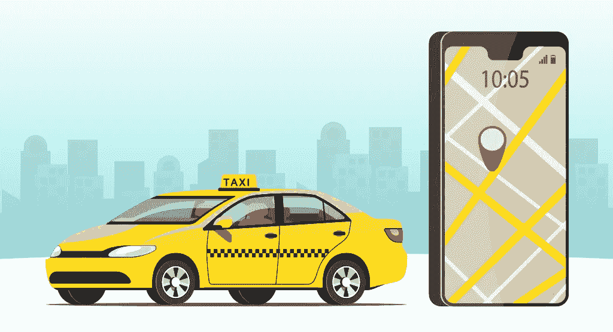
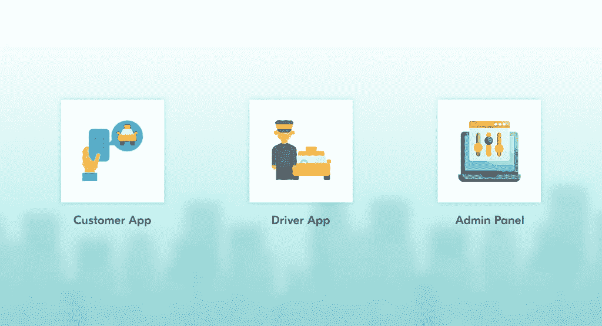
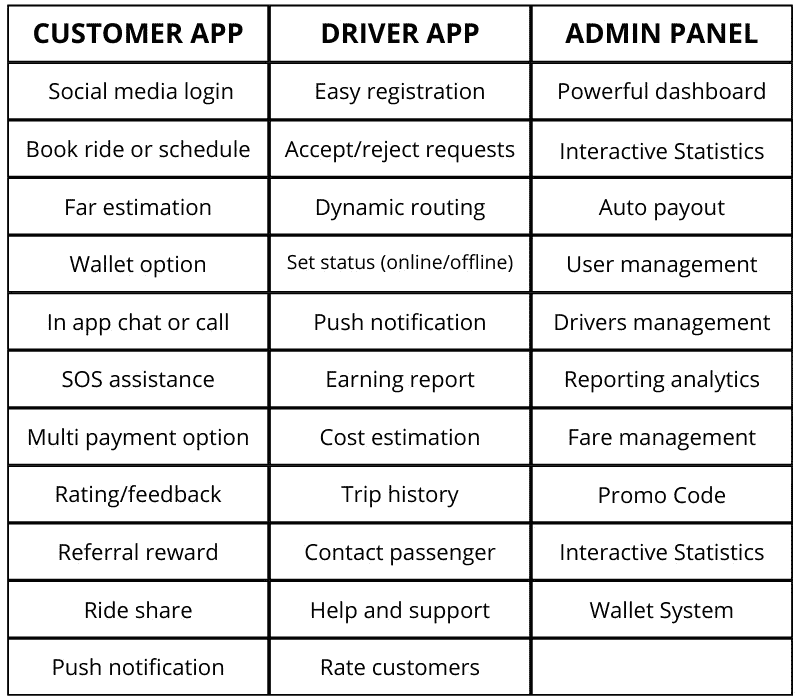

# 优步克隆 App:开发一个像优步一样的打车 App 的成本是多少？

> 原文：<https://javascript.plainenglish.io/what-is-uber-clone-app-cost-6ddf85176ad6?source=collection_archive---------9----------------------->

创业为消费者提供服务或销售产品是最有前途的赚钱方式。多年来，的士服务有显著的增长。在商业中，利润受到那些拥有深思熟虑的战略和对当前技术趋势透彻理解的人的青睐。

继续阅读，了解更多关于出租车行业，其演变，以及如何建立一个出租车业务。过去，在几秒钟内以合理的价格叫到出租车是不可能的。现在只要按一下按钮，出租车随处可见。我们目前目睹的出租车行业的大规模繁荣花了几十年时间才发展起来。

## 什么是优步克隆应用？

> 优步克隆是最初的打车应用优步的复制品。

优步克隆应用程序是一个完全可定制的白标解决方案，专为初创公司或企业家开发，以开始他们的在线出租车业务。

 [## 激励创业的 9 款成功打车应用

### 开出租车生意？这篇文章帮助你了解 9 个成功的出租车预订应用程序，在开发一个出租车应用程序之前要考虑…

www.peppyocean.com](https://www.peppyocean.com/blog/successful-taxi-apps/) 

一款优步克隆软件通过允许潜在客户按需预订乘车服务，帮助企业接触到他们。这是一项全天候的叫车服务。它通过提供可用于实现任何业务组件的可定制模块来帮助业务。直观的界面满足了所有用户的期望，完整的技术支持团队处理与之相关的任何问题。它有助于增加收入和保持与用户的良好关系。

使用[优步克隆应用](https://www.xongolab.com/uber-clone-app/)解决方案，你可以在网上开始或发展你的打车业务。通过它，用户可以在方便的时候找到顺风车，司机可以通过完成请求的行程来赚钱。该应用程序包含所有必要的特点和功能，方便用户和司机。

## 开发优步克隆应用的好处

## **从客户的角度:**

*   它消除了等待出租车或麻烦自己去出租车停靠站的必要性。
*   要价过高的传统出租车无疑更贵，但在线预订服务提供了一个估计公平的性价比。
*   客户可以随时轻松选择自己喜欢的出租车。
*   几乎每个最受欢迎的地点都有固定的价格，如机场、车站、公共汽车站等。
*   打车服务应用有时会提供折扣和免费乘车。
*   用户可以通过各种支付方式进行支付。打车服务应用也确保了每笔交易的安全性。

## **从车手的角度来看:**

*   如果有人想有第二收入来源，这是最好的选择。
*   司机可以在方便的时候接受或拒绝乘车请求。
*   付款程序简单明了，消除了司机和顾客之间不必要的公平争论。
*   司机可以随时调整他们的行程。
*   优步对在线的司机进行补偿，不管他们是否收到乘车请求。

## **出租车业主保险金:**

*   所有系统都可以控制，并且可以查看报告，以便清楚地了解企业的运作方式以及如何改进。
*   您只需找到您所有司机的确切位置，顾客就会感到安全。
*   您可以雇佣几个司机，在不同地区展示您的品牌。
*   每次搭车都会给你带来佣金。现在还需要什么？

## 优步是如何获得如此巨大的声望的？

我们现在可以随时随地租用出租车。不可否认，家门口交通便利，因为我们可以在任何地点预订出租车。优步的加入引发了出租车行业的繁荣。这是因为它的可及性和低成本。优步还在市场上为自己开辟了一个独特的利基市场，创造了大量收入并树立了品牌形象。

***以下提及的是对其成功起到关键作用的一些关键属性。***

*   这是一个精心策划的商业策略，也是它成功的原因。
*   正确理解人们的实际需求以及他们如何解决挑战。
*   它对在合适的时间引入合适的技术的贡献帮助人们在手机和桌面上预订出租车。
*   选择正确的目标社会群体(高层和中层)。
*   可提供多种汽车服务。您可以选择任何一种您喜欢的出租车。

## 为什么你应该投资开发一个像优步这样的出租车应用程序

***技术优势***
您获得了巨大的技术优势。不要损害应用程序的功能和其他基本功能，否则，您将无法满足乘客和司机的需求。你需要投资一个具有很多功能的优步克隆应用程序脚本。这可以帮助你增加你的用户群，并且在一个时间内，它将有可能瞄准大客户。

***财务利益***
购买优步克隆脚本始终是增加业务收入的可靠且经济有效的方法。为您的客户提供多种付款选择，让他们可以选择您的服务而不是其他服务。它将帮助您提升品牌形象。

***曝光度提高***
打造优步克隆人可以帮助您与更多的受众建立联系，从而提高您的出租车公司的知名度。

***获取用户反馈***
用户反馈可以让你准确定位业务中需要改进的地方以及那些表现有效的地方。优步的应用克隆将允许用户对你的服务留下反馈，这是一个非常有用的功能。

***实时监控***
打车预约软件可以让你实时跟踪公司的日常任务。使用该信息可以估计出租车到达需要多长时间。司机可以使用谷歌地图工具，帮助他们标记接客人的准确位置。

## 如何建立一个像优步一样的应用程序？

让我们用几个简单的步骤来讨论这个过程。你需要创建两个应用程序和一个管理面板来开发一个功能齐全的出租车服务应用程序。这两个应用程序都将连接到管理面板，因为它们可以帮助企业主跟踪他们的进度报告。

建议在两个应用程序上添加高级功能，以便您可以在市场上与竞争对手竞争。在将你的应用程序投放到市场之前，对其进行适当的检查。

以下是您可以在应用中包含的一些基本功能:

 [## 2022 年打车应用开发分步指南

### 你想知道如何建立一个像优步一样的打车应用吗？如果是的话，那么看看这个帖子就知道如何开发优步喜欢的打车 app 了…

www.peppyocean.com](https://www.peppyocean.com/blog/a-step-by-step-guide-on-taxi-app-development-in-2022/) 

## 开发一个像优步这样的出租车预订应用程序的总成本是多少？

在前一阶段，了解优步式打车应用开发的总体成本非常重要。因为你必须在做出应用程序开发决定之前设定预算。你可以从一家知名公司选择[打车应用开发服务](https://www.xongolab.com/taxi-booking-app/)，以获得更好的见解和指导。开发打车应用的整体成本由以下因素决定-

*   应用平台(Android 或 iOS 或两者)
*   应用程序设计
*   应用程序开发公司位置
*   第三方集成

因此，它会根据应用程序的复杂性以及您希望在应用程序中包含的特性和功能的数量而有所不同。平均而言，开发一个类似优步的打车应用程序要花费你 8000 到 60000 美元。

 [## 如何明智地降低 App 开发成本？

### 开发移动应用程序是当今的趋势，因为它们有助于同时瞄准大量受众。它有助于…

xongolab.medium.com](https://xongolab.medium.com/how-to-reduce-app-development-cost-wisely-1057408763a0) 

## 最后的想法

拥有一个设计良好的优步克隆应用程序可以让你获得品牌知名度，并建立广泛的客户基础。像优步这样以你的品牌拥有和运营的出租车克隆应用只会让你的出租车业务更加成功。除此之外，集成到您的应用程序中的高级功能在提高您的业务收入方面发挥着至关重要的作用。确保遵循以客户为中心的方法，这样你就可以说服他们接受你的服务。如果你需要任何帮助，你可以随时联系我们。

*更多内容请看*[***plain English . io***](https://plainenglish.io/)*。报名参加我们的* [***免费周报***](http://newsletter.plainenglish.io/) *。关注我们关于*[***Twitter***](https://twitter.com/inPlainEngHQ)*和*[***LinkedIn***](https://www.linkedin.com/company/inplainenglish/)*。加入我们的* [***社区不和谐***](https://discord.gg/GtDtUAvyhW) *。*