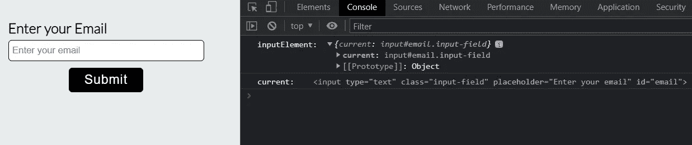
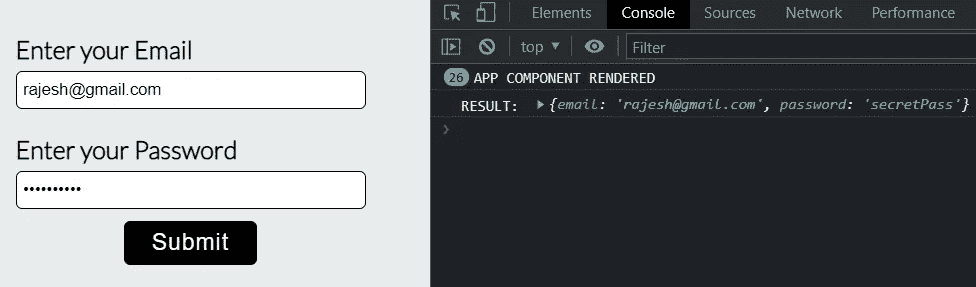
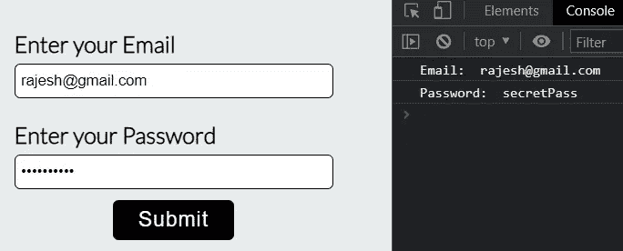
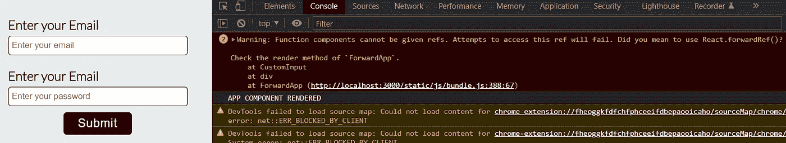
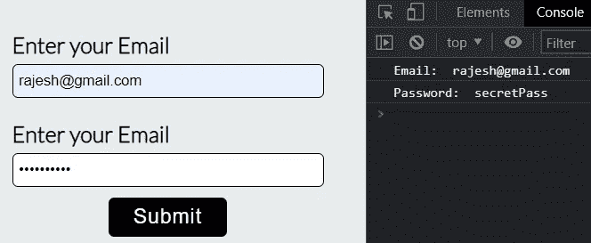

# React 中的 useRef hook & forwardRef 是什么？完整的解释

> 原文：<https://javascript.plainenglish.io/what-is-useref-hook-forwardref-in-react-a-complete-explanation-8f55496875ca?source=collection_archive---------5----------------------->


在这篇博客中，我们将对 react 中的 useRef 钩子和 forwardRef 进行一次完整的讨论。我们将通过一些例子来理解 useRef 钩子的用例，并看到 forwardRef 的重要性。在博客的最后，你会对 React 中的 useRef hook 和 forwardRef 有一个完整的了解。

# React 中的 useRef 钩子是什么？

useRef 是一个 React 挂钩，它允许您直接创建对 DOM 元素的引用，并返回一个 Ref 对象，其中一个 current 属性最初设置为您提供的初始值。

```
import { useRef } from 'react';
const ref = useRef(initialValue)
```

## 让我们用以下几点来简化这个定义

1.  **访问 DOM 元素:** useRef 钩子允许你访问 DOM 中的一个元素。我们可以给元素添加一个 ref 属性来直接访问它。

**访问 DOM 元素 usging useRef 钩子**

```
import { useRef } from 'react';

const Blog = () => {
    const inputElement = useRef();

    const handleClick = () => {
      console.log("inputElement: ", inputElement);
      console.log("current: ", inputElement.current);
    };

    return (
      <div className="main-component">
      <div className="input-control">
            <label htmlFor="email">Enter your Email</label>
            <input 
             type="text" 
             className="input-field" 
             placeholder="Enter your email" 
             id="email" 
             ref={inputElement}
            />
        </div>
        <button className="submit" onClick={handleClick}>Submit</button>
      </div>
    );
};

export default Blog;
```

**输出**



Accessing input element using useRef hook

正如您所看到的，useRef 返回了一个 Ref 对象(在我们的示例中为 inputElement ),该对象具有一个 current 属性，该属性实际上包含 dom 元素。

**2。不会导致重新呈现:**当我们更新 useState 钩子的数据时，它会重新呈现组件，以反映 web 页面上的新变化。但是在 useRef 挂钩的情况下，当更新值时，它不会导致重新呈现。

让我们看看下面的例子。首先我们将看到使用 useState 钩子的实现，然后使用 useRef 钩子来改进它。

> 使用 useState 钩子实现登录表单

```
import { useEffect, useState } from "react";
import "./App.css";

function App() {
  const [formData, setFormData] = useState({email: "", password: ""});

  const handleChange = name => event => {
    setFormData({...formData, [name]: event.target.value})
  }

  const handleSubmit = () => {
    console.log("RESULT: ", formData);
  }

  useEffect(()=> {
    console.log("APP COMPONENT RENDERED");
  })
  return (
    <div className="parent-component">
      <div className="input-control">
        <label htmlFor="email">Enter your Email</label>
        <input 
         type="email" 
         className="input-field" 
         placeholder="Enter your email" 
         id="email" 
         onChange={handleChange("email")}
        />
      </div>

      <div className="input-control">
        <label htmlFor="password">Enter your Password</label>
        <input 
         type="password" 
         className="input-field" 
         placeholder="Enter your password" 
         id="password" 
         onChange={handleChange("password")}
        />
      </div>

      <div>
        <button onClick={handleSubmit} className="submit">Submit</button>
      </div>

    </div>
  );
}

export default App;
```

**输出**



Component re-renders due to state update

在上面的例子中，你也可以看到填充表单的每个字符输入导致状态更新，因此组件不断得到重新呈现。

我们可以使用 useRef 钩子避免组件的连续重新呈现。让我们看看使用 useRef 钩子的相同实现。

> 使用 useRef 钩子实现登录表单

```
import { useEffect, useRef } from "react";
import "./App.css";

function App() {
  const emailField = useRef("");
  const passwordField = useRef("");

  const handleSubmit = () => {
    if(emailField.current.value === "") {
      emailField.current.focus();
      return;
    }
    console.log("Email: ", emailField.current.value);
    console.log("Password: ", passwordField.current.value);
  }

  useEffect(()=> {
    console.log("APP COMPONENT RENDERED");
  })
  return (
    <div className="parent-component">
      <div className="input-control">
        <label htmlFor="email">Enter your Email</label>
        <input 
         type="email" 
         className="input-field" 
         placeholder="Enter your email" 
         id="email" 
         ref={emailField}
        />
      </div>

      <div className="input-control">
        <label htmlFor="password">Enter your Password</label>
        <input 
         type="password" 
         className="input-field" 
         placeholder="Enter your password" 
         id="password" 
         ref={passwordField}
        />
      </div>

      <div>
        <button onClick={handleSubmit} className="submit">Submit</button>
      </div>

    </div>
  );
}

export default App;
```

**输出**



Avoiding re-rendering using useRef hook

我们可以看到没有使用 useRef 钩子进行重新渲染。

# forwardRef 简介

考虑到上面的登录表单示例，现在我想创建一个单独的自定义输入组件，以使我们的代码更加模块化和可重用。

让我们快速看一下这个实现，看看结果。

**ForwardApp 组件**

```
import { useEffect, useRef } from "react";
import "./App.css";
import CustomInput from "./CustomInput";

function ForwardApp() {
  const emailField = useRef("");
  const passwordField = useRef("");

  const handleSubmit = () => {
    if(emailField.current.value === "") {
      emailField.current.focus();
      return;
    }
    console.log("Email: ", emailField.current.value);
    console.log("Password: ", passwordField.current.value);
  }

  useEffect(()=> {
    console.log("APP COMPONENT RENDERED");
  })
  return (
    <div className="parent-component">
      <CustomInput
        type="email" 
        className="input-field" 
        placeholder="Enter your email" 
        id="email"  
        ref={emailField}
      />
      <CustomInput
        type="password" 
        className="input-field" 
        placeholder="Enter your password" 
        id="password" 
        ref={passwordField} 
       />
      <div>
        <button onClick={handleSubmit} className="submit">Submit</button>
      </div>

    </div>
  );
}

export default ForwardApp;
```

**自定义输入组件**

```
const CustomInput = (props, ref) => {
    return (
        <div className="input-control">
            <label htmlFor="email">Enter your Email</label>
            <input {...props} />
        </div>
    )};

export default CustomInput;
```

**输出**



Error while passing ref to child component

错误背后的原因是我们不能将父组件的引用作为一个属性直接传递给子组件。所以我们得到一个错误，告诉我们使用 forwardRef，请忽略开发工具的警告。让我们详细讨论一下什么是 forwardRef。

# React 中 forwardRef 是什么？

在 React forwardRef 中，有一个方法允许父组件将 Ref 向下传递给它们的子组件。forwardRef 将由其父组件创建的 DOM 元素引用给子组件。这样，孩子就可以在任何使用该元素的地方阅读和修改它。

让我们修复使用 forwardRef 得到的错误。

**ForwardApp 组件**

```
import { useEffect, useRef } from "react";
import "./App.css";
import CustomInput from "./CustomInput";

function ForwardApp() {
  const emailField = useRef("");
  const passwordField = useRef("");

  const handleSubmit = () => {
    if(emailField.current.value === "") {
      emailField.current.focus();
      return;
    }
    console.log("Email: ", emailField.current.value);
    console.log("Password: ", passwordField.current.value);
  }

  useEffect(()=> {
    console.log("APP COMPONENT RENDERED");
  })
  return (
    <div className="parent-component">
      <CustomInput
        type="email" 
        className="input-field" 
        placeholder="Enter your email" 
        id="email"  
        ref={emailField}
      />
      <CustomInput
        type="password" 
        className="input-field" 
        placeholder="Enter your password" 
        id="password" 
        ref={passwordField} 
       />
      <div>
        <button onClick={handleSubmit} className="submit">Submit</button>
      </div>

    </div>
  );
}

export default ForwardApp;
```

**自定义输入组件**

```
import { forwardRef } from "react";

const CustomInput = forwardRef((props, ref) => {
    return (
        <div className="input-control">
            <label htmlFor="email">Enter your Email</label>
            <input {...props} ref={ref}/>
        </div>
    )}
);

export default CustomInput;
```

**输出**



used forwardRef to fix the error

现在我们已经理解了 React 中的 useRef 钩子和 forwardRef。下面让我们快速总结一下。

## useRef 挂钩摘要:

1.  它可以用来直接访问 DOM 元素。
2.  它可用于存储更新时不会导致重新呈现的值。

## **forwardRef 摘要:**

forwardRef 允许您将 DOM 元素的引用从父组件传递到子组件。

**感谢您阅读至此。我希望现在你已经理解了 react 中的 useRef 钩子和 forwardRef。**

# 如果你想要更多这样的内容，请在媒体上关注我，订阅我的 YouTube 频道

# 有疑问吗？通过推特[联系我](https://twitter.com/izrajesh)

*更多内容看* [***说白了就是***](https://plainenglish.io/) *。报名参加我们的* [***免费周报***](http://newsletter.plainenglish.io/) *。关注我们* [***推特***](https://twitter.com/inPlainEngHQ) ，[***LinkedIn***](https://www.linkedin.com/company/inplainenglish/)*，*[***YouTube***](https://www.youtube.com/channel/UCtipWUghju290NWcn8jhyAw)*，*[*不和*](https://discord.gg/GtDtUAvyhW) ***。***

***有兴趣缩放你的软件启动*** *？检查出* [***电路***](https://circuit.ooo?utm=publication-post-cta) *。*