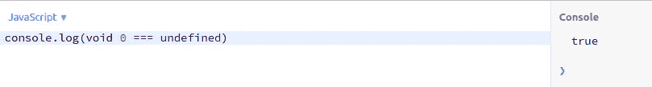
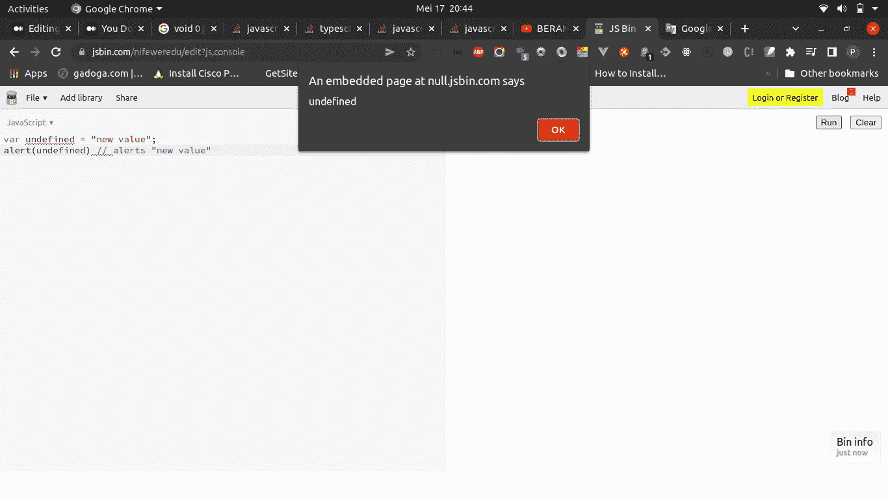

# JavaScript 中的“void 0”是什么？

> 原文：<https://javascript.plainenglish.io/what-is-void-0-in-javascript-bdd4b3eb19a7?source=collection_archive---------7----------------------->

## 类似于未定义吗？到底该不该回避？


Photo by [Andrea De Santis](https://unsplash.com/@santesson89?utm_source=medium&utm_medium=referral) on [Unsplash](https://unsplash.com?utm_source=medium&utm_medium=referral)

嗨，我是一名软件工程师，欢迎来到我的博客。今天我们要讨论的是 **void 0** 。

# 关于 void 0 我们应该知道什么

在旧版本的 JavaScript 中，你不会发现 **void 0 表达式**。关键字是 **void** 其中**T7**未定义**。**



```
void 0
void (0)
void "hello"
void (new Date())
//all will return undefined
```

# **未定义是可变的**


Photo by [Valentin Lacoste](https://unsplash.com/@valentinlacoste?utm_source=medium&utm_medium=referral) on [Unsplash](https://unsplash.com?utm_source=medium&utm_medium=referral)

那么我们为什么要用 **void 0** 作为 undefined 的别名呢？

JavaScript 的一个怪癖是它不是一个保留关键字。相反，它是全局对象的一个属性。

据 wtjs.com 报道，

*Undefined 不过是一个没有默认值的全局变量名。因此，其原始值是未定义的。您可以更改未定义的值:*

```
var a = {};
a.b === undefined; // true because property b is not set
undefined = 42;
a.b === undefined; // false
```

*由于 undefined 的可变性，通过 typeof 检查 undefined 通常是一个更好的主意:*

```
var a = {};
typeof a.b == 'undefined'; // always true
```

**如上图**所示，未定义的全局变量在 ES5 中已被禁用。



当变量将被打印时，查看变量函数。**仍未定义为值**。

ESLint 规则，no-undefined ，不允许使用 undefined 作为变量名，并防止隐藏问题。

## void 0 作为未定义值怎么样？我们应该避免这种情况吗？

是的，ES5 及更新版本中不需要 void 0。让你的代码保持可读性，让编译器优化性能。

# 警惕！

如果你们碰巧来自印度尼西亚，想要支持我写更多的东西，希望你们能从钱包里拿出一点来。可以通过一些方式分享你的天赋，谢谢。

# 萨韦里亚

[https://saweria.co/pandhuwibowo](https://saweria.co/pandhuwibowo)


# 特拉克特尔

[https://trakteer.id/goodpeopletogivemoney](https://trakteer.id/goodpeopletogivemoney)


# 多读我的文章

[](/how-to-use-as-const-in-typescript-const-assertions-4ed34921ac51) [## 如何在 TypeScript 中使用“as const ”( const 断言)

### 我们应该什么时候使用它？

javascript.plainenglish.io](/how-to-use-as-const-in-typescript-const-assertions-4ed34921ac51) [](/nodejs-global-summit-2020-virtual-summit-in-the-middle-of-a-pandemic-part-1-b9d5ae846f54) [## 我在 Node.js 全球峰会 2020 上的经历:疫情中央的虚拟峰会

### Node.js 2020 全球峰会的一些关键幻灯片和要点。

javascript.plainenglish.io](/nodejs-global-summit-2020-virtual-summit-in-the-middle-of-a-pandemic-part-1-b9d5ae846f54) [](/queue-data-structure-explained-simply-with-javascript-f6261f68b0b9) [## 用 JavaScript 简单解释队列数据结构

### 关于队列你需要知道的一切——软件工程师必须掌握的基本算法之一。

javascript.plainenglish.io](/queue-data-structure-explained-simply-with-javascript-f6261f68b0b9) [](https://pandhuwibowo.medium.com/when-do-you-use-splice-slice-substring-and-substr-f940cdde3db1) [## 什么时候使用 splice()、slice()、substring()和 substr()？

### 大家好，欢迎来到我的博客。在这一节我们将讨论关于 javascript 函数的内置。有:

pandhuwibowo.medium.com](https://pandhuwibowo.medium.com/when-do-you-use-splice-slice-substring-and-substr-f940cdde3db1) [](/define-graphql-schema-with-untype-in-nestjs-f22012437a7b) [## 在 NestJS 中用 Untype 定义 GraphQL 模式

### 这个场景是当我想在突变中创建一个有效载荷，而这个有效载荷并不总是相同的。希望，这…

javascript.plainenglish.io](/define-graphql-schema-with-untype-in-nestjs-f22012437a7b) 

# 参考

[](https://developer.mozilla.org/en-US/docs/Web/JavaScript/Reference/Operators/void) [## void 运算符- JavaScript | MDN

### 此运算符允许将生成值的表达式计算到计算结果为的表达式所在的位置…

developer.mozilla.org](https://developer.mozilla.org/en-US/docs/Web/JavaScript/Reference/Operators/void) [](https://www.freecodecamp.org/news/javascript-void-keyword-explained/) [## JavaScript Void 0-JavaScript:Void(0)做什么；刻薄？

### 根据字典，void 一词的意思是“完全空白的空间”。这个术语在编程中使用时，指的是…

www.freecodecamp.org](https://www.freecodecamp.org/news/javascript-void-keyword-explained/) [](https://stackoverflow.com/questions/7452341/what-does-void-0-mean) [## “void 0”是什么意思？

### 通读 Backbone.js 源代码，看到了这个:valid obj[attr]= void 0；什么是 void 0？目的是什么…

stackoverflow.com](https://stackoverflow.com/questions/7452341/what-does-void-0-mean) [](https://stackoverflow.com/questions/38655639/javascript-what-does-void-0-mean?noredirect=1&lq=1) [## JavaScript:“void 0”是什么意思？

### void 运算符计算给定的表达式，然后返回 undefined。void 运算符通常仅用于…

stackoverflow.com](https://stackoverflow.com/questions/38655639/javascript-what-does-void-0-mean?noredirect=1&lq=1) [](https://betterprogramming.pub/you-dont-need-void-0-f9d4cc1d0e1f) [## JavaScript 中不需要 void 0

### 这里有一个更好的选择

better 编程. pub](https://betterprogramming.pub/you-dont-need-void-0-f9d4cc1d0e1f)  [## wtfjs——一个关于我们热爱语言的小代码博客，尽管这种语言让我们讨厌

### 在 JavaScript 中，undefined 只不过是一个没有默认值的全局变量名。因此，它的原始价值…

web.archive.org](https://web.archive.org/web/20160311231335/http://wtfjs.com/2010/02/15/undefined-is-mutable) 

*更多内容请看*[***plain English . io***](https://plainenglish.io/)*。报名参加我们的* [***免费周报***](http://newsletter.plainenglish.io/) *。关注我们关于*[***Twitter***](https://twitter.com/inPlainEngHQ)*和*[***LinkedIn***](https://www.linkedin.com/company/inplainenglish/)*。查看我们的* [***社区不和谐***](https://discord.gg/GtDtUAvyhW) *加入我们的* [***人才集体***](https://inplainenglish.pallet.com/talent/welcome) *。*