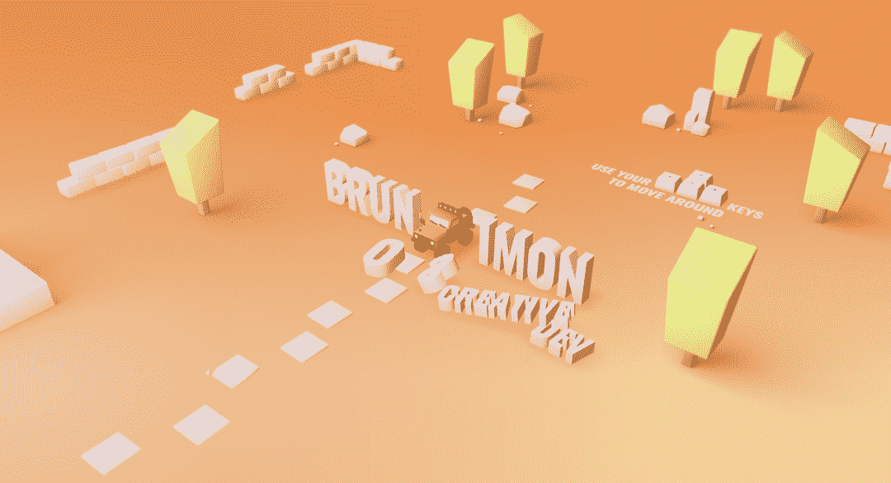
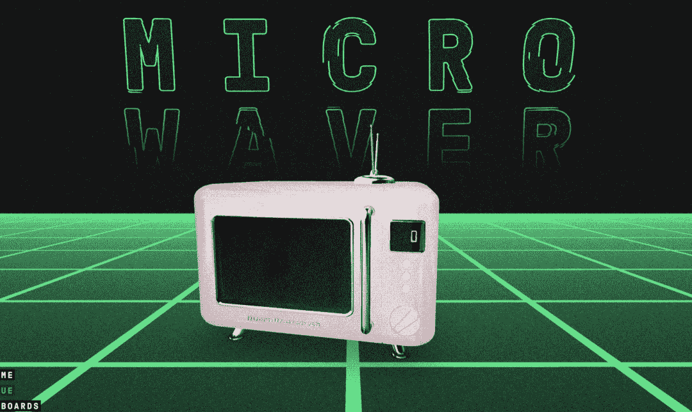

# 什么是 WebGL，为什么要用 Three.js？

> 原文：<https://javascript.plainenglish.io/what-is-webgl-and-why-use-three-js-82ef9db2ae39?source=collection_archive---------7----------------------->

**Three.js** 是一个 JavaScript 库，用于在浏览器中创建 3D 内容，使创建网页的 3D 体验变得更加容易。

## 用 Three.js 开发的案例

这里我为大家收集了一些用 Three.js 开发的精彩例子:

https://bruno-simon.com

【https://microwaver59.com/ 

[https://therace.montblanclegend.com/](https://therace.montblanclegend.com/)

[https://ezshine.jnsii.com/cases/smart3d/index.html](https://ezshine.jnsii.com/cases/smart3d/index.html)

[https://david-hckh.com/](https://david-hckh.com/)

这样的网页真的很酷，不是吗？你想马上学习如何制作这样的网页吗？

在学习 Three.js 之前，我们先了解一下 WebGL 是什么。

## WebGL 是什么？

WebGL 是一个 JavaScript API，允许我们以非常高性能的方式在画布上绘制三角形。没错，三角形是构成数字 3D 世界的基础。大多数现代浏览器都支持这个 API，因为它可以使用 GPU 来执行计算，所以速度非常快。

当然，WebGL 本质上是一个绘图库，它不区分你用什么来绘制 3D 或 2D 图形，在本课程中，我们当然专注于构建 3D。

GPU 可以并行计算。3D 模型通常由数千个三角形组成，每个三角形有 3 个点。当我们在计算机中渲染我们的模型时，GPU 本质上是在计算所有点的位置。然而，因为 GPU 可以执行并行计算，所以它仍然可以高效地这样做，即使这些点的数量可能看起来很大。除此之外，GPU 还需要根据这些点绘制表面的像素。

计算点的位置和在画布上绘制像素都是由着色器完成的。着色器的知识很难掌握。我们还需要知道如何向这些着色器提供数据。例如，基于相机的视角计算变换模型的渲染。再比如光照如何影响每个三角形面的颜色，很明显，被光照的三角形面比没被光照的三角形面更亮。

直接使用 WebGL API 非常困难，在画布上画一个三角形至少需要 100 行代码。在这种情况下，如果你想添加透视、灯光和模型，并使所有的东西都有生气，那只会变得更加困难。

## 谢天谢地，有三个

[https://github.com/mrdoob/three.js](https://github.com/mrdoob/three.js)

Three.js 是一个 JavaScript 库，使用 MIT 开源协议，底层使用 WebGL API 工作。该图书馆由 Ricardo Cabello(doob 先生)创建，现在有一个大型社区组织来维护更新，几乎每个月都会更新。使用的时候要注意教程和 Three.js 库的当前发布号。

这个库的最大目标是简化处理我们使用 WebGL 的困难部分，我们可以用几行代码绘制带有动画的 3D 场景，而不必经历诸如着色器、矩阵算法等晦涩的点。

然而，在本课程的后面，我们还将学习一些着色器 API。虽然我也不太擅长这部分，但这足以让你跟上进度。

## 还有其他类似的库吗？

当然还有像微软的 Babylon.js，Mozilla 的 A-Frame，Snapchat 的 PlayCanvas 这样的库，它们都是为了更容易使用 WebGL 来创建华丽的 Web3D 体验。这些库各有千秋，适用于略有不同的场景。未来我们甚至可以使用已经逐渐进入浏览器标准的 WebGPU APIs。

但是 Three.js 仍然是最流行的 WebGL 库，并且有丰富的信息、社区和示例，所以这是最好的起点。

写作一直是我的激情所在，帮助和激励他人给我带来了快乐。如果您有任何问题，请随时联系我们！

如果你想从我这里听到更多或阅读更多，可以考虑通过使用 [***此链接***](https://medium.com/@897083490/membership) 和 [***关注我***](https://medium.com/@897083490) 成为中等会员。

*更多内容请看*[***plain English . io***](https://plainenglish.io/)*。报名参加我们的* [***免费周报***](http://newsletter.plainenglish.io/) *。关注我们关于*[***Twitter***](https://twitter.com/inPlainEngHQ)*和*[***LinkedIn***](https://www.linkedin.com/company/inplainenglish/)*。查看我们的* [***社区不和谐***](https://discord.gg/GtDtUAvyhW) *加入我们的* [***人才集体***](https://inplainenglish.pallet.com/talent/welcome) *。*