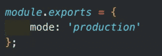

# JavaScript 中的 Webpack 是什么？

> 原文：<https://javascript.plainenglish.io/what-is-webpack-ed18b68bd5d3?source=collection_archive---------16----------------------->

## 我们大多数人在构建 JavaScript 应用程序时都听说过术语“Webpack”。**什么** **难道是**？**如何工作****？**怎么用**？我需要它吗？**

****

**这些是我将在本文中尝试回答的问题，希望在本文结束时，您会对 Webpack 有更好的理解。**

# **什么是 Webpack？**

****

****link****

**Webpack 是 JavaScript 应用程序的静态模块捆绑器。简而言之，Webpack 检查你的包并创建一个所谓的**依赖图**，它由各种**模块**组成，你的 web 应用程序需要这些模块才能按预期运行。**

> ****【模块**是从你的应用程序的 JavaScript、node_modules、images 和 CSS 样式构建的可重用代码块，它们被打包以方便在你的网站中使用。Webpack 根据代码在应用中的使用方式来分离代码，通过这种模块化的职责划分，管理、调试、验证和测试代码变得更加容易。**
> 
> **依赖图是描述节点如何相互关联的有向图。在这种情况下，图形定义通过文件之间的引用(`require`、`import`)来定义。Webpack 静态地遍历这些文件，而不执行源代码来生成创建包所需的图。]**

**然后，根据这个图，它创建一个新的包，这个包由最少数量的所需文件组成，通常只有一个 bundle.js 文件，这个文件可以很容易地插入到 HTML 文件中，供应用程序使用。**

# **我需要使用 Webpack 吗？**

**随着项目中包含的库数量的增加，包的大小也会增加。以前的网站不再只是一个包含几个文件的小包，但是随着 **JavaScript 模块的引入，**由于文件数量巨大，它们变得大了 4 到 5 倍。**

**不仅应用程序的整体规模是一个挑战，而且开发人员编写的代码类型和浏览器能够理解的代码类型之间也存在巨大的差距。开发人员不得不使用大量名为 **polyfills** 的辅助代码来确保浏览器能够解释他们包中的代码。**

**Webpack 解决了所有这些问题。因此，如果您有一个使用很少软件包的小型应用程序，那么 webpack 可能不会对您有太大帮助，但是如果您在应用程序中使用大量软件包，并且您希望降低软件包的大小以提高性能，那么 webpack 非常适合您。**

****

# **它的工作原理和使用方法是什么？**

****

**[link](https://survivejs.com/webpack/what-is-webpack/)**

**Webpack 遵循以下 5 条原则:**

*   ****条目** —这是 Webpack 将处理的第一个模块，用于构建完整的依赖关系图。它会将该文件添加到依赖关系图中，然后继续遍历所有导入的文件，直到考虑到运行应用程序所需的所有代码。您可以有一个或多个入口点，webpack 将为它制作一个或多个依赖图。**

****

*   ****输出—** 这是文件以文件名写入磁盘的点。主输出文件被写成**。/dist/main.js** 和任何其他文件被添加到 **dist** 目录中。输出设置在与入口点相同的位置。**

****

*   ****加载器—** 加载器通过将文件转换成模块来帮助 Webpack 理解除`.js`或`.json`之外的文件。装载机在`rules`下的`module`键中指定。添加一个加载器需要两个配置选项——一个**测试**确定应该转换的文件或文件类型，另一个**使用**告诉 Webpack 使用哪个加载器来转换这些文件。它看起来像下面这样:**

****

*   ****插件—** 处理加载程序无法完成的额外任务。这包括诸如包优化、定义环境变量等。另一个例子是为单页 web 应用程序提取样式表或者生成一个`index.htm` l 文件。**

****

*   ****模式—** 这告诉Webpack 为您的应用程序使用哪些配置和优化。模式有**开发、生产或无。**如果未指定模式，则 Webpack 自动默认为生产。`Development`针对更快的构建时间和代码可读性进行优化，以便于调试。`Production`针对可能的最小构建进行优化，需要更长的构建时间来解析和收缩代码。**

****

# **结论**

****

**希望在通读本文后，您可能对这个难以理解的术语 Webpack 有了更好的理解。**

**如果你喜欢这个，可以多看几篇下面的文章:**

** [## React 中的代码拆分—您需要知道的一切

### React 中对代码拆分的深入探讨。

javascript.plainenglish.io](/code-splitting-in-react-all-you-need-to-know-392b0dfeb1fa)  [## React Hooks —您需要知道的一切

### 当我开始将我们以前的产品从使用类过渡到使用功能组件和钩子时，我面临着…

javascript.plainenglish.io](/react-hooks-all-that-you-need-to-ever-know-d197109e99da)  [## YAML vs JSON vs XML:选择哪一个？

### 在你的代码库中或者日常工作中，你会经常遇到这些格式，但是很多时候，我们不会…

javascript.plainenglish.io](/yaml-vs-json-vs-xml-what-to-choose-4c7a72417ff4) 

*更多内容请看*[***plain English . io***](http://plainenglish.io/)*。报名参加我们的* [***免费周报***](http://newsletter.plainenglish.io/) *。在我们的* [***社区***](https://discord.gg/GtDtUAvyhW) *获得独家获得写作机会和建议。***