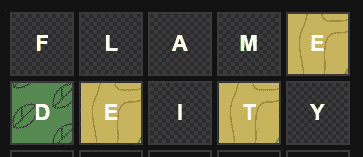

# 我从建造一个沃尔克隆体中学到的是

> 原文：<https://javascript.plainenglish.io/what-ive-learned-from-building-a-wordle-clone-3fadcc3d7f7a?source=collection_archive---------6----------------------->

## 分享我使用 HTML/CSS/JavaScript 构建 Wordle 克隆的回顾

自从一月份一个朋友把我介绍给 Wordle 后，我就对这个游戏着迷了。它开始是一天中 10 分钟的娱乐，在那里我可以测试我的英语知识。

一开始，我们比较了彼此猜了多少次才解决了这个日常难题。午夜一到，我就打开了游戏。然后我开始每天想要不止一个拼图。

Project result

当我玩完 Elden Ring 后，我终于抽出一些时间回到个人项目中。创造一个我想玩多少就玩多少的 Wordle 克隆体是第一步。

这篇文章是我分享带着明确的目标回到 web dev 的经验。这不是一个教程或任何太专注于代码。作为一个已经三年没有接触过普通 HTML/CSS/JavaScript 的人，我只是简单地分享了我在几个小时的工作中可以实现的东西。

如果你想跳过故事直接进入游戏，尽一切办法，去[这里](https://wordle-clone.ze1598.repl.co/)，游戏在 repl.it 托管。

附言:请记住，这款游戏还没有针对手机进行优化:(

旁注:我假设你熟悉 Worlde 及其规则。

# 技术选择

我没有考虑太多技术问题，因为我已经有了两个目标:构建一个 Wordle 克隆体，练习 HTML/CSS/JavaScript。因此，这是一个结合两者的绝佳机会。当我大学毕业的时候，我有一个网站开发的实习，但是那是 3 年前的事了，从那以后我再也没有接触过网站开发。

正如所料，我在游戏面板和 qwerty 键盘上使用了 HTML 稍后会谈到这一点。CSS 负责样式，JavaScript 处理所有逻辑:验证猜测、在棋盘上呈现字母，以及控制游戏流程。

最后，生成的代码被上传到 repl.it，游戏就托管在那里。像往常一样，repl.it 是一个 MVP，免费为❤️主持小项目

# **痛点**

在我花在这个项目上的晚上，我发现了一些棘手的问题。不可否认，一部分是因为我的粗鲁，但也有一些是因为我的固执。所以在某种程度上，我想说出我自己的缺点，希望你，读者，可以避免这些，写出更好的代码:)

## **CSS**

我不喜欢它作为一个活跃的网站开发者，我也不喜欢它比以前更好。我发现它很难控制——可能是我缺乏知识，但感觉总是有问题，一件小事破坏了我的页面布局。

这尤其令人沮丧，因为这个项目没有太多的 HTML 内容，但即使是简单的事情，如分割游戏板和键盘之间的可用高度，也不能完全像我想要的那样工作。在项目进行到一半的时候，我从头开始重新设计了 CSS 样式，这无疑简化了代码，但最终结果仍然远非完美。

深入研究代码，不要忘记研究 display grid 和 display flex！它们可以很好地横向和纵向分发内容，并且可以极大地改进您的代码！

## 猜测验证逻辑

我已经有一段时间没有编写游戏逻辑，甚至是 Wordle 中需要的字符串验证了。它不仅仅是检查一个单词是否存在于有效单词列表中，并且它包含五个字母。我还需要检查字母是否在正确的位置，需要多少个特定的字母，基于验证每个字母显示什么颜色，等等。

我是我自己最大的敌人，因为我总是带着一个理想的版本开始写代码。每次我停下来考虑，比如说，for 循环，我都花两倍的时间来避免它，结果发现 for 循环是最简单的解决方案。我固执的结果是从头开始写了三遍验证逻辑。我一直在寻找测试失败的边缘案例，或者键盘改变颜色，但板上的同一个字母颜色错误的案例。最后，我采用了一种简单的方法:

*   如果猜测中 X 位置的字母是该位置需要的字母，则将其涂成绿色
*   如果不需要这个字母，就把它变成灰色
*   如果解决方案需要多个相同的字母，则根据猜测的字母数和解决方案的字母数进行着色，例如，对于解决方案“土丘”,猜测“muddy”中的第一个 D 应为黄色，第二个 D 应为灰色

通过与键盘交互和改变背景颜色来在板上呈现字母是很容易的。另一方面，获得正确的验证逻辑是整个操作的关键！

## 移动布局/媒体查询

最后一点与 CSS 有关。截至目前的“发布”，游戏在移动设备上看起来很糟糕。有一个垂直滚动，你不能点击键盘太快，否则它会放大。我可以用一行 HTML 代码来[禁用移动缩放，但是在这里不可行，因为内容是垂直滚动的…](https://stackoverflow.com/questions/4472891/how-can-i-disable-zoom-on-a-mobile-web-page)

我的计划是实现 CSS 媒体查询，即根据用户的屏幕尺寸动态调整样式。我尝试了不同的手机款式的价值组合，但没有一个让它看起来很棒。

我不认为它看起来像我想象的那么糟糕，但是用户在移动设备上的体验并不怎么样。根本原因可能是显示网格和显示 flex 的误用，以及一些淘气的边框和填充破坏了高度/宽度的计算…

# 个人亮点

这些是我特别自豪的东西和一些想法的组合，可以考虑用于未来的项目/未来对这个项目的改进。

## 自定义 qwerty 键盘

我以为这是浏览器中的开箱即用组件，但显然不是。我用 HTML 创建了所有的键盘按钮，用 CSS 设计了它们的样式，并在用户点击它们时用 JavaScript 添加了逻辑。我个人认为它在桌面上看起来很酷，而且功能齐全。

和原来的 Wordle 一样，你通过点击虚拟键盘输入字母，而不是使用物理键盘。Enter 提交猜测，这可能导致短/无效单词的验证错误，退格键从当前猜测中删除字母。我对它的视觉效果以及它如何控制板上呈现的字母感到非常自豪。

## 易接近

项目快结束时，我意识到可访问性是垃圾。我还没有对最终的项目进行失明测试，但我试图为色盲用户改进游戏。我知道它在其他方面失败了，比如除了 toast 通知之外没有任何类型的信息，但是我有在键盘和板上添加图案背景的想法。

Accessibility implementation in the board

Accessibility implementation in the keyboard

这是我意识到的最初游戏的一个方面:色盲玩家很难区分他们猜测的反馈。原版只是改变了棋盘和键盘背景的颜色。

这只是冰山一角，但是这些模式为每个字母与解决方案的相关性提供了更多的上下文。同样，没有关于游戏中哪些模式意味着什么的信息，这是我在最后添加的，以便在游戏的未来迭代中改进。

附言:感谢 [Hero Patterns](https://heropatterns.com/~) 网站让寻找模式变得超级容易，并且不费吹灰之力就能在 CSS 中实现。

## Toast 通知

这是另一个加在最后的功能。我在项目的大部分时间里都在使用浏览器中默认包含的那些单调的警告框。你知道，这些

Browser default alert

是啊，他们并不伟大。它们在开发过程中是一个有用的占位符，但是我不想在最终的 MVP“发布”中保留它们。

谢天谢地，我在 GitHub 上找到了可爱的 [toastify-js 库。然后，我花了 5 分钟来实现我需要的所有通知。通知消失时让我运行功能的加分。它让我在游戏结束/猜对后重置游戏变得更容易。:)](https://github.com/apvarun/toastify-js)

Win notification

Short guess notification

# 积压

我把一些想法留在了待办事项中，以便在某个时候回到这个项目。这里有几个马上浮现在脑海中的想法。

## 玩家统计

非常类似于原始游戏中的统计数据，你可以看到你需要猜 X 次才能赢得游戏。即使现在重置游戏是一个页面重载，这个特性也很容易通过本地存储实现。我认为让用户回顾他们玩了多少会是一个很好的功能。

## 更易接近

这意味着添加游戏信息，即新玩家的规则和背景图案的图例。此外，这将包括对盲人用户的可访问性的认真检查，即深入研究网页可访问性指南([链接到 Mozilla 文档的相关文章](https://developer.mozilla.org/en-US/docs/Learn/Accessibility/WAI-ARIA_basics))。

## 移动布局

是的，移动布局在接下来要做的事情列表上。它在桌面上运行良好，但在移动设备上也应该运行良好。

# 结束语:“构建哑弹”

最后要说的是“造哑 sh*t”。不久前，我在一次 JavaScript 会议上听到了这句口头禅，老实说，它已经拯救了我无数次。我已经记不清有多少次我在个人项目中做了一些看似无用的事情，只是为了在工作后不久派上用场。

尤其是在编程/IT 领域，我们经常会构建一些东西，然后在不同的上下文中再次遇到它。一次可能是一组解锁字符串处理的特定函数，另一次可能是您学会了如何修改十六进制颜色的强度，现在您已经准备好代码，可以在工作中被要求使用该功能时进行复制粘贴。

总的来说，我的建议是建立你感兴趣的东西，不管它们听起来有多傻。当然，这更适合于个人项目/个人学习，但是不要低估“简单地”获得更多技术经验的价值，尤其是当你对结果有既得利益的时候！

*更多内容请看*[***plain English . io***](https://plainenglish.io/)*。报名参加我们的* [***免费周报***](http://newsletter.plainenglish.io/) *。关注我们关于*[***Twitter***](https://twitter.com/inPlainEngHQ)*和*[***LinkedIn***](https://www.linkedin.com/company/inplainenglish/)*。加入我们的* [***社区不和谐***](https://discord.gg/GtDtUAvyhW) *。*