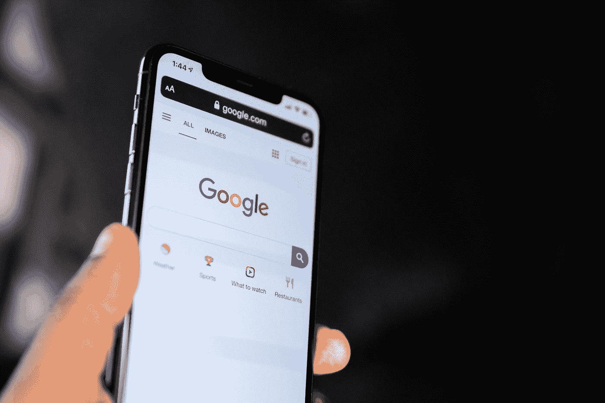

# 像谷歌、微软和苹果这样的大公司对世界有哪些不明显的贡献

> 原文：<https://javascript.plainenglish.io/what-non-obvious-ways-big-companies-like-google-microsoft-and-apple-contribute-to-the-world-87a9d0e0168a?source=collection_archive---------11----------------------->

## 我们很多人都没有意识到。

Photo by [Solen Feyissa](https://unsplash.com/@solenfeyissa?utm_source=medium&utm_medium=referral) on [Unsplash](https://unsplash.com?utm_source=medium&utm_medium=referral)

这些科技公司为世界增加了许多不明显的价值。我们大多数人，包括我自己，首先认为他们只在乎钱，尤其是苹果，因为他们的产品很贵。

如果你想改变对这些公司的看法，让我们看看他们是怎么做的:

# **创新与创业**

不，我不是说这些公司是创新的，而是说他们鼓励创新。Google for Startups Partner Network 帮助初创企业在早期阶段取得成功。该项目提供了一个庞大的导师网络，提供了不求回报的宝贵培训。任何这种风格的节目，一般都会要求公司提成。其他公司也做了类似的努力。

# **研究**

这些公司在研究上投入了数亿美元。我指的不仅仅是他们为自己的产品所做的研究，还包括向大学捐赠大量资金，让他们能够继续研究。这帮助了许多大学。

# **自动驾驶汽车及更多**

虽然对许多人来说这仍然是无稽之谈，但自动驾驶汽车有可能拯救成千上万的生命。每年有一百多万人死于车祸。想象一下能够减少 99%。谷歌是第一批认真投资于此的公司之一。这是几年前，只有几所大学参与。现在整个行业都参与其中。

# **数字内容**

现在，获取书籍(谷歌图书)、自由作家(博客)和新闻变得容易多了。YouTube 为人们打开了一个全新的世界。

老实说，当这样的事情带来了如此多的机会时，说它没有增加任何东西对我来说似乎不公平。由于谷歌新闻，原本没有流量的独立新闻媒体获得了更多的用户。

# **自然灾害中的支持**

谷歌、脸书和其他大型科技公司会尽一切可能提供支持，比如为每个受影响的人组织一个快速的互联网连接，这样他们就可以联系到他们的亲人，他们会创建一个实时地图，还有很多其他的方式。

老实说，我可以继续下去。在教育、翻译、健康、通信(Hangouts 和 Android)以及许多更明显的事情上所做的努力是巨大的。

不，并不是这些公司做的每件事都给世界增加了价值。但是，说它们一点也没有增加价值，太接近于它们真正所做的事情的最低限度的形象。

*更多内容请看*[***plain English . io***](https://plainenglish.io/)*。报名参加我们的* [***免费周报***](http://newsletter.plainenglish.io/) *。关注我们关于*[***Twitter***](https://twitter.com/inPlainEngHQ)*和*[***LinkedIn***](https://www.linkedin.com/company/inplainenglish/)*。查看我们的* [***社区不和谐***](https://discord.gg/GtDtUAvyhW) *加入我们的* [***人才集体***](https://inplainenglish.pallet.com/talent/welcome) *。*