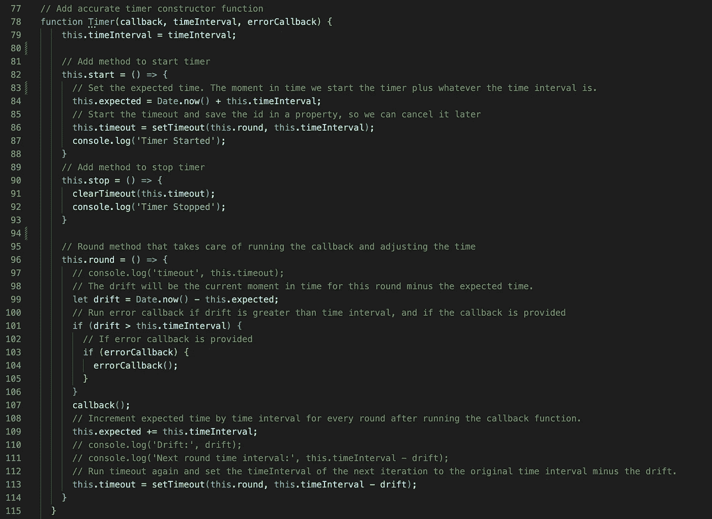
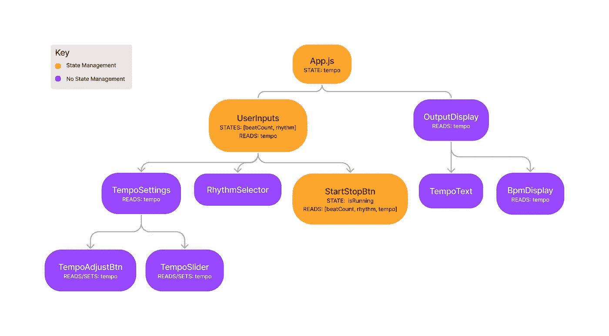
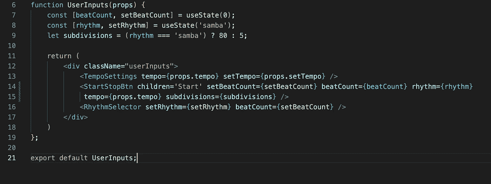
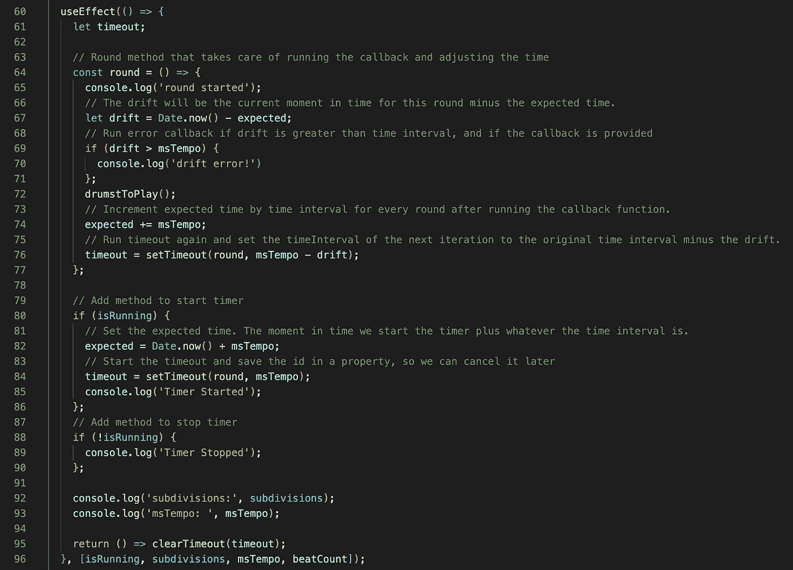
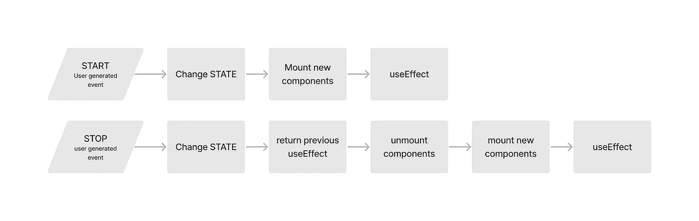

# 什么反应不是为

> 原文：<https://javascript.plainenglish.io/what-reactjs-is-not-made-for-7a3a9eb109?source=collection_archive---------15----------------------->

## React 是为数据驱动的动态网站设计的——但对于较小的项目来说，它会使过程变得更长。学会什么时候不使用 React。

当某个工具变得难以置信的流行时，很容易陷入在知道问题之前选择工具的陷阱。这就像先买一把锤子，然后再看计划需要的是螺丝还是钉子。

# 摘要

我一直在热情地学习 React，但不太明白它的设计目的是什么，不是什么。因此，我尝试用普通的 JavaScript 和 React 构建了许多小应用程序，以理解事物是如何从一个转换到另一个的。以下是我学到的！

## React 的设计目的是什么？

React 是为数据驱动的动态网站设计的，通常是单页面应用程序，其中数据是从服务器请求的，然后由浏览器使用来呈现页面。React 有助于将应用程序分解成许多小的 UI 组件，这使得在大型团队中进行思维映射和共享组件变得更加容易。脸书是一个完美的例子(React 的创造者)。

## 我试图建造什么？

一个节拍器应用程序，没有服务器端编程或从数据库获取数据。只是复杂的客户端节拍器逻辑，为音乐家创建一个工具。

## 我成功了吗？

是的，实际上！但是使用 React 更加困难，需要更多的代码行和更多的依赖项。

# 该项目

我的目标是在 React 中重建我的[swing division 节拍器](https://github.com/michaelpgalen/SwingDivision)，目的是了解 React 的更多弱点以及如何克服它们。

## 我的挑战，我在哪里找到帮助和解决方案！

***挑战一:节拍器构造函数放在哪里？***

对于 vanilla JS 版本，我创建了一个计时器构造函数(灵感来自 YouTube 上音乐和编码的创建者)。然后，我使用 metronome 的回调和错误函数声明了 timer 函数的一个实例。这有助于我将一些复杂性分成更小的块。在 React 中，我不知道在哪里写我的构造函数代码，以便它可以用于我的节拍器。构造函数依赖于“this”关键字，但在 React 中将所有东西都分解成模块时，这个关键字似乎丢失了。

The vanilla JS constructor function for my metronome

***解***

我从来没有弄清楚在哪里编写这样的构造函数，以及如何在 React 中使用它，但是相反，我意识到我不需要函数的多个实例。所以，我只是将函数逻辑直接写入我的 startStopBtn 组件，而不需要' this '关键字。

***挑战二:状态需要管理在哪里？***

我的普通 JS 版本不需要考虑太多状态管理，因为我所有的 UI 都编码在一个文件中。常规 JS 变量通过事件处理程序声明并绑定到用户输入，然后读入 metronome 逻辑和 UI。

在 React 中，每个 UI 组件都是自己的模块。因此，在创建了 UI 的静态版本之后，我必须考虑状态。哪些变量需要改变，哪些组件需要接受这些改变？

***解***

我映射了组件架构，然后通过识别读取特定状态的所有组件的最近公共祖先，来标记哪些组件需要管理哪个状态变量。

Component Architecture Map

UserInput module, managing state for rhythm and beatCount

***挑战三:每个新渲染丢失 timeoutID 时如何清除 Timeout？***

这是我最大的障碍！我使用 google、StackOverflow、slack groups 等等，到处寻找解决方案。至少有一半的答案使用了 React 的旧类模型，所以我不得不改进我的搜索以使用 Hooks 进行 React。我发现的所有解决方案/示例都是针对单次超时的，这需要在用户没有主动取消任务的情况下自动清除超时。我的问题是不同的，因为我有一个递归超时，我希望 clearTimeout 由 onClick 事件触发。这些细节都不符合我找到的解决方案。

问题是:每一次状态改变——从而重新呈现——都会导致我丢失超时 Id。因此，当用户单击“STOP”时，React 再次呈现 UI 组件并丢失超时 ID，使 clearTimeout 函数变得无用。我尝试使用 Context 来维护我正在丢失的超时 ID，但是不起作用。所有这些搜索促使我学习了很多关于使用状态、使用上下文和使用效果的知识。

***解***

深入研究 React 钩子文档，我了解到尽管 useEffect 钩子不需要返回任何东西(这是典型的)，但是可以让它们的 useEffect 块返回一个 arrow 函数，它将在组件生命周期结束时被调用。因此，在下一次渲染之前，当组件卸载时，将返回 useEffect。有了这个发现，我能够将我的节拍器逻辑放入 useEffect，并返回 clearTimeout。这样，当用户单击“STOP”时，它会触发状态更改，但在卸载组件和装载新实例之前，会返回以前的 useEffect，在超时 ID 丢失之前清除超时。

The useEffect() block and the return() with all my essential metronome logic.

The order of execution for State and useEffect in React

***挑战 4:如何使用 How ljs——是否真的需要？***

HowlJS 是一个伟大的 javascript 库，解决了许多网络音频挑战。在我的普通 JS 版本的应用程序中，这是一个有用的工具，它允许我的音频文件自行中断并重放。没有嚎叫，节拍器点击将被跳过，直到当前音频文件播放完毕。不好！

不幸的是，我的嚎叫音频对象没有在 React 版本中播放。我查阅了 how js 文档和 google，寻找如何将 how js 整合到 React 项目中的信息和示例。

我发现人们已经开发了必要的 React 钩子来成功地合并 HowlJS。

***解***

在学习新的 HowlJS 钩子的 API 之前，我思考了 React 的魔力。它如何创建虚拟 DOM 并只呈现改变状态的 UI 组件。我测试了在没有嚎叫的情况下制作节拍器，经过一些障碍后，它成功了！React 的 state magic 已经解决了 vanilla JS 在回放音频文件时遇到的问题。

# 结论

React 是为动态数据驱动的网站设计的，在这种网站中，数据是从服务器请求的，然后由客户端的浏览器用来呈现页面。React 使工程师能够将 UI 组件封装到可以管理它们自己状态的模块中。这有助于大型组织管理包含大量组件的应用程序。我的 metronome 应用程序不需要大型团队协作，也不需要从服务器上获取数据。因此，React 并不是这项工作的最佳工具。不过，我还是推荐这种学习 React 或任何其他 JavaScript 框架/库的方法。

首先，用 vanilla JS 构建一个项目，因为在核心处，这就是所有这些前端框架要转换的内容。你对普通 JS 理解得越好，你就越容易使用更高级的框架。

第二，尝试使用 React 或任何你想学习的框架来重建应用程序。对挑战要有耐心。记住，你的目标不是成品，而是学习。因此，欢迎挑战和他们需要的所有解决方案挖掘！

*更多内容请看*[***plain English . io***](https://plainenglish.io/)*。报名参加我们的* [***免费周报***](http://newsletter.plainenglish.io/) *。关注我们关于*[***Twitter***](https://twitter.com/inPlainEngHQ)[***LinkedIn***](https://www.linkedin.com/company/inplainenglish/)*[***YouTube***](https://www.youtube.com/channel/UCtipWUghju290NWcn8jhyAw)*[***不和***](https://discord.gg/GtDtUAvyhW) *。对增长黑客感兴趣？检查* [***电路***](https://circuit.ooo/) *。***