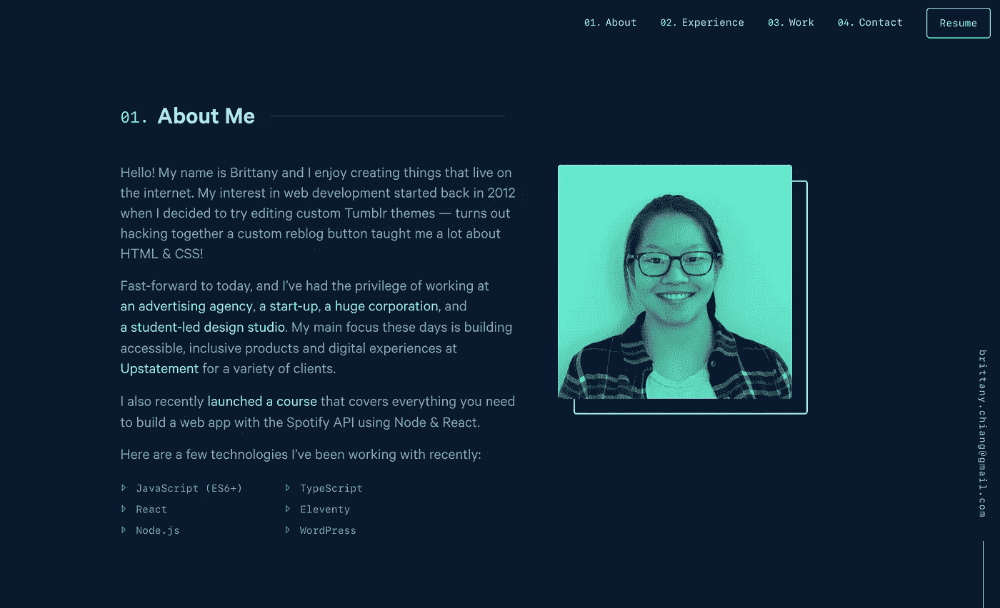
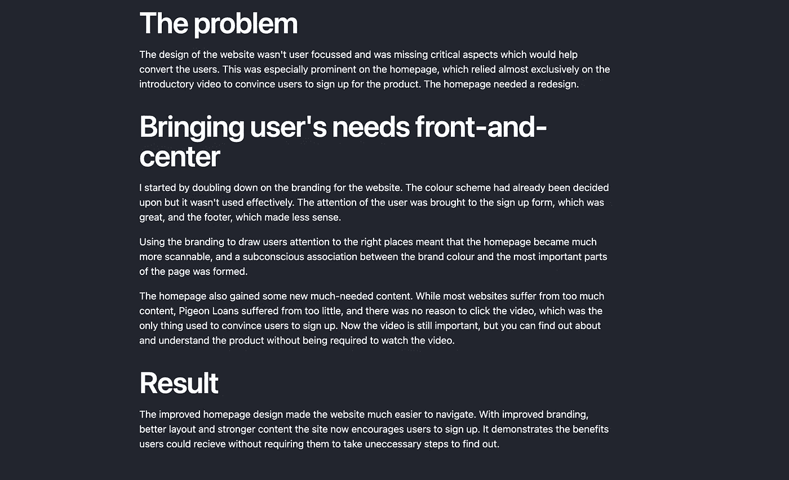
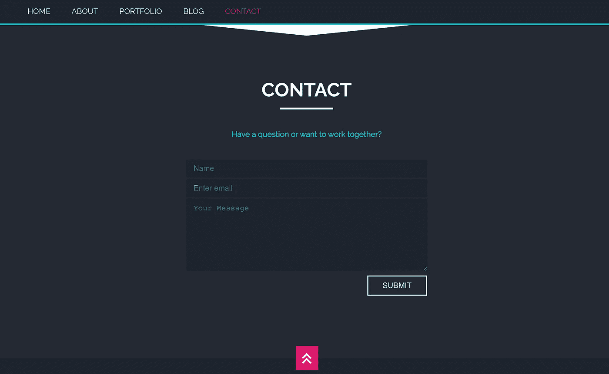
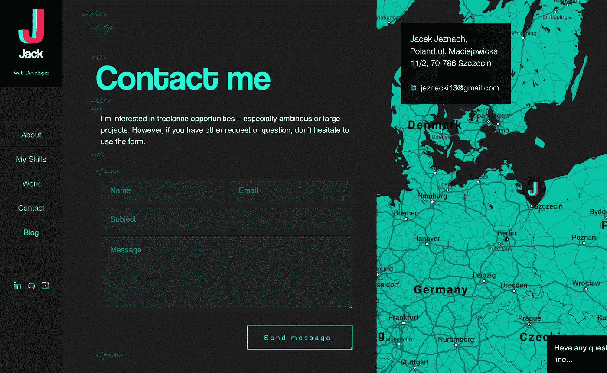

# 一个伟大的初级开发者作品集网站应该是什么样的？

> 原文：<https://javascript.plainenglish.io/what-should-a-great-junior-developer-portfolio-website-look-like-34ec64ea9576?source=collection_archive---------2----------------------->

## 这能让你被录用。

Photo by [Sarah Pflug](https://burst.shopify.com/@sarahpflugphoto?utm_campaign=photo_credit&utm_content=Picture+of+Developers+Discussing+Javascript+Code+%E2%80%94+Free+Stock+Photo&utm_medium=referral&utm_source=credit) from [Burst](https://burst.shopify.com/api-tech?utm_campaign=photo_credit&utm_content=Picture+of+Developers+Discussing+Javascript+Code+%E2%80%94+Free+Stock+Photo&utm_medium=referral&utm_source=credit)

根据 Zippia 的调查，目前仅在美国就有 215，248 名初级开发人员在 T2 工作。

到处都有很多机会让你获得第一份开发工作。然而，**的竞争**更加激烈。所以如果你想赢得这场比赛，你必须脱颖而出。

那么，如果你刚从大学毕业，或者你已经学会了用在线资源编程，你该怎么做呢？你如何向潜在雇主证明你的价值？

解决方案是为你自己建立一个惊人的**开发组合**。

有了一个构建良好的开发组合，你将能够展示你的技术和软技能。你的作品集是讲述你自己的故事的地方，最重要的是，向雇主展示你成长的意愿，即使你从未专业地工作过。

那么，你如何确保你能**建立一个令人惊叹的开发组合**值得展示呢？以下是我给你的最佳建议。

# 1.使用漂亮的设计

设计和编码是两个完全不同的研究课题。作为一名开发人员，你可能没有很多设计技能。那么，如何在不聘请 UI 专家的情况下，让你的作品集看起来惊艳呢？

解决方法是参考**已有设计**。

如果你访问一个类似于 [Dribble](https://dribbble.com/tags/portfolio) 或 [Behance](https://www.behance.net/search/projects?search=portfolio%20website&tracking_source=typeahead_nav_direct) 的网站，你会发现大量的**免费设计创意**供你参考。

请不要完全照搬你喜欢的设计。您应该仅将这些设计用作指南。例如，你可以采用这个设计中的导航栏[，然后选择使用一个类似于](https://dribbble.com/shots/11584903-Micael-Personal-CV-Resume-Site)的[关于我的部分，然后用一个定制的、流行的调色板来混合一切，你可以在这里生成](https://dribbble.com/shots/14943796-Personal-portfolio-website)。

根据经验，最好的投资组合设计是由简单的想法和简单的导航组成的。我完全不喜欢高度互动的投资组合，因为它们可能会惹恼人力资源经理，消耗他们本已有限的注意力。

# 2.为自己写一份强有力的描述

文件夹中的“关于我”部分是向潜在雇主描述你自己的一小部分。写得好的话，这一部分可以让雇主记住你的个性。在相反的情况下，它会让你看起来默默无闻，甚至令人厌烦。

考虑以下我可以在我的作品集里为自己写的介绍:

> “你好，我是皮耶罗！我对软件开发充满热情，精通 HTML、JavaScript 和 React。我现在正在寻找初级开发人员的职位，因为我最近学会了如何自己编写代码。”

那么考虑一下这个:

> “大家好，我是皮耶罗，我热衷于为网络创造东西。当我还是个孩子的时候，我就开始了我的开发者之旅。我找到了一个关于如何使用 Visual Basic 在我的电脑屏幕上显示一朵花的教程，一旦出现这种情况，我就完全迷上了计算机世界。
> 
> 这些年来，我通过研究 IT 领域培养了我对编码的热情，但最重要的是，通过使用 JavaScript 构建游戏，这样我可以挑战我的朋友。
> 
> 最近，我发现了自己对 web 开发世界的热情，以及构建有用网站背后的美丽，就像你将在这个文件夹中找到的那样。我现在正在寻找一个初级开发职位，以最终启动我的职业生涯，并在专业人士中学习。"

你读到的关于我的两件事都是真的，但其中一件更好地表达了我的能力和技能。

人力资源经理或开发人员在向他们申请时会清楚地知道你没有真正的工作经验，所以当他们查看你的投资组合时，他们希望看到的是你解决问题的**主动性**、**你的热情**、**你的学习意愿**。

所以当你写关于我的部分时，一定要突出你的所有这些特点。讲述一个你如何面对挑战并通过代码解决它的故事，谈论学习中最困难的时刻，解释为什么你想成为一名专业人士。

下面是布列塔尼·蒋作品集[中另一个关于我的精彩片段](https://brittanychiang.com/)。

[Brittany Chiang’s portfolio](https://brittanychiang.com/)

# 3.展示一些你引以为豪的项目

这是你投资组合的精髓。这是你展示你的技能和你在技术上能做什么的地方。

大多数人会建议你至少有两到六个值得展示的项目，包括他们的演示和 Github 代码的链接。我相信即使只有一个你也能做好**，但在那种情况下，你需要有一个更大的、令人难以置信的好项目。**

永远不要局限于简单地提及你的项目和添加一些链接。相反，写一个关于你每个项目的背景故事。

*   你为什么决定创建这个项目？你在日常生活中遇到过可以用代码解决的问题吗？
*   提及您使用的堆栈，并说明您选择它的原因以及这些堆栈给您带来的挑战。
*   你从这个项目中学到了什么？

例如，丹·斯普拉特林在他的[作品集](https://danspratling.dev/projects/pigeon-loans)中使用了一个很棒的背景故事，描述了他如何为一家希望改善前端体验的年轻公司解决了一个问题。

# 4.创建高效的联系方式

没有必要对此抱有幻想，因为这只是你的投资组合的最后一部分，在这里你可以让潜在的雇主很容易地与你联系。

这一部分可能是这样的:

Matthew Williams’ portfolio at: [www.findmatthew.com](http://findmatthew.com/)

Jack Jeznach‘s portfolio at [www.jacekjeznach.com](https://jacekjeznach.com/)

最后一个建议是，如果你觉得社交媒体的链接很有价值，记得在这一部分加入它们。例如，如果你有一个编码博客或者你在 Medium 上写东西，那么在页面上附上一个链接。其他常见的网站包括你的 Twitter 和 Linkedin 页面。

# 关键要点

*   获得开发工作的竞争非常激烈，尤其是在初级开发人员中。如果你想脱颖而出，那么你需要一个漂亮的投资组合。
*   你的第一个重点应该是从现有的免费设计中获取灵感，让你的作品看起来很漂亮。
*   一个伟大的作品集由三个主要部分组成:*关于我*、*项目*和*联系我*表格。
*   不要在你的“关于我”部分感到无聊，记得在你的话语中闪耀出你的学习意愿、技能和激情。
*   拥有两到五个令人惊叹的项目，如果真的很棒，甚至一个，为每个项目创造一个背景故事，讲述你为什么以及如何实施它们。
*   最后，创建一个高效的*联系我*表单，让雇主轻松找到你。

# 我最喜欢的开发投资组合

在搜索了几十个开发者的作品之后，我在这里向你展示了我最喜欢的作品，这样你就可以把它们作为一个例子，展示它们在传达创造者的价值方面的美丽和效率。

*   [杰克·杰兹纳赫的作品集](https://jacekjeznach.com/)。
*   [布列塔尼·蒋作品集](https://brittanychiang.com/)(绝对热门)。
*   [尤里·德·保拉的作品集](https://iuri.is/)(最令人印象深刻的图形)。
*   [Oluwakemi Adeleke 的作品集](https://www.kemiadeleke.com/)(我最喜欢的调色板)。
*   罗柏欧文的作品集。
*   [Olaolu 奥拉武义作品集](https://olaolu.dev/)。
*   丹·斯普拉特林的作品集(我喜欢他讲故事)。

# 资源

我在本文中提到的所有资源都在一个地方:

*   [运球](https://dribbble.com/tags/portfolio)
*   [行为](https://www.behance.net/search/projects?search=portfolio%20website&tracking_source=typeahead_nav_direct)
*   [Zippia dev 调查](https://www.zippia.com/junior-software-developer-jobs/demographics/)
*   [杰克·杰兹纳赫的作品集](https://jacekjeznach.com/)。
*   [布列塔尼·蒋作品集](https://brittanychiang.com/)。
*   [尤里·德·波拉的作品集](https://iuri.is/)。
*   [奥卢瓦凯米阿德莱克的作品集](https://www.kemiadeleke.com/)。
*   [罗柏欧文的作品集](https://robbowen.digital/)。
*   [Olaolu 奥拉武义作品集](https://olaolu.dev/)。
*   [丹·斯普拉特林作品集](https://danspratling.dev/)。

你还想要更多的 T21 吗？⬇️

## 想学习如何作为一名开发者赚更多的钱并达到财务自由吗？这是我给你的免费指南。

*更多内容请看*[***plain English . io***](http://plainenglish.io/)*。报名参加我们的* [***免费每周简讯***](http://newsletter.plainenglish.io/) *。在我们的* [***社区***](https://discord.gg/GtDtUAvyhW) *获取独家写作机会和建议。*