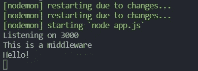
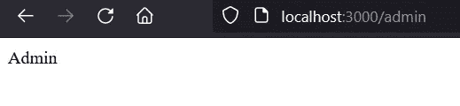
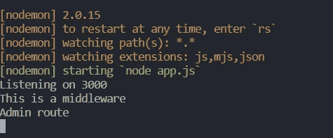
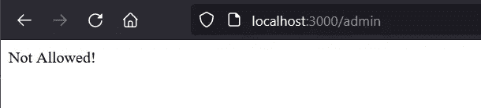
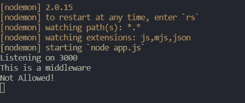
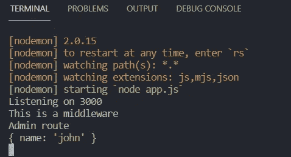

# Node.js 中的中间件到底是什么？

> 原文：<https://javascript.plainenglish.io/what-the-heck-is-middleware-in-node-js-626107ca44d0?source=collection_archive---------10----------------------->

## Node.js 中间件如何工作，它是什么。


Photo by [Glenn Carstens-Peters](https://unsplash.com/@glenncarstenspeters?utm_source=unsplash&utm_medium=referral&utm_content=creditCopyText) on [Unsplash](https://unsplash.com/s/photos/computer?utm_source=unsplash&utm_medium=referral&utm_content=creditCopyText)

中间件可以被定义为在请求和响应之间执行的功能。它还可以访问请求和响应对象。

让我们使用一个用 Node.js 编写的简单程序来理解这个概念。

这有两条路线。如你所见，有一个函数被定义为中间件，带有参数 **req** ， **res** ，以及 **next** 。并且已经通过了顶部的 app.use()。因此，这是一个全局定义的中间件，将在我们发送的每个请求中运行。

一旦程序运行，如果我们尝试访问 [http://localhost:3000](http://localhost:3000/) ，您可以看到下面的输出。



“这是一个中间件”的日志已经打印出来之前，“你好！”。这就是它的工作原理。这个全局中间件将在执行每个请求的函数体之前执行。所以这种类型的中间件可以在我们需要为每个请求做些事情的时候使用。

注意，这个中间件调用了代码的顶部。这是因为中间件按照我们定义的顺序运行。

还有另一种使用中间件的方法。

想象一下，您的应用程序由两种类型的用户使用，即管理员和公共用户。并且您需要验证只允许管理的路由的用户。这可以使用中间件来实现。为了解释这个概念，我使用了 **verifyUser()** 函数。为了简单起见，这里我只使用了一个字符串变量。但这是您可以添加逻辑来验证用户的地方。

如果用户是 admin，我们接下来调用，这允许继续请求-响应循环。否则，我们终止该功能继续运行。

我们如何将这个中间件用于我们需要发送的请求？我们可以这样做。

```
app.get('/admin', **verifyUser**, (req, res) => {
   console.log('Admin route');
   res.send("Admin");
});
```

使用 **verifyUser** 以及我们需要发送的请求。

让我们运行代码，看看验证输出。

尝试在您的浏览器中放置[http://localhost:3000/admin](http://localhost:3000/admin)。



我们可以看到响应“Admin”。

我们在候机厅被跟踪了。



如果我们将 verifyUser()中间件的 **userRole** 变量的当前值(admin)更改为其他值，会发生什么情况？在这里。



这是终端输出。



正如我们所看到的，它没有执行管理路由的函数体。

这种类型的中间件可以用于 JWT 验证。如果用户被授权，我们可以继续其余的事情，否则没有。

最后需要提到的是，我们可以访问中间件内部的 req 和 res 对象。

让我们在 verifyUser 中间件中添加一个简单的 console.log(req.query)语句。

而如果我们把网址 [http://localhost:3000/admin？在浏览器中，它会在终端中显示以下输出。](http://localhost:3000/admin?name=john)



它打印我们提供的查询参数。

希望这对您有所帮助。

编码快乐！

*更多内容看* [*说白了。报名参加我们的*](http://plainenglish.io/) [*免费每周简讯*](http://newsletter.plainenglish.io/) *。在我们的* [*社区*](https://discord.gg/GtDtUAvyhW) *获得独家写作机会和建议。*