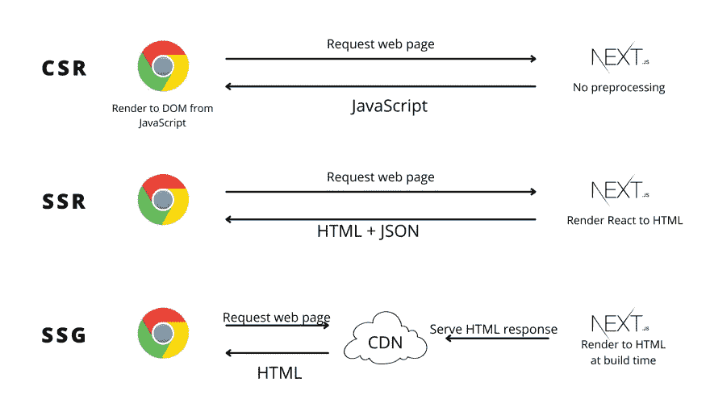

# SSG 到底是什么？用 Next.js 解释静态站点生成

> 原文：<https://javascript.plainenglish.io/what-the-heck-is-ssg-static-site-generation-explained-with-next-js-63d3a8c2cc1a?source=collection_archive---------11----------------------->


如果你是一名网络开发人员，并且你不是生活在岩石下，你一定遇到过这个叫做“SSG”的流行词。

在接下来的 5 分钟里，我们将学习它的基础知识。


# 什么是 SSG？

静态网站生成又名 SSG 是在构建时将你的 React 应用预渲染成 HTML。



SSG vs SSR vs CSR

我们来分解一下。理想情况下，您的 React 应用程序是客户端呈现的，这意味着用户的浏览器将首先下载完整的 JavaScript 包，然后在用户可以看到任何内容之前执行它。听起来很慢，是吧？真的是。

预渲染为 HTML 意味着我们将 React 组件转换为 HTML 文件，并将 HTML 文件发送到客户端，这样它就可以快速向我们的用户显示，而无需太多的处理或带宽。

你可能会想，这就是服务器端渲染。

是的，它是，SSG 的**静态**来自于这样一个事实，即整个过程不是为每个用户请求(像 SSR)而发生，而是在构建时发生，这使得 SSG 甚至比服务器端渲染更快。

简而言之，SSG 将在构建时在 React 应用程序中制作 HTML 页面，这样它就不必为每个请求都这样做，浏览器也不必在客户端这样做。

# 我们为什么需要 SSG？

SSG 的存在是为了服务于一个特定的用例，以 HTML 的形式提供 React 内置的动态页面。

你问的好处是什么？

*   **SEO** ，搜索引擎优化是做 SSG 的最大好处之一，因为它让爬虫很容易索引页面。
*   **速度**:正如你所猜测的，为最终用户提供一个 HTML 页面要快得多，因为浏览器不需要做太多的前期处理。预渲染使浏览器很容易获取 HTML 并直接呈现出来。
*   **用 CDN 缓存**:构建 HTML 页面为 CDN 缓存展现魅力打开了可能性。这些页面存储在离用户更近的地方，因此可以更快地访问。每个请求不必等待服务器渲染页面，它只需从 CDN 接收页面，从而节省我们的计算资源和资金。

# 用例

虽然您可以在任何场景中使用 SSG，只要页面可以在构建时呈现，但是这里有一些流行的 SSG 用例模式

*   营销网站
*   博客和文档，比如我自己的[博客](https://theanshuman.dev/articles)
*   投资组合网站

> *提示:知道你是否应该使用 SSG 的一个简单方法是回答:“你能在用户请求之前预渲染页面吗？”如果答案是肯定的，那么你应该选择静态生成。*

# 将 Next.js 用于 SSG

用 Next.js 构建静态页面很简单。它的工作方式与构建任何其他页面非常相似，即在`pages`目录中创建新文件。


## 静态路由的静态页面

让我们从创建静态路由`./pages/first-ssg.tsx`开始

因为页面是在构建时呈现的，所以 Next.js 需要在呈现之前获取所有数据。Next.js 寻找一个从页面导出的`getStaticProps`方法，以便在构建时运行。这个方法应该返回一个带有`props`键的对象，它被传递给页面组件。

`getStaticProps`应该被用来获取渲染页面所需的所有信息。例如，如果我们正在制作一个关于公司的页面，`getStaticProps`是从我们的 API 端点获取公司详细信息的合适位置。

```
// ./pages/first-ssg.tsx
import type { NextPage } from "next";

export async function getStaticProps() {
  // get all the data needed for rendering the page
  const data = await fetchPageData();
  return {
    props: { data },
  };
}

const FirstSSG = ({ data }) => {
 return (
      <main>
        {/* more html content */}
      </main>
 )
}

export default FirstSSG;
```

> *注意:* `*getStaticProps*` *不能访问传入的请求(如查询参数或 HTTP 头)，因为它在构建时运行，而不是在请求时运行。*

## 动态路由的静态页面

让我们创建一条动态路线`./pages/[id].tsx`

除了针对特定于页面的数据的`getStaticProps`之外，Next.js 现在还需要找出这条路径的所有可能路径，因为 Next.js 将不得不在构建时呈现这些路径的页面。

为此，Next.js 期望一个`getStaticPaths`方法，它将在构建时列出动态路由的所有可能路径。例如，如果它是一个动态博客页面，我们将需要列出所有可用的博客作为路径。

由`getStaticPaths`返回的`paths`包含一个将被传递给`getStaticProps`的`params`对象。您可以使用`params`来传递关于路径的数据，比如 blog slug 或 id，这些数据稍后会被`getStaticProps`用来获取页面数据。

```
// ./pages/[id].tsx
import type { NextPage } from "next";

export async function getStaticPaths() {
  return {
    paths: [
      { params: { ... } }
    ],
    fallback: // true or false or 'blocking', to be discussed later
  };
}

export async function getStaticProps({ params }) {
  // get all the data needed for rendering the page
  const data = await fetchPageData(params);
  return {
    props: { data },
  };
}

// Your page layout
const FirstSSG = ({ data }) => {
 return (
      <main>
        {/* more html content */}
      </main>
 )
}

export default FirstSSG;
```

为了使用 Next.js 构建一个静态网站，这就是你需要做的全部工作。

不可能都是美好的，对吧？先说一些陷阱。

# 陷阱

1.  这种方法的最大缺点之一是构建时间。如果你有成千上万的页面，建立所有的页面会花费很多时间。我知道有像*增量静态再生*和`fallback`道具这样的解决方案，可以结合使用来解决这个问题。我们一会儿会看到这一点。
2.  另一个可能出现的问题是过时的页面。因为您在构建时获取页面数据，所以一段时间后数据可能会过时。因此，您可能必须计划构建或以特定的时间间隔触发它们，以确保数据是最新的。这也可以通过*增量静态再生*解决。但是，如果是这种情况，您可能应该考虑服务器端呈现，而不是静态页面。

# `fallback`选项

正如我们上面讨论的，有一个`fallback`选项可以从`getStaticPaths`返回，它用于从`getStaticPaths`返回的不在`paths`列表中的路径。


> *重要的是要理解回退选项不会重新生成或更新在构建时渲染的路径，而是仅适用于构建时未预渲染的路径。*

`fallback`选项对于有数千页的应用程序来说非常有用，可以加快构建速度，同时保持最佳的用户体验。

# 为什么是 Next.js？

我更喜欢 Next.js，因为它提供了两种选择，

1.  服务器端渲染
2.  静态站点生成

所以，我可以在写作的时候选择我想走的路。

它还提供了与 Vercel 云平台的高度集成，该平台允许免费的边缘缓存和 CI/CD。

这一次到此为止。我将很快写另一篇文章解释*增量静态再生*。希望这篇文章对你有帮助！如果您有任何反馈或问题，请随时在下面的评论中提出。更多此类文章，请在 Twitter 上关注我

> *直到下一次*


*原载于 2022 年 3 月 21 日*[*https://theanshuman . de*v](https://theanshuman.dev/articles/create-your-own-url-shortener-with-nextjs-and-mongodb-in-10-minutes-4fg)*。*

*更多内容请看*[***plain English . io***](https://plainenglish.io/)*。报名参加我们的* [***免费周报***](http://newsletter.plainenglish.io/) *。关注我们关于*[***Twitter***](https://twitter.com/inPlainEngHQ)*和*[***LinkedIn***](https://www.linkedin.com/company/inplainenglish/)*。加入我们的* [***社区不和谐***](https://discord.gg/GtDtUAvyhW) *。*