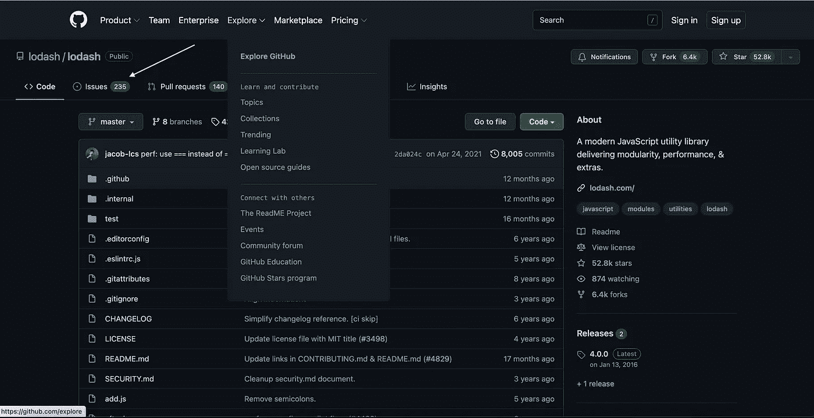
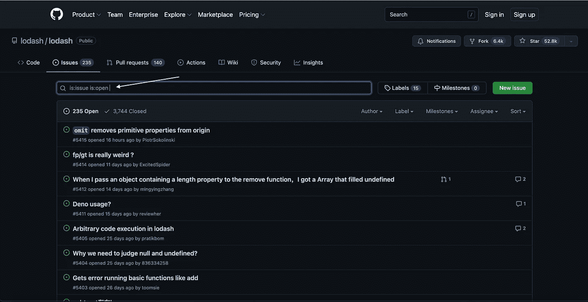

# 当您在第三方库中发现 Bug 时该怎么办

> 原文：<https://javascript.plainenglish.io/what-to-do-when-you-find-a-bug-in-a-third-party-library-7807a89ad8d9?source=collection_archive---------20----------------------->

## 当你在第三方代码中发现一个 bug 时，该怎么做的一些提示。

每个人都使用第三方代码。引入模块或库是每种编程语言的核心特性。它们提供的好处是显而易见的，但是当您在第三方代码中发现一个 bug 时，新开发人员可能很难知道该做什么。我想分享一些当你认为你已经找到了的时候该怎么做的建议。

## 仔细检查文档

我的第一条建议是百分之百确定你看到的行为不是有意的。仔细检查您提供的任何输入，并重新阅读库提供的文档。

我记得有无数次我认为我在库中发现了一个错误，结果发现我提供了错误的输入，错过了一个配置选项，或者使用了错误的方法。

图书馆越大，同行评审越多，我就越想这么做。

## 搜索问题部分

如果你确定这是一个 bug，那么接下来要去的地方就是图书馆的 GitHub 页面。每个 Github repo 都有一个部分，开发者可以在那里报告他们发现的问题。

访问“问题”选项卡会将您带到“问题”部分。您可以搜索其他开发人员报告的问题。你可能不是第一个注意到这个错误的人。

当您第一次访问“问题”选项卡时，搜索结果将过滤未解决的问题。如果你在这里没有找到你要找的东西，我建议扩大搜索范围。您看到的问题可能已经解决。

如果你的搜索发现了一个看起来有希望的问题，你可以点击它来阅读这个帖子。请务必仔细阅读问题报告。

问题线索有时很难跟踪。线程可能会因为几个月甚至几年的开放而变得冗长。其他的可能会演变成无关话题的争吵。我已经数不清我读过多少关于函数式编程与面向对象编程的争论，为什么 javascript 是人类最糟糕的事情，或者为什么使用 typescript 的人都是白痴。

如果你觉得某个帖子太冗长或者开始偏离主题，你可以快速浏览评论，寻找底部有这样图标的帖子。

如果你看到这些，有人很可能已经提供了解决方案或者写了一些重要的东西。停止滚动，看看周围的评论。

## 一般搜索

如果你在问题部分没有找到任何报道，我接下来要做的就是尝试在谷歌上进行一般性搜索。这可能会把你带到像 StackOverflow 或任何数量的软件信息网站这样的地方。

我提倡在浏览完 GitHub 的问题后做一个一般性的搜索，因为根据我的经验，一般性的搜索经常会回到问题部分。可能的话最好避开中间人。

## 制造一个问题

如果在全面搜索后你仍然两手空空，回到之前的 GitHub 问题部分，创建你自己的问题。为了最大限度地利用您的错误报告，在描述您遇到的错误时要尽可能具体。看看其他的一些问题，了解一下什么是好的问题。GitHub 的问题是垃圾中的垃圾。如果你写了一个糟糕的问题，你会得到一个糟糕的回应。

## 包扎

希望这能给你一些启示或想法，告诉你如果将来发现一个 bug 该怎么做。如果你觉得我错过了什么或者想要给我反馈，请随时评论。

*更多内容请看*[***plain English . io***](https://plainenglish.io/)*。报名参加我们的* [***免费周报***](http://newsletter.plainenglish.io/) *。关注我们关于*[***Twitter***](https://twitter.com/inPlainEngHQ)*和*[***LinkedIn***](https://www.linkedin.com/company/inplainenglish/)*。加入我们的* [***社区不和谐***](https://discord.gg/GtDtUAvyhW) *。*