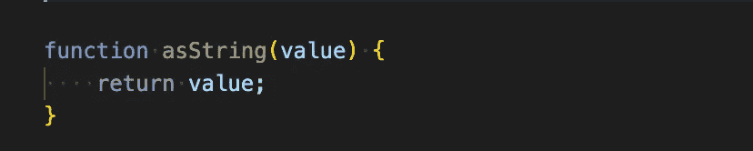
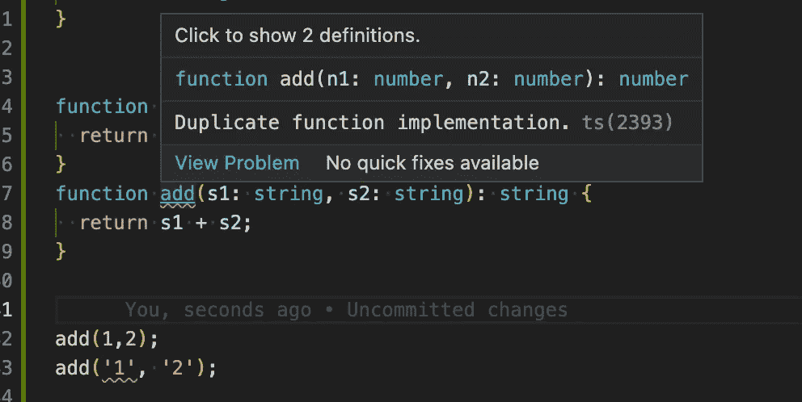

# TypeScript 对我们的 JavaScript 代码真正意味着什么

> 原文：<https://javascript.plainenglish.io/what-typescript-really-means-for-our-javascript-code-90f3ea7ad8a5?source=collection_archive---------3----------------------->

Photo by [Mohammad Rahmani](https://unsplash.com/@afgprogrammer?utm_source=medium&utm_medium=referral) on [Unsplash](https://unsplash.com?utm_source=medium&utm_medium=referral)

"类型脚本是 JavaScript 的超集."每个 JavaScript/TypeScript 开发人员都读过或听过这种说法。但这到底意味着什么呢？

在高层次上，当我们编译 TypeScript 代码(使用`tsc`命令)时，我们得到两件事:

*   将我们具有现代特性的类型脚本代码转换成旧版本的 JavaScript(取决于我们的输出目标)。
*   检查我们的代码中的类型错误。

这两件事是完全独立的，我们将看到如何。

# **即使我们有类型错误，我们也能得到 JavaScript 代码**

在像 Java 或 C 这样的语言中，如果我们在“编译时”有任何错误，就不会产生任何输出。当我们运行`tsc`命令来编译我们的类型脚本代码时，出现错误并不妨碍我们获得有效的 JavaScript 代码。

例如，如果我们有这样的代码:

我们运行`tsc`命令，我们将得到这样的代码:

甚至当我们收到错误`Type ‘number' is not assignable to type ‘string'.ts(2322)`时。

如果我们想避免这种情况，我们应该在我们的“tsconfig”文件中使用选项`noEmitOnError: true`,或者作为命令行选项。通常，这个选项应该是`true`，但是如果我们需要，我们可以把它设置为`false`，并且总是得到有效的 JavaScript 代码。

这种行为在 Java 或 c 语言中是不可能的。

# 运行时无法检查 TypeScript 类型

参见以下代码:

你以前见过这个错误吗？

TypeScript 类型只在我们编码时存在，当代码被“编译”时，它们被删除，所以在运行时它们将不存在。

这个错误至少可以用两种方法解决(还有更多方法)。

使用属性进行验证:

使用类别:

第一个可行，因为我们有一个值可以使用(“worker”属性)，第二个可行，因为我们有一个类型和值，而接口只引入类型。

# 运行时值不受类型操作的影响

我们从这段完全有效的类型脚本代码开始:

很容易理解，一个总是以字符串形式获取的代码。让我们看看生成的 JavaScript 代码:

如果我们真的想规范化数据，我们需要执行某种运行时检查，比如:

输出是一样的，只是删除了类型:

# 方法没有重载

TypeScript 允许我们定义但不能实现具有不同签名的方法。

我们可以用不同的签名定义一个方法，然后实现一个方法:

但是我们不能用不同的签名实现这个方法:

# 这对运行时性能没有影响

与“性能”相关的只有两件事:

*   编译代码的时间开销。
*   与本机实现相比，支持较旧的运行时可能会导致性能开销。

这些是使用 TypeScript 时要记住的一些基本的和更重要的事情。希望这能帮助你更多地了解和理解在你当前的项目中使用它。

*更多内容请看*[***plain English . io***](https://plainenglish.io/)*。报名参加我们的* [***免费周报***](http://newsletter.plainenglish.io/) *。关注我们关于*[***Twitter***](https://twitter.com/inPlainEngHQ)*和*[***LinkedIn***](https://www.linkedin.com/company/inplainenglish/)*。加入我们的* [***社区不和谐***](https://discord.gg/GtDtUAvyhW) *。*