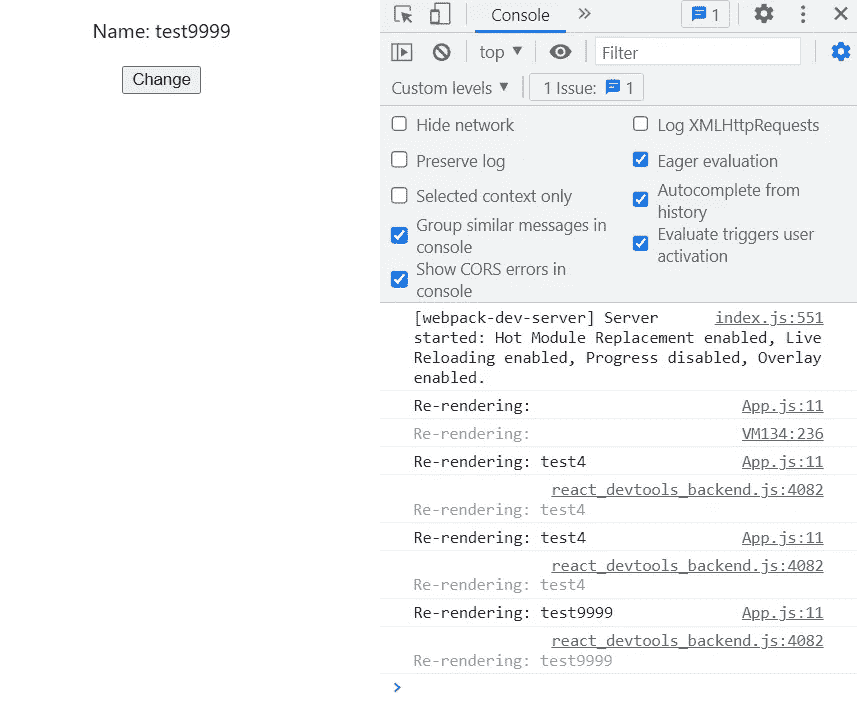

# 如果我们调用 React.useState 一万次会发生什么？

> 原文：<https://javascript.plainenglish.io/what-will-happen-if-we-call-react-usestate-10000-times-cfb82b6de179?source=collection_archive---------6----------------------->


Photo by [Ferenc Almasi](https://unsplash.com/@flowforfrank?utm_source=medium&utm_medium=referral) on [Unsplash](https://unsplash.com?utm_source=medium&utm_medium=referral)

# 介绍

今天的文章就是为了回答这个问题: ***如果我们调用 React.useState 10000 次会发生什么？***

简单来说，React 是一个 JavaScript 库，可以帮助您创建 SPA 应用程序。但是有一个小问题，如果我们调用`useState` 10000 次或 1 次以上，React 会重新呈现吗？

在本文中，我们还将学习 React 的两个最重要的深入概念。

## 让我们测试一下行为

为了测试这种行为，我创建了一个只有一个状态`name`的小 React 应用程序，单击一个按钮，我将更新`name`状态 10000 次。以下是 App.js:


App.js

现在，让我们转到浏览器，看看它将如何运行:


First-time load app

当应用程序第一次加载时，它将打印为空，因为默认状态没有变化，我们将默认状态保持为空字符串。接下来，让我们做一个点击动作，看看它会重新渲染组件多少次:


after the click

很奇怪，对吧？如果我们让循环运行 4 次，为什么只有一次重新渲染？我们试一万次，确认一下。咔嚓一声之后:



同样的输出。重新渲染只发生一次，但是为什么呢？所以有两个原因阻止了重新渲染。

# 为什么禁止重新渲染？

阻止重新渲染有两个原因，它们都满足阻止的条件。

## 对象. is 检查

我们都知道 React 与虚拟 DOM 一起工作，每当 React 感觉到组件中有有效的更新，它就会触发重新渲染。但是那种感觉是什么？一种这样的“感觉”是`Object.is()`检查。点击阅读更多关于`Object.is()`的内容。但事情是这样的:

```
Object.is(5, 5); // true       
Object.is(5, 6); // false
Object.is(null, null); // true
Object.is([], []);  // false
```

对于所有原始数据类型，如果里面的数据有效，`Object.is()`检查返回`true`；而对于非原语数据类型，如果它们共享同一个内存位置，那么返回值为`true`，否则为 false。现在，React 正在对每个导致重新渲染的变量使用这个`Object.is()`检查。例如，如果我们多次使用同一个值，那么重新渲染也只会发生

```
if(Object.is(prevState, newState))// don't do anything
else // re-rendersetName('test')
setName('test')
setName('test')// only runs for one time which is first
```

但是在我们之前的例子中，我们用索引更新了值，所以`Object.is()`检查应该会失败，对吗？

是的，它会失败，但是还有一个检查阻止了重新渲染。

## 同时处理多条语句

比方说，如果 React 是一个人，你要求那个人改变主工厂的一些东西，当他回来说他改变了它，然后你再次要求同样的东西再次改变。

这太搞笑了，一个正常人会给你当头一棒。相反，你可以做一些调查，然后把最后的修改告诉那个人。对那个人来说，这也更容易理解。

以同样的方式，React 在实际触发重新呈现之前等待并查看下一条语句是否相同。举个例子，

```
setName('test')
setName('test1')
setName('test2')// re-render only one time
```

虽然有 3 个具有不同值的语句，但是它们被保存在相同的队列中以重新呈现，并且由于它们的顺序遵循相同的状态，所以它将只更新 DOM 一次。

## 结论

在这篇文章中，我们学到了两个关于 React 如何防止重新渲染的新东西。这些是 React 采取的优化应用性能的对策。在我们上面的例子中，只有发送原因阻止了重新渲染，但是了解其他概念也是很好的。

我希望你今天知道了一些有趣的事情。你可以在这里找到源代码[。编码快乐！](https://github.com/Piyush-Use-Personal/react-10000-times)

*更多内容看* [***说白了。报名参加我们的***](https://plainenglish.io/) **[***免费周报***](http://newsletter.plainenglish.io/) *。关注我们关于* [***推特***](https://twitter.com/inPlainEngHQ)[***LinkedIn***](https://www.linkedin.com/company/inplainenglish/)*[***YouTube***](https://www.youtube.com/channel/UCtipWUghju290NWcn8jhyAw)*[***不和***](https://discord.gg/GtDtUAvyhW) *。*****