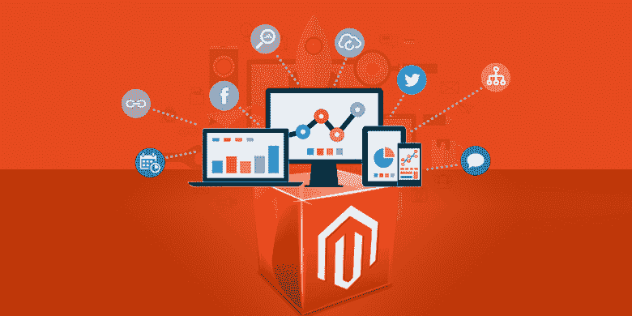
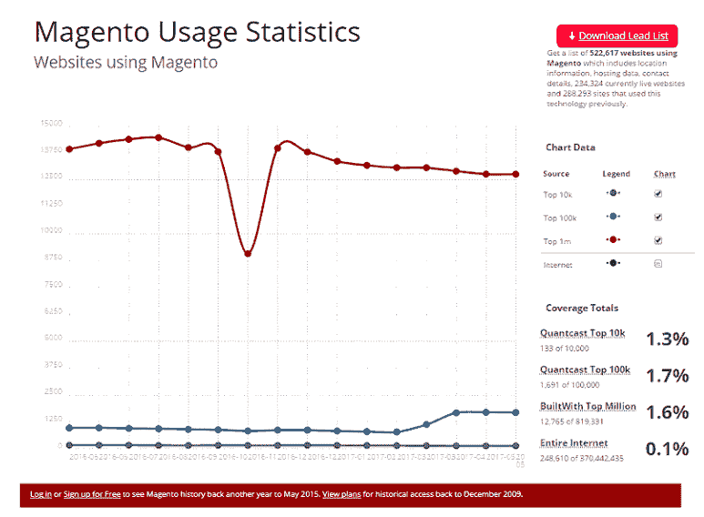
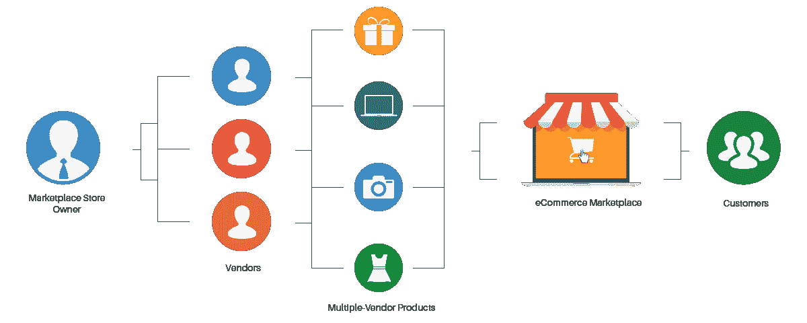
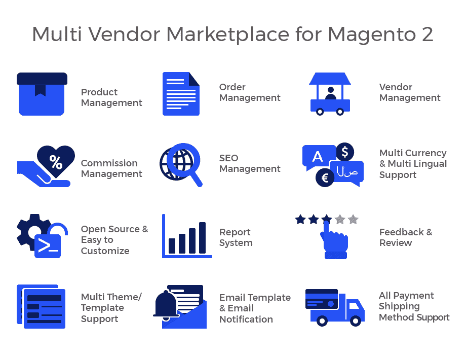
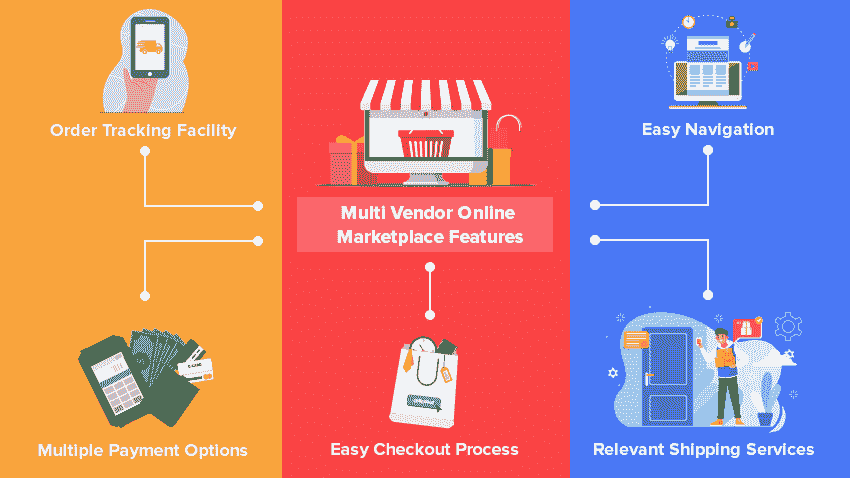

# 建立电子商务市场你必须知道什么

> 原文：<https://javascript.plainenglish.io/what-you-must-know-to-build-an-e-commerce-marketplace-aa972a1cd983?source=collection_archive---------15----------------------->

## 如何像亚马逊一样建立一个多厂商销售的电子商务网站？

[图像来源](https://learnwoo.com/magento-beneficial-ecommerce-business/)

Magento 是一个著名的可扩展电子商务平台，使企业能够创建多供应商解决方案。随着越来越多的公司寻求通过共享产品、运输、库存管理等方式来削减成本，多供应商解决方案变得越来越受欢迎。

[图片来源](https://www.intelvue.com/services/magento-development-agency/)

自 2008 年发布以来，Magento 一直是多供应商电子商务解决方案的首选平台之一。在这篇博文中，我们将了解如何使用 Magento 的内置工具和由 Magento 社区或其他供应商开发的第三方应用程序来开发多供应商解决方案。

# **多供应商解决方案是如何工作的？**

多供应商解决方案支持在您的在线商店上销售来自多个供应商的商品。简而言之，如果你有不止一个卖家在你的网站上销售他们自己的产品，这就是多供应商销售。

这在服装等行业很常见，每个制造商通常都有自己的品牌和产品线。亚马逊就是这种解决方案的一个例子。那么，你如何像亚马逊一样建立一个面向多供应商销售的电子商务网站呢？

[图像来源](https://www.fihaarabari.com/become-our-vendor-with-no-transaction-fee/)

每当你想到创建一个电子商务企业，尤其是如果它是大型的和成功的，你的第一个想法将是如何为你的网上商店创建一个多供应商解决方案。

这是自然的，也是可以理解的，因为无论你的经营规模是大是小，在很多情况下，你都需要增加更多的供应商或者从不同的公司进行销售。那么，让我们来了解如何使用 Magento 创建多供应商解决方案。

此外，如果您想要投资电子商务业务或启动成熟的创业业务，您必须考虑**多供应商应用程序开发**以获得出色的解决方案。

***另请阅读*** [***关于 Magento 2 多厂商市场***](https://www.valuecoders.com/blog/technology-and-apps/everything-you-need-to-know-about-magento-2-multi-vendor-marketplace/?utm_source=magento_multi&utm_medium=guest_blog&utm_campaign=medium&utm_id=NKY) 的一切信息

# **使用 Magento 2 创建多厂商电子商务应用**

Magento 2 为亚马逊和 Lowes 等畅销网站提供支持的能力是它在企业家中如此受欢迎的原因。有了一个平台，你就可以为任何你能想到的产品或服务创建一个在线商店。

Magento 2 已经是一个多厂商市场，需要你在屏幕上做一些简单的点击来启动你的应用程序。Magento 2 拥有未来市场所有者所梦想的一切。凭借其 29%的市场份额和高度可定制的特性，

Magento 的顶级 cms 一定会让您了解最新的行业趋势，同时也让那些希望自己的交易免受黑客攻击或在线欺诈的客户高枕无忧。它为用户提供了几种适合不同规模企业的计划。

该平台还提供了一个免费选项，中小型公司可以不受任何限制地使用，尽管它不具备大型软件包中的所有功能，如在线支付处理和实时聊天支持服务，这就是付费订阅发挥作用的地方！

[图像来源](https://community.magento.com/t5/Find-an-Extension-that/Best-Magento-2-Marketplace/td-p/101327)

要创建一个成功的市场，你需要的不仅仅是完美的网站。您还必须确保您的脚本已经准备好所有的特性和功能！

这样，人们就可以在你的网站上轻松找到他们想要的东西，而不是像 Etsy、易贝等网站那样把几十个甚至几百个分散在网上。

选择一个脚本来开发您的在线市场可能会令人生畏，但是 Magento 开发人员的一个灵巧的团队可以为您做到这一点。当查看现有用户的评论并了解更多关于 Magento 开发公司****的信息时，不要忘记移动设备兼容性是多么重要。****

****你想要一个专门为小屏幕定制的界面，这样每个人都可以访问，无论他们的大小或偏好如何——特别是每天都有这些新技术出现(如 AR)。如果定制不是这个项目真正需要的，那么雇佣熟练的 Magento 开发者可能会有所帮助。****

****此外，专业的 **Magento 2 多厂商移动应用程序开发**服务也可以帮助您获得想要的解决方案，从而获得巨大的吸引力。****

*******同时阅读*** [***多厂商市场网站上的宝贵见解:完整指南***](https://www.valuecoders.com/blog/ecommerce-cms/multi-vendor-marketplace-guide/?utm_source=multi_vendor_guide&utm_medium=guest_blog&utm_campaign=medium&utm_id=NKY)****

****以下是您的多供应商市场必须具备的特性。****

# ****多供应商电子商务应用程序的必备功能****

****多供应商电子商务应用程序应该具有许多对管理多供应商商店至关重要的功能。这些功能包括:****

*   ******多供应商购物车******

****它使商家能够通过单一的店面销售他们的产品。这对于希望外包其电子商务需求或拥有大量产品目录的企业来说非常理想。****

*   ******产品目录同步******

****它允许你在你的供应商和 Magento 商店之间保持你的产品数据同步。根据每个 Magento 2 电子商务开发公司的说法，这是每个解决方案的基本特征。****

*   ******订单管理******

****此功能使您能够在一个地方管理所有供应商的订单。这对于通过多种渠道销售产品的企业来说非常重要。****

*   ******库存管理******

****该功能允许您跟踪每个供应商的库存水平。这对于希望确保有足够库存来满足客户需求的企业来说非常重要。****

*   ******付款处理******

****它允许您通过各种支付方式接受客户的付款。运输集成允许您使用供应商的运输费率和方式运输产品。****

********

****[图像来源](https://www.zapbuild.com/insights/category/ecommerce/10-most-attractive-practical-features-of-a-multi-vendor-online-marketplace/)****

*   ******快速入职******

****这是与潜在卖家的第一次迭代。由于企业家总是很忙，你应该确保供应商的入职包括最少数量的步骤，以使他们尽快进入你的市场和他们的小组，这样他们就可以马上开始赚钱！记住，越小越好！****

*   ******简单的产品管理******

****所以，如果你想给你的卖家在任何市场上最大的成功机会——无论他们是上传产品还是通过亚马逊这样的平台销售——你应该确保他们有一个简单的方法来获得他们需要的东西。****

****这意味着提供其他市场上可用的所有特性和功能，以便用户可以轻松地将商品导入到您的产品中，而无需自己花费额外的时间！专业的**电子商务市场开发**使您能够在您的解决方案中注入这些令人兴奋的功能，以提高您的客户参与度。****

*   ******方便订单处理******

****处理订单的便利性一直是亚马逊区别于竞争对手的一个因素。这一点，加上他们对客户服务和快速交付时间的关注，使他们成为一个出色的电子商务平台，既适合想利用每一个可能的机会的卖家，也适合想尽快将商品放入购物车的买家。****

****订购过程应该简单而有效，这样顾客就不会陷入试图弄清楚事情如何运作的困境，这可能会导致他们甚至在开始购物之前就感到沮丧！****

*   ******直观的用户体验******

****卖家应该能够轻松直观地访问显示其店铺最重要信息的数据。这样，他们可以跟踪流量统计，如总销售额或潜在客户的转换率。例如，为了做出关于如何最好地经营你的企业的明智决定，这是必不可少的！****

*   ******高级产品搜索&过滤器******

****毫不奇怪，高级产品搜索和过滤是电子商务网站上最受欢迎的功能之一。****

****它们可以让用户更容易地找到产品，允许他们过滤选项，确保你不会错过任何搜索结果，相比之下，在常规网络浏览器中只使用简单的关键字或短语，如谷歌的 Prime Results 页面，只显示排名“最畅销”的商品。****

****当浏览充满不同类型商品的页面时，它也提供了清晰度，因为如果它们用颜色编码，某些东西的含义更有意义，例如红色意味着昂贵，蓝色意味着便宜。****

****此外，自 2008 年发布以来，Magento 一直是多供应商电子商务解决方案的首选平台之一。****

****它由许多功能组成，这些功能使其成为多供应商解决方案的理想平台，包括多供应商购物车、产品目录同步、订单管理、库存管理、支付处理和运输集成。****

****这就是为什么 Magento 的**电子商务市场开发非常受欢迎，并被小型&大型企业所利用。******

# ******利用 Magento 开发多供应商市场的成本******

****根据您的特定需求定制市场的成本可能会很高，价格从 1 万美元到 10 万美元不等。拥有你所需要的所有功能的多供应商软件最终的价格可能会超过 15 万美元甚至更高！****

****在这种情况下，对于大多数刚刚起步的企业来说，这可能是有意义的，不仅是为了站稳脚跟，也是为了在投入太多资金到可能不会成功的事情上之前，看看自己在朝着什么方向努力。****

****现代消费者希望从他们的市场中得到很多，并且拥有所有最新的功能，价格也很高。然而，在 Magento Community Edition 中用现成的脚本建立一个类似易贝的站点是可能的，它拥有最新的功能，花费超过 800 美元！****

******结束******

****借助多供应商解决方案，您不再需要多个购物车和结帐表单。客户可以从您网站上的任何供应商处购买，而无需在其他地方注册或创建帐户。您的客户只需一辆购物车就能浏览所有供应商提供的产品。****

****此外，多供应商解决方案是您在一个网站上销售来自不同供应商的产品和服务的绝佳方式。像 Magento 2 这样的多处理平台可以用来创建一个包含许多供应商产品的在线商店。****

****在创建多供应商电子商务平台时，确保它提供用户管理、运输管理、库存控制等功能。为了创造一个非凡的解决方案，[**聘请一位电子商务开发人员**](https://www.valuecoders.com/hire-developers/hire-ecommerce-developers?utm_source=hire_ecom_dev&utm_medium=Medium&utm_id=NKY) ，他能理解你的愿景并创造一个高品位的解决方案。****

****感谢您的阅读。****

*****更多内容看* [***说白了。报名参加我们的***](http://plainenglish.io/) **[***免费周报***](http://newsletter.plainenglish.io/) *。在我们的* [***社区不和谐***](https://discord.gg/GtDtUAvyhW) *获得独家获取写作机会和建议。*******