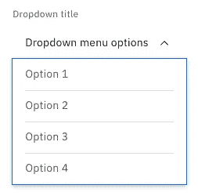
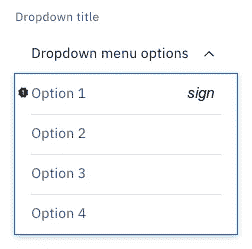

# 关于控制反转你需要知道什么(对于 React)

> 原文：<https://javascript.plainenglish.io/what-you-need-to-know-about-the-inversion-of-control-for-react-278c0f4dcd18?source=collection_archive---------2----------------------->

## 逆控制原理在反应工程中的应用

Image by [Martin Sanchez](https://unsplash.com/@martinsanchez) on [Unsplash](https://unsplash.com/photos/SL1co_Etck8)

## **TL；博士**

当我在[维基百科](https://en.wikipedia.org/wiki/Inversion_of_control)上打开“控制反转”原理的解释时，我愣住了——它的描述如此复杂，不是人类可读的方式……在这篇文章中，你会找到一个关于“控制反转”原理的问题定义及其解决方案，希望这比维基百科的内容更容易理解。

简而言之，“控制反转”(IoC)原则是为某个模块构建 API 的一种方式，它允许在没有大量输入参数的情况下灵活定制该模块，例如:

*   标志(例如，“visibleIcon”、“disabledSubSecionSubmitButton”等)
*   类型(例如，`iconType="primary"`、`subSectionSubmitButonType="secondary"`)

这是没有实现 IoC 的 React 组件的常规用法:

Gist 1\. Section w/o IoC

这就是我们如何使用这个遵循 IoC 原则并实现适当 API 的“部分”组件:

Gist 2\. Section with IoC

假设您正在使用 React 构建一个大型应用程序。有一天，业务部门要求您为 dropdown UI 元素开发一个通用的解决方案——“drop down”React 组件。我假设它可能看起来像下面这样(图片。1).

Pic. 1\. Dropdown v1 ([source](https://www.carbondesignsystem.com/components/dropdown/usage/))

你可能认为现在它看起来相当不错，绝对应该为你的工作感到骄傲！

随着时间的推移，这个“Dropdown”组件已经被许多开发人员在数百个地方使用。该组件按预期工作，并且在整个应用程序中看起来一致——这是在一个系统中使用共享组件的好处。它强制团队使用相同的技术方法，并产生一致的设计。

下面是这个组件的代码。我不打算深入研究实现细节——只指定了与主题相关的主要部分。

Gist 3\. Dropdown implementation w/o IoC

再一次。这是一个很好的解决方案。但是，不幸的是，不可扩展。

这是用法示例。

Gist 4\. Dropdown usage w/o IoC

## 扩展性问题

这款应用正在成长。对设计有了新的要求:下拉菜单在不同的地方应该有不同的视图形式。这意味着您需要允许将定制应用于“下拉”React 组件。

例如，需要向下拉选项添加两个 UI 元素:

*   选项标题前面的图标
*   选项标题后的文本符号

Pic. 2\. Dropdown v2 ([source](https://www.carbondesignsystem.com/components/dropdown/usage))

见图。1.请不要因为这张不漂亮的照片责怪我。我的目标是更多地开发有用的内容，所以现在，我宁愿忽略这些细节。希望你能理解。

我们可以遵循一种简单的方法来开发初始解决方案。这个解决方案假设添加控制这些新 UI 元素的道具——这是一个相当流行的解决方案。但不是很好，我们稍后会看到。

让我们试试。

Gist 5\. Complex dropdown implementation w/o IoC

这是用法示例。

Gist 6\. Complex dropdown usage w/o IoC

看起来没那么糟。开发者可以使用“道具”来控制视图。但正如我已经提到的，这不是一个理想的解决方案。想象一下这个组件的未来增长——当一个组件有大量的道具控制 UI 元素时，这将是地狱。它还需要保持所有相关逻辑的同步。只要相信我，在前端开发人员的职业生涯中，支持这样的组件并不是一件更好的事情。😀

让我们返工这个组件！

## 控制反转

我们可以遵循几种模式来实现 React 组件的控制反转:

*   [渲染道具](https://reactjs.org/docs/render-props.html#gatsby-focus-wrapper)
*   [反应过来的孩子](https://en.reactjs.org/docs/composition-vs-inheritance.html)

这两种方法都不错。它们中的每一个都可能在不同的情况下有用。两者我都用，但在大多数情况下，我更喜欢第二种选择。我将倾向于这种方法并详细描述它。我相信“渲染道具”的方法对你来说很容易理解，如果你理解“儿童”的方法的话。还有，有很多关于“渲染道具”的很酷的文章，我不想重复。

这些模式与本文中的[【复合组件】](https://medium.com/unibuddy-technology-blog/compound-components-in-react-b04772f9eb58)模式紧密相连。对于开发[内聚](https://medium.com/clarityhub/low-coupling-high-cohesion-3610e35ac4a6)组件来说，这是一件很有用的事情。有关更多详细信息，请参见提供的文章。

“children”方法的思想假设使用“children”属性(Capitan Obvious)和从可定制组件的根重新导出的公共组件。

这是根组件——“下拉菜单”。

Gist 7\. Complex dropdown implementation with IoC

然后我们需要开发代表自定义 UI 元素的组件——“选项”、“选项”。标题“，”选项。图标”和”选项。签字”。

Gist 8\. Dropdown element — Option

Gist 9\. Dropdown element — Option.Title

Gist 10\. Dropdown element — Option.Icon

Gist 11\. Dropdown element — Option.Sign

现在我们需要将所有这些部分组装成一个实体。

Gist 12\. Dropdown — assemble elements

Gist 13\. Dropdown option — assemble elements

现在，让我们来看一下使用示例。这与第一个例子非常不同。

Gist 14\. Complex dropdown with IoC — usage example

看起来不错！是吗？

你可能认为有许多小块可以合并成一个实体。但这是不对的:我们需要这些小部件来提供扩展性和使用便利性的所有条件。

现在真的可以扩展了。让我提供一个添加新 UI 元素选项—“按钮”的例子。

Gist 15\. Dropdown element — Option.Button

现在我们需要将这个新的“按钮”连接到“选项”上。

Gist 16\. Dropdown option — assemble elements (with Button)

最后是使用示例。

Gist 17\. Complex dropdown with IoC — usage example (with Button)

我可以继续这个话题。但不确定这是否有意义。我建议您停止阅读，打开您的代码编辑器，尝试建议的解决方案。这是学习最佳实践的最佳方法。

你也可以谷歌一下，找到很多与这个话题相关的有用资源。我喜欢[肯特·c·多兹](https://medium.com/u/db72389e89d8?source=post_page-----278c0f4dcd18--------------------------------)的这篇[“控制反转”](https://kentcdodds.com/blog/inversion-of-control)的文章。

如果有任何问题，请随时与我联系。

祝你好运！

*更多内容看* [*说白了。报名参加我们的*](http://plainenglish.io/) [*免费周报*](http://newsletter.plainenglish.io/) *。在我们的* [*社区*](https://discord.gg/GtDtUAvyhW) *获得独家写作机会和建议。*