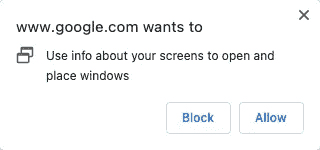
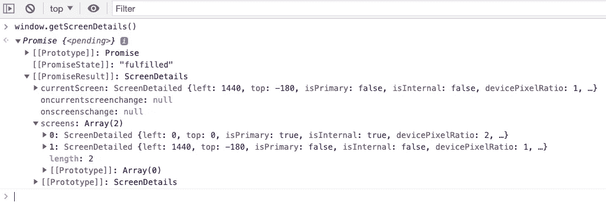

# Chrome 100 有什么新功能？

> 原文：<https://javascript.plainenglish.io/whats-new-in-chrome-100-623327e35d26?source=collection_archive---------18----------------------->

## 100 个很酷的网络瞬间


Photo by [Rubaitul Azad](https://unsplash.com/@rubaitulazad?utm_source=medium&utm_medium=referral) on [Unsplash](https://unsplash.com?utm_source=medium&utm_medium=referral)

Chrome 更新到版本 100！从 1989 年万维网诞生到现在，30 多年来，Web 的发展经历了许多非常重要和激动人心的时刻。Google 还发布了 [100CoolWebMoments](https://developer.chrome.com/100/) ，里面记录了很多有趣且值得纪念的瞬间，推荐大家去看看！

本文将介绍 Chrome 100 中那些我们需要注意的新特性。

# 用户代理字符串

由于用户代理中的 Chrome 已经升级到版本 100，所以如果使用的版本匹配规则不够健壮，就会出现问题，比如下面的代码:

```
const userAgentString =
  'Mozilla/5.0 (Macintosh; Intel Mac OS X 10_15_7) AppleWebKit/537.36 (KHTML, like Gecko) Chrome/100.0.4896.75 Safari/537.36';**// limited number of matches.**
console.log(userAgentString.match(/Chrome\/(\d\d)/).slice(0, 2)); // [ 'Chrome/10', '10' ]**// unlimited number of matches.**
console.log(userAgentString.match(/Chrome\/(\d+)/).slice(0, 2)); // [ 'Chrome/100', '100' ]
```

此外，Chrome 100 将是默认支持未缩减 User-Agent 的最后一个版本，之后 User-Agent 中包含的信息将逐渐缩减。

示例:

铬 101:船舶减少铬未成年人。BUILD.PATCH 版本号(“0.0.0”)。

Chrome 107:开始推出缩减的桌面 UA 字符串和相关的 JS API(`navigator.userAgent`、`navigator.appVersion`、`navigator.platform`)。

Chrome 110:开始推出精简的 Android 移动(和平板)UA 字符串和相关的 JS APIs。

更多细节和时间，请参考 [Chromium 博客](https://blog.chromium.org/2021/09/user-agent-reduction-origin-trial-and-dates.html)。

# 多屏幕窗口放置 API

为了改善多屏显示的用户体验，Chrome 更新了多屏窗口放置的 API，具体如下:

特征检测:

```
'getScreenDetails' in window;
```

获取权限:

```
const { state } = await navigator.permissions.query({ name: 'window-placement' });
state === 'granted';
```

快速检测设备是否连接了多个屏幕:

```
window.screen.isExtended
```

获取屏幕详细信息:

这个时候 Chrome 会善意的要求我们在这个 API 中授予权限并返回一个承诺。在用户允许的情况下，我们可以获得一些关于显示器的信息。



`screenschange`事件:

可以监听诸如插入或移除显示器、分辨率更改等事件。

```
const screens = await window.getScreenDetails();
const previousScreensLen = screens.screens.length;screens.addEventListener('screenschange', (event) => {
  if (screens.screens.length !== previousScreensLen) {
    console.log('Screen count changed');
    previousScreensLen = screens.screens.length;
  }
});
```

`currentscreenchange`事件:

它可以监视当前屏幕的变化。

```
const screenDetails = await window.getScreenDetails();screenDetails.addEventListener('currentscreenchange', (event) => {
  const details = screenDetails.currentScreen;
  console.log('The current screen has changed.', event, details);
});
```

`change`事件:

```
const firstScreen = (await window.getScreenDetails())[0];firstScreen.addEventListener('change', (event) => {
  console.log('The first screen has changed.', event, firstScreen);
});
```

新的全屏选项:

`requestFullscreen`添加一个屏幕选项，允许我们在指定屏幕上全屏启动。以下代码将请求在主屏幕上全屏显示:

```
try {
  const primaryScreen = (await getScreenDetails()).screens.filter(
    (screen) => screen.isPrimary,
  )[0]; await document.body.requestFullscreen({ screen: primaryScreen });
} catch (err) {
  console.error(err.name, err.message);
}
```

今天就到这里。我是 Zachary，我会继续输出与 web 开发相关的故事，如果你喜欢这样的故事并想支持我，请考虑成为 [*中级会员*](https://medium.com/@islizeqiang/membership) *。每月 5 美元，你可以无限制地访问媒体内容。如果你通过* [*我的链接*](https://medium.com/@islizeqiang/membership) *报名，我会得到一点佣金。*

你的支持对我来说非常重要——谢谢。

*更多内容请看* [***说白了就是***](https://plainenglish.io/) *。报名参加我们的* [***免费每周简讯***](http://newsletter.plainenglish.io/) *。关注我们* [***推特***](https://twitter.com/inPlainEngHQ) *和*[***LinkedIn***](https://www.linkedin.com/company/inplainenglish/)*。加入我们的* [***社区不和谐***](https://discord.gg/GtDtUAvyhW) *。*