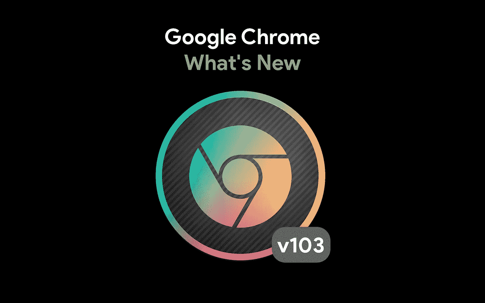

# Chrome 103 有什么新功能

> 原文：<https://javascript.plainenglish.io/whats-new-in-chrome-103-3b118b6dadde?source=collection_archive---------12----------------------->

## 谷歌 Chrome 的每一次更新都充满了独特的功能。以下只是 Chrome 版本的一些新功能。

十多年前，在 2008 年，谷歌公开了其尖端的网络浏览器，自那以来已经走过了漫长的道路。就在今年，谷歌发布了 Chrome v100。昨天，他们发布了 103 版本。

ChromeOS 和 Chrome 浏览器目前享受的 4 周更新周期看起来已经被谷歌完善了。Chrome 桌面版和安卓版的最新版本现已推出，应该会在未来几天内面向大多数用户推出。不要期待一个用户界面的革新或新的主要功能。尽管如此，仍有一些重要的升级和添加将增强 Chrome 的整体用户体验。如果你是一个网页开发者，这些更新肯定会激起你的兴趣。

下面总结一下 Android 和桌面版 Chrome 103 中的新功能。

# WebApps 的本地字体

Photo by [Brett Jordan](https://unsplash.com/@brett_jordan?utm_source=medium&utm_medium=referral) on [Unsplash](https://unsplash.com?utm_source=medium&utm_medium=referral)

网络应用取得了显著进步。许多 chrome 网络应用程序都是为设计师准备的，那些想在 Chromebook 上编辑照片的人没有 Adobe Photoshop。像 Designer.io、GIMP(在 RollApp 上)和 Pixlr 这样的 web 应用程序为用户提供了对大量字体的访问，以在 Chrome 和 ChromeOS 中创建视觉设计。不幸的是，从来没有办法在这些 web 应用程序中使用本地安装的字体——你必须使用它们提供的字体。用户别无选择，只能手动导入字体或使用预装字体。由于新的本地字体 API，本地字体(安装在用户设备上)将可以通过网络访问。Chrome 开发者页面是开发者学习如何利用 API 调用本地字体的好地方。

 [## 使用本地字体的高级版式。

### 了解本地字体访问 API 如何允许您访问用户本地安装的字体，并获得低级…

网络开发](https://web.dev/local-fonts/) 

# 由 ML 支持的通知阻止

谷歌在机器学习方面进行了大量投资，以将其纳入尽可能多的服务中。谷歌还打算在 103 版本的 Chrome 中减少未经授权的警告。Chrome 将利用浏览器内的机器学习来预测用户何时可能会忽略网页警告。在此过程中，任何信息都不会被传输到谷歌的服务器上——它将在本地浏览器中进行。

 [## 谷歌 Chrome 的设备上机器学习阻止了嘈杂的通知提示

### 谷歌 Chrome 内置了网络钓鱼检测功能，可以扫描网页，查看它们是否与已知的假冒或恶意网站相匹配…

www.theverge.com](https://www.theverge.com/2022/6/9/23161292/google-chrome-machine-learning-notification-phishing-preferences) 

# 更快的页面加载速度

103 是一个 [HTTP 状态码](https://developer.mozilla.org/en-US/docs/Web/HTTP/Status)，它告诉浏览器服务器仍在响应。但是当服务器响应 HTML 页面时，它会提供资源(比如 CSS 样式表)，所以浏览器可以预加载它们。这被戏称为“早期暗示”

103 早期提示响应代码包含在 Chrome 103 中；这完全是偶然的，这是 103 版的 Chrome。简而言之，103 早期提示响应代码将允许开发人员增强核心网站活力，这对页面加载时间至关重要，并有能力建立或摧毁一个网站。希望这将使浏览互联网上的绝大多数网站总体上更好。

 [## 103 个早期提示- HTTP | MDN

### HTTP 103 早期提示信息响应状态代码主要用于标头，以允许…

developer.mozilla.org](https://developer.mozilla.org/en-US/docs/Web/HTTP/Status/103) 

# AVIF 访问网络共享

Photo by [Emily Bernal](https://unsplash.com/@emilybernal?utm_source=medium&utm_medium=referral) on [Unsplash](https://unsplash.com?utm_source=medium&utm_medium=referral)

随着`.avif`图片格式的加入，Chrome 现在可以通过 share sheet 访问各种文件格式。新的文件类型提供了比`JPG`、`PNG`，甚至`WebP`图像更好的压缩。Chrome 103 将允许社交媒体网站、图形设计网络应用程序和许多其他网站使用这种格式。

不过，这个功能可能只会在一段时间内对 Chrome 网络应用有所帮助——只有 Chrome 和 Firefox 支持这种文件类型，而 Safari 和大多数移动浏览器都不支持。然而，对于压缩网页图像来说，这是朝着正确方向迈出的良好一步。

谷歌 Chrome 有更多的升级。你可以在他们的 Chrome 开发者网站上找到完整的列表。如果你是一个网页开发者，你可能想看看 Chrome DevTools 的一些新特性。

 [## Chrome 103 中的新功能- Chrome 开发者

### Chrome 103 现在推出了！有一个新的 HTTP 状态代码，可以帮助浏览器决定预加载什么内容…

developer.chrome.com](https://developer.chrome.com/blog/new-in-chrome-103/) 

YouTube video by Google Chrome about Version 103

如果你喜欢这篇文章，我想你也会喜欢我写的其他类似的文章。

 [## Internet Explorer 已死:微软臭名昭著的浏览器的下一步是什么

### 微软在 2022 年 6 月 15 日扼杀了 Internet Explorer。以下是对浏览器和微软未来计划的反思。

medium.com](https://medium.com/@thesoggywaffle/internet-explorer-is-dead-whats-next-with-microsofts-infamous-browser-3cc908b796c8)  [## 每个开发人员都应该使用的 6 个软件开发工具

### 不管你在做哪个项目，也不管你和多少人一起工作，你都应该使用这六个…

javascript.plainenglish.io](/6-software-development-tools-every-developer-should-use-35f7ac771bad)  [## Web 开发:成功的路线图

### 成为一名优秀的 web 开发人员只需要十个步骤。这很简单，我会告诉你怎么做。

javascript.plainenglish.io](/web-development-a-roadmap-to-success-5ed8439c72a2) 

*更多内容请看*[***plain English . io***](https://plainenglish.io/)*。报名参加我们的* [***免费周报***](http://newsletter.plainenglish.io/) *。关注我们关于*[***Twitter***](https://twitter.com/inPlainEngHQ)*和*[***LinkedIn***](https://www.linkedin.com/company/inplainenglish/)*。查看我们的* [***社区不和谐***](https://discord.gg/GtDtUAvyhW) *加入我们的* [***人才集体***](https://inplainenglish.pallet.com/talent/welcome) *。*