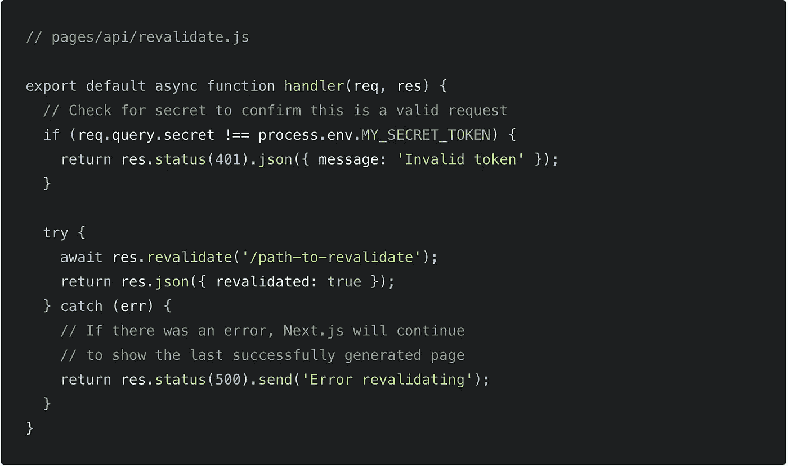

# Next.js 12.2 有什么新功能？

> 原文：<https://javascript.plainenglish.io/whats-new-in-next-js-12-2-e5cae2db0b4c?source=collection_archive---------3----------------------->

Photo by [Arnold Francisca](https://unsplash.com/@clark_fransa?utm_source=medium&utm_medium=referral) on [Unsplash](https://unsplash.com?utm_source=medium&utm_medium=referral)

js 是一个 React 框架，可以帮助你构建块。
当你在 React 中开发一个块时，有很多事情需要控制(用户界面、数据获取、路由、渲染性能等)。Next.js 有助于解决这些常见的应用程序需求。现在我们来看看 12.2 版本的新特性。

# 中间件稳定

该属性于 2021 年 10 月发布(Next.js 12.0)，并一直处于测试阶段，直到新版本的 framework 12.2。中间件是一段简单的代码，它允许我们在请求完成之前改变对请求的响应。概括地说，新的变化是:

*   中间件不再能产生响应体。(为了尊重客户端和服务器端导航的差异，并帮助确保开发人员不会构建不安全的中间件，我们正在移除在中间件中发送响应主体的能力。这确保了中间件仅用于“重写”、“重定向”或修改传入的请求。)
*   如果你的中间件*没有*用一个主体来响应，将会抛出一个运行时错误。
*   迁移到使用`rewrite` / `redirect`来处理响应的页面/API。

# 边缘

应用程序的性能会受到不同原因的影响，例如用户的位置或服务器的位置。借助轻量级 Edge 运行时，许多组件被卸载到全球分布式 Edge 基础设施，从而提高了性能和用户体验。

# SWC

使用 [SWC](http://swc.rs/) 用 Rust 编写的 Next.js 编译器，允许 Next.js 转换和精简你的 JavaScript 代码用于生产。这取代了单独文件的 Babel 和缩小输出包的 Terser。
我们选择以 SWC 为基础有几个原因:

*   可扩展性:SWC 可以在 Next.js 中用作板条箱，而不必派生库或变通设计约束。
*   性能:通过切换到 SWC，我们在 Next.js 中实现了大约 3 倍的快速刷新速度和大约 5 倍的构建速度，并且仍有更多的优化空间。
*   WebAssembly: Rust 对 WASM 的支持对于支持所有可能的平台和在任何地方进行 Next.js 开发都是必不可少的。
*   社区:Rust 社区和生态系统令人惊叹，并且仍在增长。

# **按需增量静态再生(稳定)**

一个工作日内你可以重新部署多少次？按需增量静态再生(ISR)允许您更新站点上的内容，而无需重新部署。这使得当您的 headless CMS 或商务平台中的数据发生变化时，可以很容易地立即更新您的站点。这是社区中请求最多的功能之一，我们很高兴它现在已经稳定了。

增量静态再生适用于任何支持 [Next.js 构建 API](https://nextjs.org/docs/deployment#nextjs-build-api) ( `next build`)的提供者。当部署到 [Vercel](https://vercel.com/) 时，当将页面推到边缘时，按需重新验证会在大约 300 毫秒内传播到全球。

# **其他改进**

*   在 Next.js 编译器中支持情感转换。现在支持`@emotion/babel-plugin`的大部分功能，除非你用的是`importMap`，否则可以移除。欲了解更多信息，请查阅文档。
*   通过允许定制默认选项，包括`cssProp`选项，更好地支持 Next.js 编译器中的`styled-components`转换。更多信息，请查阅文档。
*   更好地支持 JavaScript ES 模块，所以像`next/image`和`next/link`这样的组件可以正确地`import` ed。
*   `next/link`不再需要手动添加`<a>`作为子节点。你现在可以通过向后兼容的方式选择这种行为。
*   我们已经通过修改`browsersList`添加了只发布现代 JavaScript 的实验性支持。您可以通过在`next.config.js`的`experimental`选项中设置`browsersListForSwc: true`和`legacyBrowsers: false`来选择此行为。
*   新的`@swc/helpers`优化防止了捆绑包之间的重复，在最小配置中减少了大约`2KB`的捆绑包大小，在较大的应用上更多
*   我们已经显著减小了 Next.js 的安装规模。我们通过将 monorepo 移动到`pnpm`来做到这一点，这允许我们在创建我们使用的预编译版本时删除重复的包。这导致安装大小减少了 14MB。

## 进一步阅读

 [## 使用 Next.js 13 的前沿特性获取数据——入门

### NextJS 13 中的数据获取使用了应用程序目录、流、暂挂以及混合服务器和客户端组件。

javascript.plainenglish.io](/data-fetching-with-next-js-13s-bleeding-edge-features-a-primer-a60ddd3f7570) 

*更多内容请看*[***plain English . io***](https://plainenglish.io/)*。报名参加我们的* [***免费周报***](http://newsletter.plainenglish.io/) *。关注我们关于*[***Twitter***](https://twitter.com/inPlainEngHQ)*和*[***LinkedIn***](https://www.linkedin.com/company/inplainenglish/)*。查看我们的* [***社区不和谐***](https://discord.gg/GtDtUAvyhW) *加入我们的* [***人才集体***](https://inplainenglish.pallet.com/talent/welcome) *。*