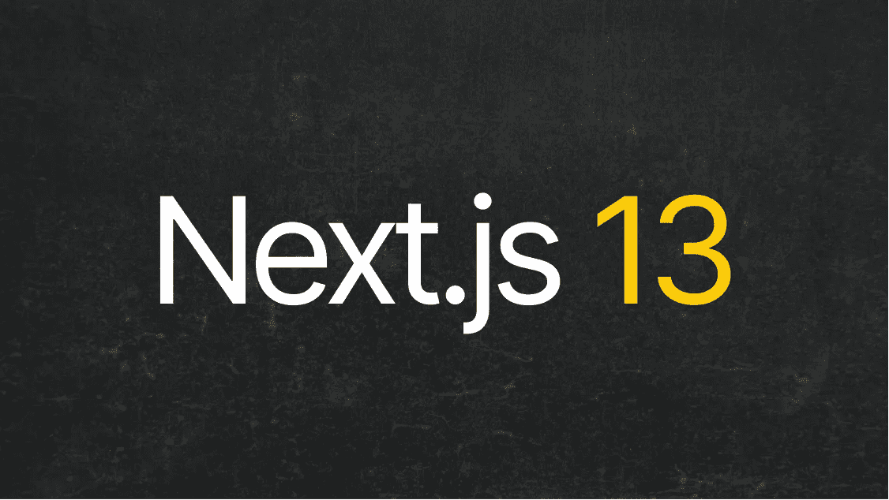

# Next.js 13 有什么新功能？

> 原文：<https://javascript.plainenglish.io/whats-new-in-next-js-13-40b79d1e79be?source=collection_archive---------6----------------------->

**总结**

*   Next.js 给我们带来了布局、Turbopack 和更多好东西，包括客户端 JavaScript 的大幅减少；
*   构建 Next.js 应用程序的新方法是选择加入，可以逐步采用，以便顺利采用；
*   新的特性将使[开发高性能的网络应用](https://www.itmagination.com/clients-scope/web-application-development)更加容易；
*   Next.js 13 自带*服务器组件*默认启用；
*   Next.js 13 值得升级吗？是的。

10 月 25 日，世界各地的人们都在收看 next . js conf——在这个会议上，开发人员发现了最著名的 [React 框架](https://www.itmagination.com/blog/react-18-what-changes-does-it-bring)的开发人员为他们准备了什么。所有参加流或现场活动的人都见证了该框架的下一个主要版本——next . js13 的展示。这一观点非同寻常——新版本在许多方面与以前的版本有很大不同。它在很多方面都发生了很大的变化——该公司自己声称这次更新将是 Next.js 有史以来最大的变化。是吗？我们为您观看了完整的发布会，但如果您想先自己观看，您可能会找到下面的视频。否则，请继续阅读。

最后，Vercel 称新版本为“无限动态”这可能是指与应用程序大小相关的限制被取消。以前，您必须仔细选择允许用户做什么，不做什么，因为新的可能性通常意味着越来越多的数据用户必须提取。现在，这种担心已经不在开发者的脑海里了:网站将保持快速运行，除非你故意让它们变得缓慢和沉重。

# 构建 Next.js 应用程序的新方法

## 一些背景

重塑 React 是最近几个月的话题。题目？获取数据并删除我们发送给世界各地用户的大量 JavaScript。首先，它让用户的体验变得更糟。此外，它对地球产生了负面影响——通过互联网发送的所有数据=排放的碳(也许减少排放只是一个副作用，尽管这肯定是一个好结果)。另一个问题是瀑布抓取的问题。简而言之，浏览器不是并行获取数据，而是顺序获取数据(一个接一个)。

第一个解决两个瀑布问题的 React 框架(或者说第一个主流框架)，太多客户端 [JavaScript](https://www.itmagination.com/blog/the-complete-history-of-javascript-typescript-and-node-js) (两者同时)被混搭。它成了网络红人。React 路由器团队的创建首先是网络标准，并使开发人员能够在此基础上创建更轻便、渲染速度更快的 React 网站。另一个卖点是获取数据的独特方法，但这是另一个故事，另一篇文章。

Remix 的方法被 Next.js 团队[采用，2022 年 5 月，他们宣布要求对他们的新提议“布局”进行反馈。](https://nextjs.org/blog/layouts-rfc)这一变化被称为迄今为止最大的一次，的确如此。这是全球开发者等待的主要原因

## 页面与应用程序

Next 13 带来的突破性功能完全是自愿加入的。我们不确定这种传统还能持续多久，新的方法将同时得到支持，尽管在撰写本文时它们已经得到了支持。

将你的代码放在 *pages* 文件夹中是你熟悉并习惯的编写全栈应用的老方法。这里的核心流程没有什么变化，如果您想坚持旧的方式，那么您可以跳过这一部分，转到“Turbopack”部分。

如果你已经准备好了新的(还没有经过测试)，把你的代码放到 *app* 目录中，然后继续阅读。Vercel 承诺大幅减少客户端 JavaScript……他们做到了！以前，一个简单的“Hello，World”应用程序需要发送超过 70kB 的数据才能拥有一个 div。现在，如果你不需要交互性，我们唯一得到的是 HTML，和 CSS。**没有 JS 什么的**。当然，如果你需要交互性，JS 就会出现，我们说的不是完整的 React + Next 包。

## 装载状态，布局

网络体验中最糟糕的部分是等待加载某些东西，而没有任何东西可看。React 18 演示期间的一次演讲已经提到了这一点，并谈到了引入悬念加载状态的重要性。

js 13 提供了该机制的改进版本。现在，您可以创建一个名为“Loading”的函数，用户将看到这个函数，直到您的页面的数据获取完成。

升级后的布局解决了所有最新版本的问题。以前，为页面创建可重用的基础有点问题。人们不得不使用一种快速和有点即兴的方式来处理事情，但现在不是了。我们现在可以创建一个名为“layout.tsx”的文件，组件将使用它来构建用户界面。

## 服务器组件

*服务器组件*大大节省了捆绑包的尺寸。他们在前端世界也有点动摇。React 以前只是一个客户端库。正如我们之前所写的，随着这种新型构件的加入，这种情况最近发生了变化。Next.js 现在使用它们，并且默认使用它们来帮助你制作更快的应用。

新组件可能会让 GraphQL 和其他库更加流行。为什么 GraphQL 比较重。@apollo/client 本身就是~ 42kb(minified；版本 3.7.1)。如果您现在将所有东西都保存在后端，那么客户机包中就不会包含任何一个字节。对于较小的团队也有好处。你现在甚至可以在你的组件内部直接调用 Prisma(尽管你并不真的想这么做)。

然而，也有一些缺点。

许多第三方组件将不得不包装在一个组件中，该组件将告诉 Next 它是一个客户端组件。这是一点额外的工作；没人喜欢的繁忙工作。您也不能添加任何交互式元素。为此，您必须使用*客户端组件。*

此外，目前不支持从*客户端组件*调用 fetch。正如医生所说:

> *客户端组件目前不支持获取。虽然可以在客户端组件中获取数据，例如，使用第三方库(如 SWR ),但这样做时可能会遇到性能问题。*

## 流动

传统上，用户必须等待所有页面生成后才能收到任何页面。不再是了。服务器现在会在创建 UI 时将它们一点一点地发送给客户端。这意味着较大的块不会阻挡较轻的块。当然，这个特性目前只在 app 目录中受支持，而且看起来似乎不会改变。

拥有快速 Wi-Fi 或良好互联网连接的人不会像网速较慢的人那样从这项新服务中受益。像这样的人比你想象的要多。我们现在可以改善他们的体验，这很好——如果你的网页加载速度更快，他们可能会成为你的客户。

# 涡轮包

Turbopack 是 Webpack 的继任者。Vercel 雇佣了 Webpack 的创建者，有可能写出比 Webpack 更快、更好的工具。它要快得多，这是肯定的，尽管它并不都很棒。首先，你现在必须使用 Rust 而不是 JavaScript 来编写插件。拥有系统语言工作知识的 JavaScript 开发人员比 JS 开发人员要少得多。

不过，这是一种权衡。我们现在有了一个快如闪电的工具，将大大减少大型应用程序的构建时间。变化是针对企业的。对于小团队来说，这种改变很好，但实际上不会有太大的改变。企业现在可以在更短的时间内开发他们的应用程序，雇佣不可靠的开发人员对他们来说不是什么大事。

此外，[开发者](https://www.itmagination.com/career-paths/react)的最爱，Tailwind CSS，现在并不真正与 Turbopack 一起工作。这是 bundler 的创造者的一个大失误，尽管我们认为它不会很快得到补救。

# 速度

涡轮包速度惊人。我们不确定更快 vs 失去许多现有插件的权衡最终是否值得。还有一个问题是为什么框架背后的开发团队没有选择使用 Vite。当然，一些现有的 Webpack 插件将与 Turbopack 兼容，尽管 Vite 已经有了大量的插件，而且速度也快得惊人。另一方面，联邦垄断不是任何人想要的。

# 新的 next/image、@next/font 和改进的 next/link

有新的软件包即将推出，这将使你的图像和字体加载更快，以及对 Next.js 13 中链接工作方式的一些改进。它们在 *app* 和 *pages* 目录中工作相同。

## 下一张/图片

新助手的设计使得图片加载速度更快。这个版本给我们带来了一些改进。首先，它现在可以帮助你加快最大容量涂料(LCP)。LCP 是页面上看到的最大元素。如果是图片，那么 Next.js 会告诉你给图片添加一个特殊的 *priority* 属性，这样框架就可以优先加载所说的块。

从其他值得注意的添加来看，现在 *alt* 属性是必需的，这意味着您必须将它添加到您的所有图像中。坦率地说，你应该已经这样做了，所以这不是问题。

## @下一页/font

字体是网站上加载最重的东西。Vercel 与 Chrome 团队合作，提供最佳体验。该库允许您从 Google 加载字体(在构建时下载)或从您的服务器加载本地字体。如果你担心从山景城下载该公司的字体会暴露你的用户，不用担心。用户根本不连接搜索引擎公司的服务器。

## 下一页/链接

启用客户端导航的解决方案有所改变。[如文件所述](https://beta.nextjs.org/docs/upgrade-guide#link-component):

> *<链接>组件不再需要手动添加一个<标签作为子标签。此行为在 12.2 版中作为实验选项添加，现在是默认行为。在 Next.js 13 中，<链接>总是呈现<一个>，并允许你将道具转发到底层标签。*

# @vercel/og

设置动态开放图(OG)/Twitter 图像曾经是一项具有挑战性的任务。在 GitHub 上有一个资源库，由 Vercel 提供，在那里您可以轻松完成任务。你所要做的就是克隆代码，进行修改，部署服务，然后，在几个小时内，你就完成了。现在，你可能不到一个小时就能完成。

它的工作方式是创建一个 React 组件，然后将它转换成一个图像。听起来很简单，事实也的确如此。对于支持什么样的 CSS 属性有一些限制，尽管一点也不用担心。创造令人惊叹的 OG 图像的可能性仍然是敞开的

# 重大变更和迁移

我们将从每个人都乐于看到的突破性变化开始。不再支持 INTERNET EXPLORER🎉。

此外，你需要记住的是:

*   React 的最低版本现在是 18.2.0，高于 17.0.2。如果你需要复习一下 18 版本的变化，可以看看这里；
*   我们告别了节点 12，所以你需要升级你的容器/改变你的环境，并且(至少)拥抱节点 14；
*   由 SWC 缩小是新的默认；
*   您习惯的下一个/image 现在是下一个/legacy/image。要迁移到新的 next/image，运行[code mod；](https://nextjs.org/docs/advanced-features/codemods#next-image-to-legacy-image)
*   新的 next/link 自动添加了一个 achor 标签，而以前你小时候必须有一个；
*   导航挂钩的功能有一些变化。更多详情，请点击[这里](https://beta.nextjs.org/docs/upgrade-guide#step-5-migrating-routing-hooks)。

# 结论

综上所述，Next.js 13 的好处值得升级。此外，额外的包，如@vercel/og 或@next/font，值得与新的应用程序目录一起采用。当然，您不需要马上迁移所有页面。您可以一页接一页地逐步升级。这一直是维塞尔的哲学与框架。这也许是为什么最大的公司在生产中使用 Next.js 感到安全的原因。如果您想将您的应用迁移到 Next.js 13，想要一个运行在最流行的 React 框架上的新网站，或者想要讨论如何构建您的 web 应用，[请在这里联系我们。](https://www.itmagination.com/contact)

*最初发表于*[*【https://www.itmagination.com】*](https://www.itmagination.com/blog/whats-new-in-next-js-13-new-features-breaking-changes)*。*

## 进一步阅读

 [## 使用 Next.js 13 的前沿特性获取数据——入门

### NextJS 13 中的数据获取使用了应用程序目录、流、暂挂以及混合服务器和客户端组件。

javascript.plainenglish.io](/data-fetching-with-next-js-13s-bleeding-edge-features-a-primer-a60ddd3f7570) 

*更多内容看* [***说白了。报名参加我们的***](https://plainenglish.io/) **[***免费周报***](http://newsletter.plainenglish.io/) *。关注我们关于* [***推特***](https://twitter.com/inPlainEngHQ) ，[***LinkedIn***](https://www.linkedin.com/company/inplainenglish/)*，*[***YouTube***](https://www.youtube.com/channel/UCtipWUghju290NWcn8jhyAw)*，以及* [***不和***](https://discord.gg/GtDtUAvyhW) *。对增长黑客感兴趣？检查* [***电路***](https://circuit.ooo/) *。***