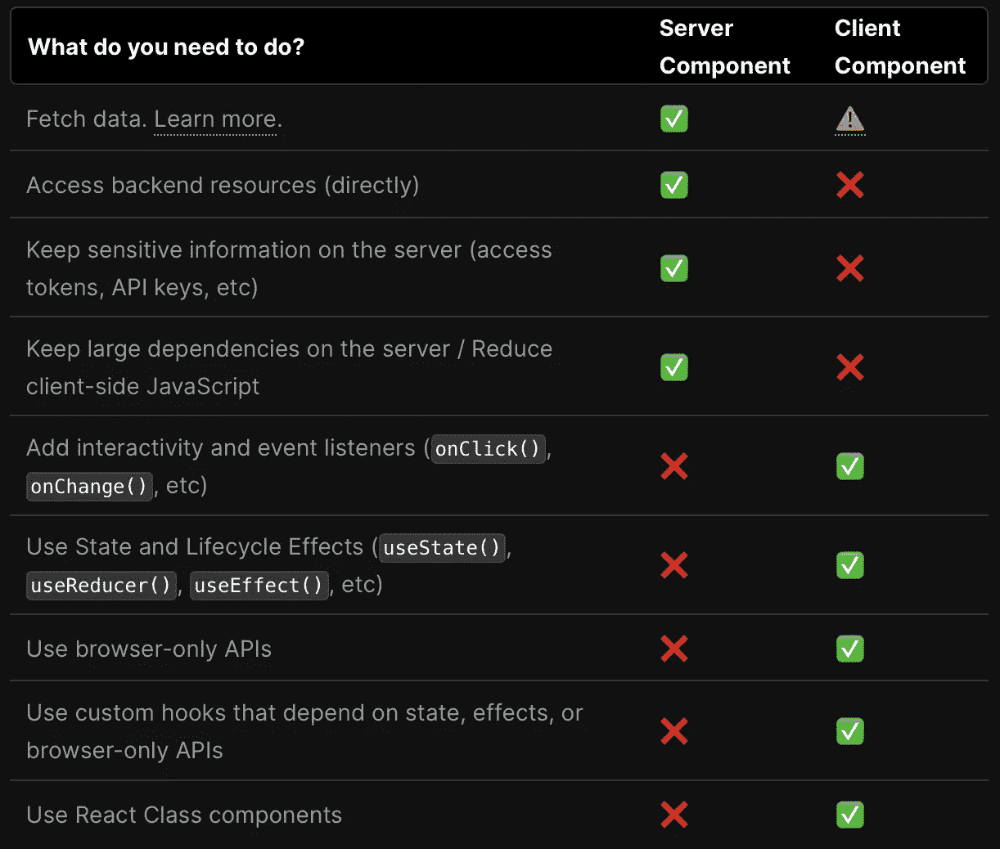

# Next.js 13 中的新特性——以及它的重要性

> 原文：<https://javascript.plainenglish.io/whats-new-in-next-js-13-and-why-it-matters-e174171976a8?source=collection_archive---------7----------------------->

## React 的服务器端渲染框架一直在变得越来越好——下面是新特性

上周， [Vercel](http://vercel.com) 在他们的开发者大会上宣布了 [Next.js 13](https://nextjs.org/blog/next-13) 。目前处于测试阶段的新版本引入了大量令人兴奋的新功能，并有助于围绕 React 的服务器端渲染以及它如何与交互式客户端组件联系在一起讲述一个更强大、更有凝聚力的故事。


在这篇文章中，我们将简要介绍 Next.js，然后分解 Next.js 13 中的一些新功能，并讨论它们为什么重要。

# Next.js 是什么，为什么用它？

Next.js 是一个基于 React 的开发框架，支持服务器端渲染、额外的服务器端功能和改进的开发和部署工具链。

使用 Next.js 进行服务器端呈现的最大好处是在性能和 SEO 方面:通过在服务器上呈现，应用程序完全呈现的初始状态可以在单个请求中提供。这意味着浏览器要做的工作更少，也意味着内容可以很容易地被搜索引擎索引。这也意味着渲染数据可以被缓存(部分或全部)以进一步提高性能。

这些 Next.js 特性有助于建立在 React 的强大基础之上，并弥补了纯客户端方法的一些缺点。对于任何重视性能和搜索引擎优化的应用来说，Next.js 是一个受欢迎的补充。因此，有了 Next.js 的背景知识，让我们深入了解即将到来的 Next.js 13 版本中会有什么。

# 基于文件的路由的应用程序/目录

Next.js 最大的特性之一是*基于文件的路由。*不用在像 [react-router](https://reactrouter.com/en/main) 这样的工具中处理复杂的路由配置，可以使用项目目录的结构来指定路由。只需在`pages`目录中放置一个入口点，就创建了一条新路径。

Next.js 13 建立在这个概念之上，并提供了新目录的[重新设计的文件路由。app directory(可选)引入了一个新的布局结构，具有几个新的特性和增强功能。](https://beta.nextjs.org/docs/routing/fundamentals)

有了新的路由方案，目录结构有所改变。在 Next.js 13 中，路径中的每个路径现在都有一个专用的*目录*，其中有一个包含内容入口点的`page.js`。下表显示了 Next.js 12 和 13 中的基本路由有何不同:

```
# Route      Next.js 12          Next.js 13 
/            pages/index.js      app/page.js 
/blog        pages/blog.js.      app/blog/page.js 
/blog/new    pages/blog/new.js   app/blog/new/page.js
```

除了一个路径的`page.js`，新的结构让我们在每个路径目录中包含另外几个*特殊的*文件，包括:`layout.js`，一个路径(和所有子路径)的布局组件；`loading.js`，一个组件为瞬间加载状态使用`React.Suspense`罩下；以及`error.js`，主组件加载失败时渲染的组件。

因为每个路径现在都是它自己的目录，所以我们还可以在路径目录中[存放源文件。我们可以包括其他组件，以及样式、测试等:](https://beta.nextjs.org/docs/routing/fundamentals#colocation)

```
app/blog/page.js 
app/blog/Header.js 
app/blog/Header.css 
app/blog/Header.test.js
```

基于文件的路由一直是一个很棒的特性，新的`app/`目录将它推向了一个新的高度。它简化了开发，并且(可能有点怀旧)有助于恢复构建更多静态站点的简单性:内容路径与内容目录结构相匹配。同样，使用新的`app/`目录是完全可选的，因此您不必马上迁移到新的结构。

# React 服务器组件

Next.js 13 下一个令人兴奋的变化是增加了对 [*React 服务器组件*](https://reactjs.org/blog/2020/12/21/data-fetching-with-react-server-components.html) *的支持。*服务器组件让我们可以在服务器端执行和渲染 React 组件，以实现更快的交付、更小的 JavaScript 包和更低的客户端渲染成本。

此外，根据渲染路线所需的数据类型，服务器组件可以在构建时或运行时自动缓存，以获得额外的性能优势。

服务器和客户机组件的功能确实有些不同，所以您需要相应地设计您的应用程序。下表摘自文档，概述了这两种不同类型的组件所具有的功能以及它们的最佳用途。



Table comparing server and client component, taken from the [Next.js documentation](https://beta.nextjs.org/docs/rendering/server-and-client-components).

服务器和客户端组件*可以混合使用*，这意味着您可以将服务器组件用于应用程序的快速加载、非交互式部分，但在需要交互性、浏览器 API 等的地方利用客户端组件。

当在 Next.js 应用程序中构建客户端组件时，您将在文件顶部使用`'use client';`指令对其进行相应的标记。注意，如果您使用第三方包，您可能需要[为那些组件](https://beta.nextjs.org/docs/rendering/server-and-client-components#third-party-packages)创建一个客户端包装器。

# 异步组件和数据提取

Next.js 13 还引入了一种[新方法来获取服务器呈现组件](https://beta.nextjs.org/docs/data-fetching/fetching)的数据:异步组件。对于异步组件，我们可以使用 async & await 的承诺来呈现组件。如果我们需要从外部服务或其他返回承诺的 API 获取数据，我们将组件声明为 async，并简单地*等待*结果:

```
async function getData() { 
  const res = await fetch('https://api.example.com/...'); 
  return res.json(); 
} export default async function Page() { 
  const name = await getData(); 
  return '...'; 
}
```

以前版本的 Next.js 使用完全不同的 API 来解析组件生命周期之外的请求数据，然后将这些数据用作组件道具。此示例显示了从外部服务加载数据的 Next.js 12 方法:

```
// This gets called on every requestexport async function getServerSideProps() { 
  // Fetch data from external API 
  const res = await fetch(`https://.../data`) 
  const data = await res.json() 
  // Pass data to the page via props return 
  { props: { data } } 
}
```

旧的方法仍然受支持**，但是在新的** `**app/**` **目录**中不受支持。如果你想利用新的`app/`目录结构及其所有很酷的新特性，你需要更新你的服务器组件。然而，如果你还没有准备好，你仍然可以为你的应用程序使用 Next.js 12 `pages/`路由。

还要注意，异步渲染和承诺支持**还不可用于客户端组件**——但它正在通过[提议的新挂钩](/all-about-reacts-proposed-new-use-hook-ba468a2302f6)实现:

[](/all-about-reacts-proposed-new-use-hook-ba468a2302f6) [## 关于 React 提出的新用途()钩子的所有内容

### 对承诺的一流支持开始起作用了——这是关于它应该如何运作的建议

javascript.plainenglish.io](/all-about-reacts-proposed-new-use-hook-ba468a2302f6) 

然而，与此同时，客户端组件可以使用更传统的异步方法，比如 [React。悬念](https://reactjs.org/docs/react-api.html#suspense)和生命周期挂钩，比如`useEffect()`，或者使用第三方库来实现这样的功能。

# 快速捆绑的涡轮包

Next.js 13 引入的最后一个主要变化是一个新的 JavaScript bundler， [Turbopack](https://turbo.build/pack) ，号称是“Webpack 的继承者”。Webpack ，最普遍的 JavaScript 构建工具之一，具有惊人的可配置性和强大的功能，但也可能相当缓慢和笨拙。

[](https://blog.devgenius.io/you-dont-need-webpack-3-better-alternatives-for-building-your-javascript-8e8fad5c15cb) [## 你不需要 web pack——构建 JavaScript 的 3 个更好的选择

### 新一代 JavaScript bundlers 提供了极大改进的开发人员体验

blog.devgenius.io](https://blog.devgenius.io/you-dont-need-webpack-3-better-alternatives-for-building-your-javascript-8e8fad5c15cb) 

Turbopack 由 Webpack 的创建者创作，但使用 Rust 构建，并承诺比原始 Webpack 快 700 倍(比更现代的替代产品 Vite 快 10 倍)。关于相似性和差异的完整分析，请查看 [Webpack & Turbopack 比较](https://turbo.build/pack/docs/comparisons/turbopack-vs-webpack)。

请注意，Turbopack 目前处于 alpha 阶段，还没有准备好投入生产使用，但它的状态绝对足以进行开发中的试驾。还要注意，Turbopack 目前缺少一个公共插件 API(这是 Webpack 最大的优势之一)，但这将在未来得到解决。

如果您创建了一个新的 Next.js 13 应用程序，您可以使用`next dev --turbo`来启动您的开发服务器，尝试新的 Turbopack bundler。

# 其他改进

虽然我们在这篇文章中关注了一些重要的项目，但是 Next.js 13 中还包含了许多其他重要的特性:

*   利用`next/image`提供更好的图像加载支持和性能
*   使用`next/font`改进了字体性能
*   将 API 改进与`next/link`联系起来

要获得完整的变化列表，请查看来自 Vercel 的 [Next.js 13 博客文章](https://nextjs.org/blog/next-13#nextimage)。

# 重述—服务器端 React 正在成长

在这篇文章中，我们介绍了 Next.js 13 中的一些新特性。虽然这里描述的新特性涉及了许多不同的领域，但对我来说，总的主题是框架的成熟。Next.js 13 以及 React 本身即将到来的变化开始讲述一个关于在服务器和客户机上混合 React 的坚实、连贯的故事。

如果您过去还没有看过 Next.js 或服务器端 React，[现在是查看它的好时机](http://nextjs.org/)！

*原载于*[*https://blixtdev.com*](https://blixtdev.com/whats-new-in-next-js-13-and-why-it-matters/)*。*

乔纳森写了一些关于创业、软件工程和健康科学的文章。如果你喜欢这篇文章，请考虑加入 Medium 来支持 [*Jonathan 和其他数千位作者*](/@jonnystartup/membership) *。*

*更多内容看* [***说白了。报名参加我们的***](https://plainenglish.io/) **[***免费周报***](http://newsletter.plainenglish.io/) *。关注我们关于* [***推特***](https://twitter.com/inPlainEngHQ) ，[***LinkedIn***](https://www.linkedin.com/company/inplainenglish/)*，*[***YouTube***](https://www.youtube.com/channel/UCtipWUghju290NWcn8jhyAw)*，以及* [***不和***](https://discord.gg/GtDtUAvyhW) *。对增长黑客感兴趣？检查* [***电路***](https://circuit.ooo/) *。***