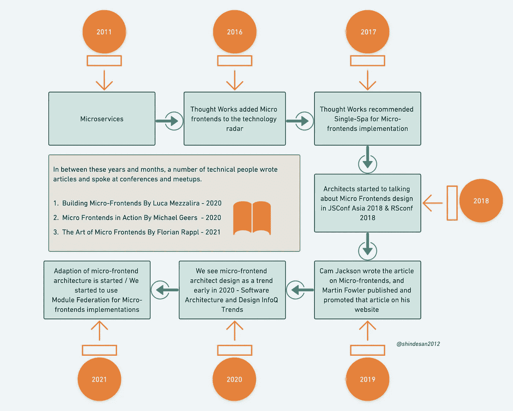
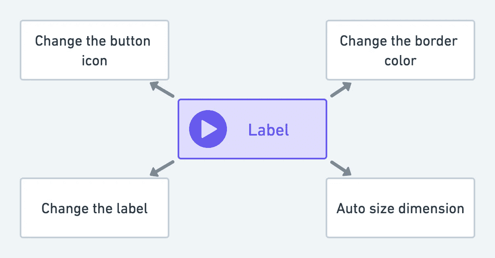
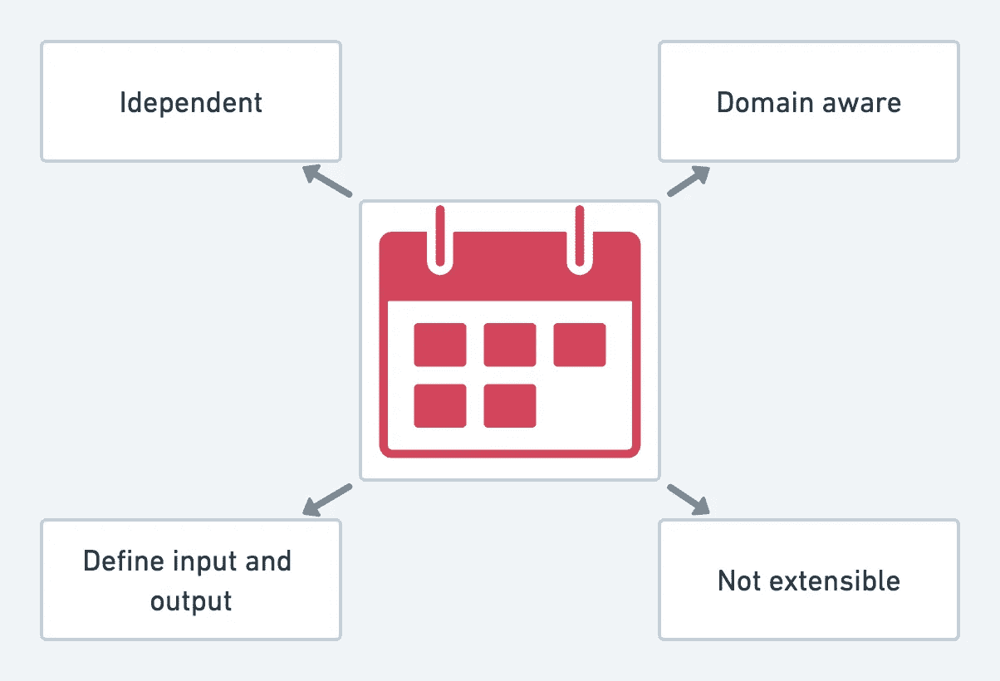
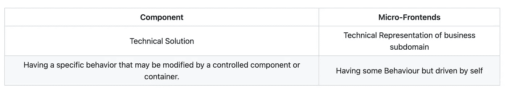

# 组件和微前端有什么区别？

> 原文：<https://javascript.plainenglish.io/whats-the-difference-between-a-component-and-a-micro-frontend-43aefd0af062?source=collection_archive---------2----------------------->

## 了解组件和微前端的区别。

# 介绍

在过去的几年中，由于灵活性的提高、技术堆栈的选择、更快的上市时间和更好的可扩展性，微前端架构越来越受欢迎。

但是很多时候，我们被组件、微前端、单页面应用之间的区别搞糊涂了。让我们首先看看微前端的定义，因为我们知道评估是如何发生的。2011 年，技术人员第一次开始谈论和适应微服务架构，后来，他们意识到为什么我们在前端没有相同的方法。

微前端是业务子域的技术表示，它们允许使用相同和不同的技术独立实现。

**微前端的历史**

我试图在这里以时间线的形式创建一个微前端发展的图形演示。如果我没有完成任何事情，请让我知道。

**The History of Micro-frontends**

请随意在下面的库中贡献您的输入，以便其他人可以开始他们的微前端学习之旅。

 [## GitHub-Santosh shinde 2012/微前端-思维导图:总结微前端概念的思维导图

### 总结微前端概念的思维导图。为 Santosh shinde 2012/微前端-思维导图开发做出贡献…

github.com](https://github.com/santoshshinde2012/micro-frontends-mindmaps) 

# 什么是组件？

组件是任何前端元素的技术解决方案，它具有可由受控组件或容器修改的特定行为。

以一个按钮为例，我们已经知道可以从容器中改变以下属性，这可以通过 React 中的 props 和 Angular 中的 input decorators 来实现。

1.  更改按钮图标
2.  更改边框颜色
3.  根据输入文本自动调整尺寸
4.  更换标签

然而，重要的是要记住，我们从未定义过业务标准或需求，所以我们只是将它们视为简单的组件，它们的容器将控制它们。

Component — Button

# 什么是微前端？

微前端架构是一种将 web 应用程序开发为小型前端应用程序组合的方法。不是编写一个大型的整体前端应用程序，而是将应用程序分解成特定领域的微前端，这些微前端是自包含的，可以独立开发和部署。

书中的定义[行动中的微前端](https://www.manning.com/books/micro-frontends-in-action)作者 [Michael Geers](https://medium.com/u/4e4d69830e74?source=post_page-----43aefd0af062--------------------------------)

*微前端背后的想法是将一个网站或网络应用想象成* ***由* ***独立团队*** *所拥有的功能*** *的组合。每个团队都有一个* ***截然不同的业务领域*** *或* ***任务*** *它所关心和擅长的。一个团队是* ***跨职能*** *并开发其特性* ***端到端*** *，从数据库到用户界面。*

Luca Mezzalira[所著](https://medium.com/u/9119c54d607d?source=post_page-----43aefd0af062--------------------------------)[构建微前端](https://www.buildingmicrofrontends.com/)一书中的定义。

*微前端是一个业务子域的技术表示，它们允许使用相同和不同的技术独立实现。*

以日历为例，我们可以定义业务标准，并且可以根据自己的选择独立工作。

在识别微前端时，我们需要关注以下特性:

1.  自主的
2.  领域感知
3.  不可扩展
4.  定义的输入和输出

让我们总结一下:

*微前端是一个业务子域的技术表示，它具有由自我控制的特定行为。*

Microfrontend — Calendar

# 摘要

Summary

感谢阅读，请分享你的评论，如果这个博客增加了你的学习价值，请鼓掌。

## 了解更多信息

 [## 我们如何构建微前端

### 构建微前端来加速和扩展我们的 web 开发过程。

blog.bitsrc.io](https://blog.bitsrc.io/how-we-build-micro-front-ends-d3eeeac0acfc)  [## 我们如何构建一个组件设计系统

### 用组件构建一个设计系统来标准化和扩展我们的 UI 开发过程。

blog.bitsrc.io](https://blog.bitsrc.io/how-we-build-our-design-system-15713a1f1833)  [## 可组合企业:指南

### 为了在 2022 年实现这一目标，现代企业必须变得可组合。

blog.bitsrc.io](https://blog.bitsrc.io/the-composable-enterprise-a-guide-609443ae1282)  [## 如何建立一个可组合的博客

### 从头开始创建一个博客需要很多。有许多移动的部件组合在一起形成一个…

比特云](https://bit.cloud/blog/how-to-build-a-composable-blog-l1jkl9f4) 

*更多内容请看*[***plain English . io***](https://plainenglish.io/)*。报名参加我们的* [***免费周报***](http://newsletter.plainenglish.io/) *。关注我们关于*[***Twitter***](https://twitter.com/inPlainEngHQ)*和*[***LinkedIn***](https://www.linkedin.com/company/inplainenglish/)*。加入我们的* [***社区不和谐***](https://discord.gg/GtDtUAvyhW) *。*