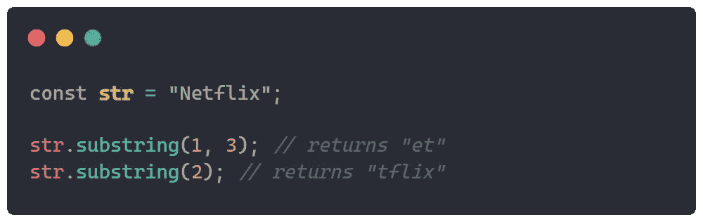
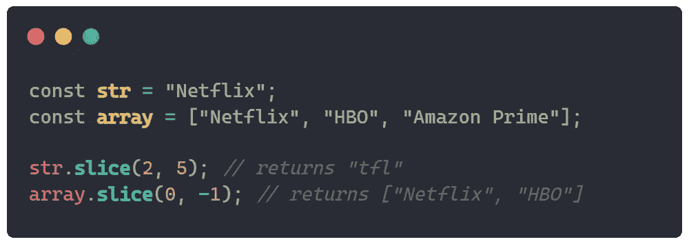
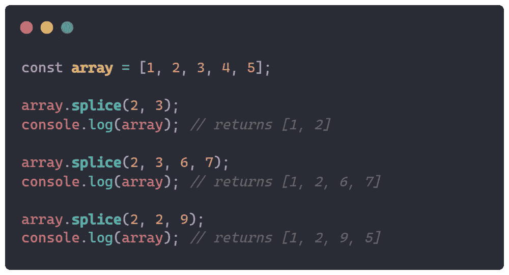

# substring()、slice()和 splice()有什么区别？

> 原文：<https://javascript.plainenglish.io/whats-the-difference-between-substring-slice-and-splice-e5a9b277636c?source=collection_archive---------9----------------------->

## Java Script 语言

## 揭示 JavaScript 中这些函数背后的差异。

Photo by [Nikolai Chernichenko](https://unsplash.com/@perfectcoding?utm_source=medium&utm_medium=referral) on [Unsplash](https://unsplash.com?utm_source=medium&utm_medium=referral)

函数`substring()`、`slice()`和`splice()`是对内容的字符串和数组的操作函数。这些函数不修改它被调用的原始字符串或数组，除了`splice()`，它只返回新的值。这些可以用于从某个索引到某个索引获取部分内容。

# 子字符串()

函数`substring()`是一个只能在字符串数据类型上调用的操作函数。这个函数应该从起始索引到结束索引获取字符串的一部分。这可以用来把文章的描述剪切到字符中的某一点，并像 Medium 一样添加省略号来创建文章的预览。

example of a substring() use case

该函数有 2 个参数`**substring**(start, end?)`。`start`参数是切割开始时字符串中的一个索引，包括起始索引；而`end`参数是切割结束时不包括索引。

如果没有给出`end`参数，切割将从`start`开始执行到字符串结束。此函数不支持将负索引作为参数，如果传递了负索引，则函数不会执行。

## 例子

从索引 2(包括到索引 3，不包括)剪切字符串`Netflix`并从索引 2 剪切到末尾的示例:

该函数还有另一种形式`**substr**(start, length)`，用于从一个`start`索引开始，并从该计数增加`length`，这将是结束索引(结束刚好是`start + length`)。不幸的是，这个函数现在被弃用了。

# 切片()

函数`slice()`也是一个操纵函数，可以在字符串或任何内容的数组上调用。在某种程度上，该功能和`substring()`的工作方式相同，可以互换使用。

Photo by [Nery Montenegro](https://unsplash.com/@neryfabiola_?utm_source=medium&utm_medium=referral) on [Unsplash](https://unsplash.com?utm_source=medium&utm_medium=referral)

该函数有两个参数`**slice**(start, end?)`。`start`参数是切割开始时字符串中的一个索引，包括起始索引，而`end`参数是切割字符串结束时不包括索引。

但是这个函数和`substring()`函数有所不同，这个函数支持负索引，表示从数组后面开始计数。例如，`**slice**(3, -2)`，此功能将从索引 3 开始，包括，到后面的索引 2(也从 0 开始计数)。

## 例子

从索引 2-包含到索引 5-排除剪切字符串`Netflix`和从数组后面从索引 0-包含到索引 1-包含剪切数组的示例。

如果想从 back 语法中访问最后一个索引，不是`-0`，只需写`array.length — 1`。

这个函数在字符串和数组上的工作方式类似，如果你在字符串上调用`slice()`，索引将像字符一样工作，在数组上索引将像数组中的项目一样工作。

# 拼接()

函数`splice()`也是一个只能在数组上调用的操作函数。这个函数通过移除或替换某个索引中的现有元素来修改数组的内容。这对于大规模替换数组中的元素非常有用。

Photo by [Scott Sanker](https://unsplash.com/@scottsanker?utm_source=medium&utm_medium=referral) on [Unsplash](https://unsplash.com?utm_source=medium&utm_medium=referral)

该功能采用 3 个基本参数`**splice**(start, deleteCount?, item?)`。参数`start`是删除开始的地方，`deleteCount`是我们想要从`start`中删除多少个元素，`item`是在`start`之后将添加到数组中的内容。我们可以添加任意多的`item`,只需向函数传递额外的参数。

## 例子

从索引 2 中删除索引的示例—包含在数组的末尾；从索引 2 —包含到数组的末尾，并在起始索引后添加值`6`和`7`；从索引 2-包含到下一个索引，并在起始索引后添加新值`9`:

## 结论

这些函数在使用时非常有用和强大，但是有时很难不把它们和相似的名字或意思联系在一起。我希望这篇文章能帮助您理解何时以及如何使用它们。

*更多内容请看*[***plain English . io***](https://plainenglish.io/)*。报名参加我们的* [***免费周报***](http://newsletter.plainenglish.io/) *。关注我们关于*[***Twitter***](https://twitter.com/inPlainEngHQ)*和*[***LinkedIn***](https://www.linkedin.com/company/inplainenglish/)*。加入我们的* [***社区不和谐***](https://discord.gg/GtDtUAvyhW) *。*