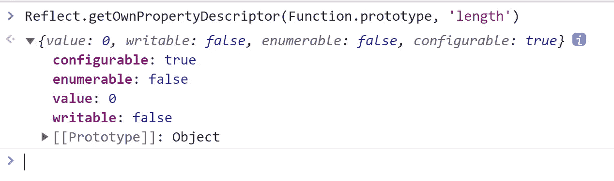
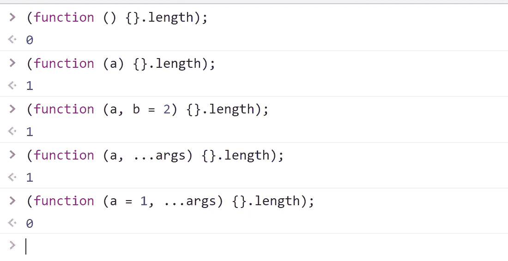
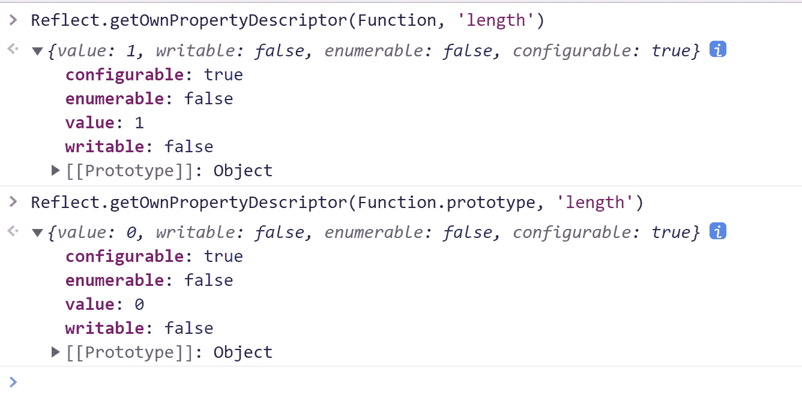
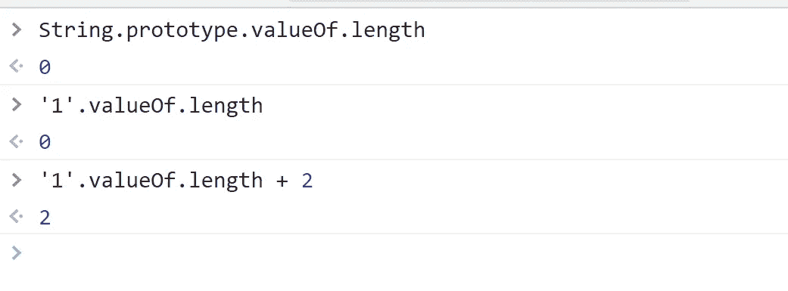
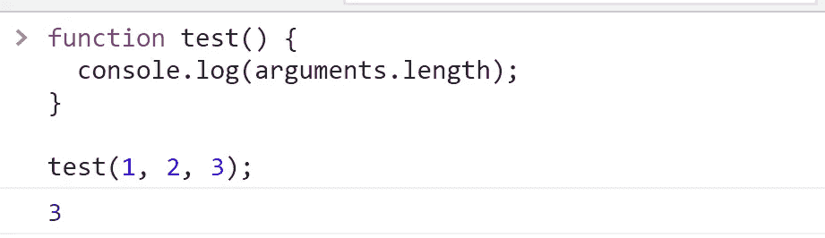

# ' 1 '的结果是什么. valueOf.length + 2？

> 原文：<https://javascript.plainenglish.io/whats-the-result-of-1-valueof-length-2-7957559e21e9?source=collection_archive---------10----------------------->

## 你能猜出正确答案吗？


Photo by [JESHOOTS.COM](https://unsplash.com/@jeshoots?utm_source=medium&utm_medium=referral) on [Unsplash](https://unsplash.com?utm_source=medium&utm_medium=referral)

如题，你能猜出正确答案吗？

其实主要看`'1'.valueOf.length`会返回什么。所以我们来分析一下:

`valueof`是`String.prototype`上的一个方法。另一方面，对原始数据类型`string`的调用会将其装箱，这样它就可以使用`String.prototype`上的方法。

那么`String.prototype.valueof.length`回报什么呢？

由于`String.prototype.valueof`也是一个函数，那么我们需要知道函数的长度属性:



您可以看到函数对象的 length 属性只是可配置的。那么它的值等于什么呢？

> `length`是函数对象的一个属性，表示函数需要多少个参数，即形参的个数。这个数字不包括[剩余参数](https://developer.mozilla.org/en-US/docs/Web/JavaScript/Reference/Functions/rest_parameters)，只包括第一个有默认值的参数之前的参数。

以上描述来自 [MDN](https://developer.mozilla.org/en-US/docs/Web/JavaScript/Reference/Global_Objects/Function/length#description) 。所以让我们来试试吧:



可以看出符合 MDN 的描述。除此之外，我认为还有一个特例，那就是函数构造函数:



`[Function() constructor](https://developer.mozilla.org/en-US/docs/Web/JavaScript/Reference/Global_Objects/Function/Function)`可以动态创建一个函数对象。虽然在业务开发中不常使用，但在某些框架中它有很大的价值。比如用在 Vue.js 的[编译中。](https://github.com/vuejs/vue/blob/cca88b9919cb0773895bbcef649c61a206fd0a32/src/compiler/to-function.ts#L12)

其语法如下:

```
new Function(functionBody)
new Function(arg1, functionBody)
new Function(arg1, ... argN, functionBody)
```

但是它的长度属性值是 1。可能就是这么设计的吧。

至此，我们来回答一下开头的问题:



那么这个答案是你所期待的吗？

## 延伸:和`arguments.length`有什么不同？

事实上，`[arguments.length](https://developer.mozilla.org/en-US/docs/Web/JavaScript/Reference/Functions/arguments/length)`的值是传递给函数的实际参数数量。例如:



今天就到这里，感谢阅读。

*更多内容请看*[***plain English . io***](https://plainenglish.io/)*。报名参加我们的* [***免费周报***](http://newsletter.plainenglish.io/) *。关注我们关于*[***Twitter***](https://twitter.com/inPlainEngHQ)*和*[***LinkedIn***](https://www.linkedin.com/company/inplainenglish/)*。查看我们的* [***社区不和谐***](https://discord.gg/GtDtUAvyhW) *加入我们的* [***人才集体***](https://inplainenglish.pallet.com/talent/welcome) *。*