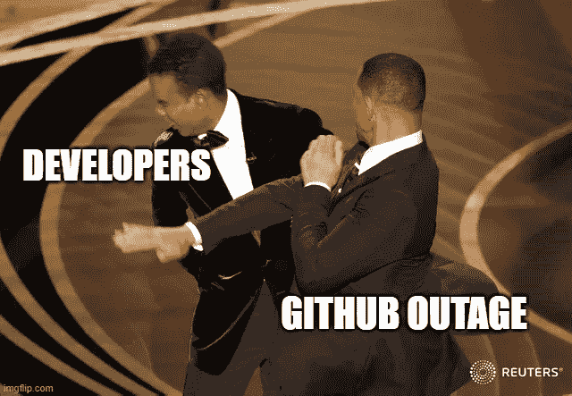
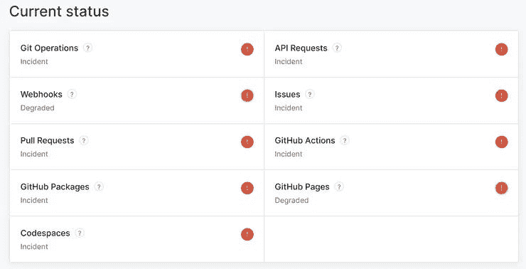
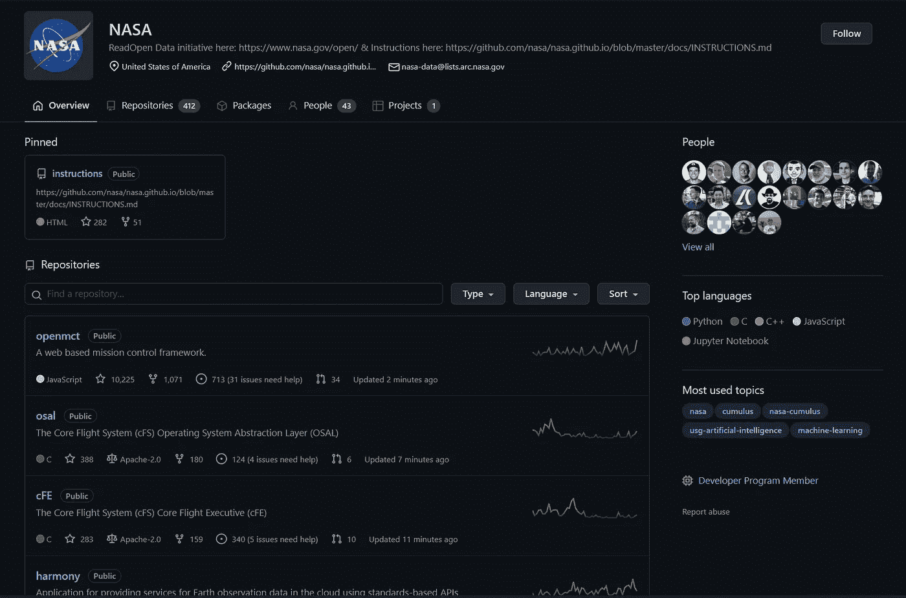
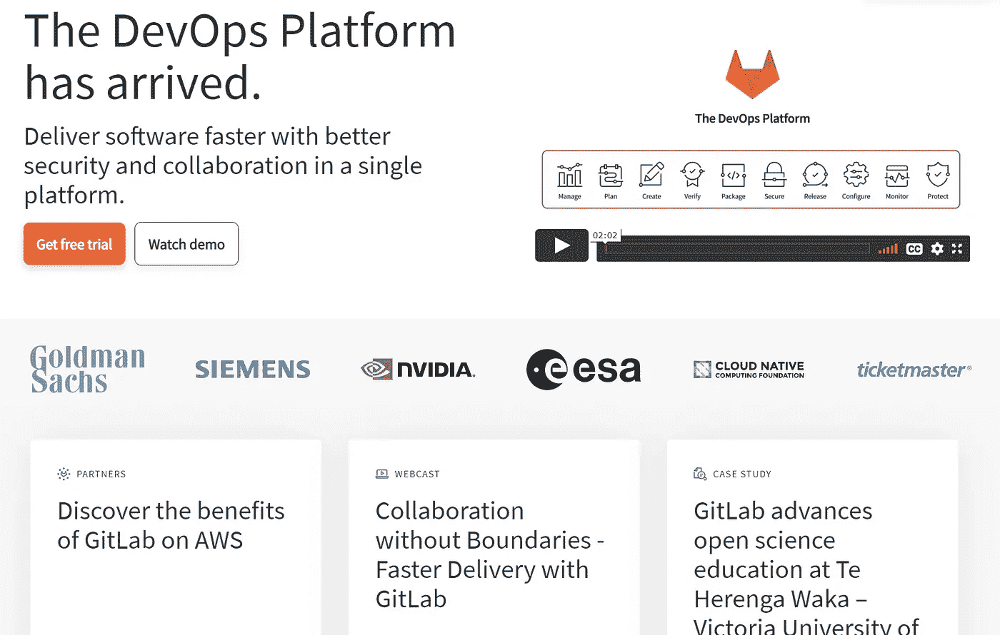
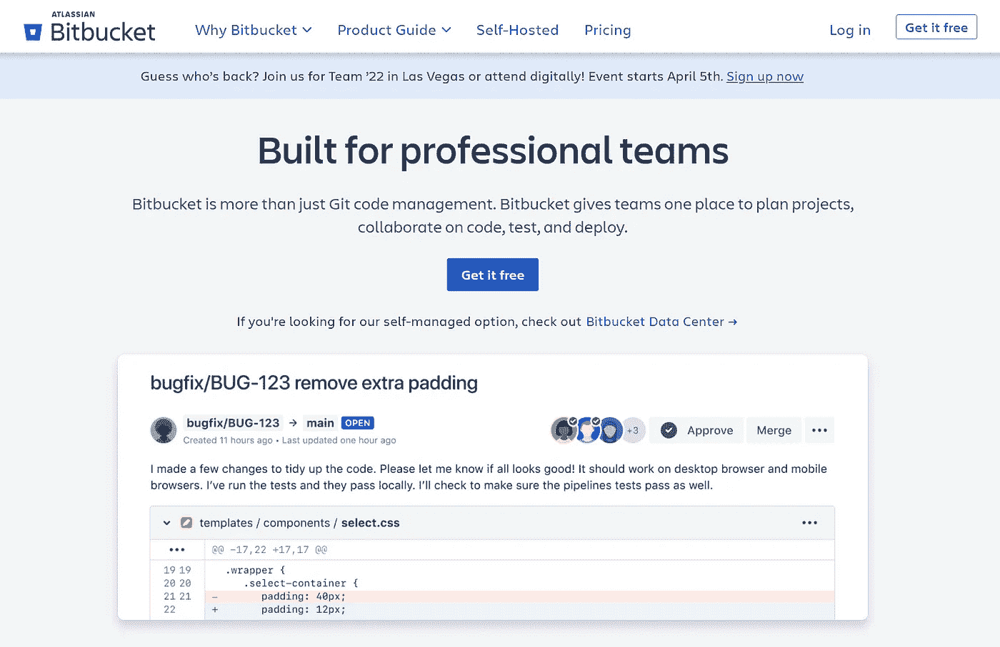

# 当 GitHub 倒下的时候，世界就分崩离析了

> 原文：<https://javascript.plainenglish.io/when-github-goes-down-the-world-comes-apart-94d1c9bf75bf?source=collection_archive---------8----------------------->

## 还是真的？

开发人员经常争论他们喜欢的技术，或者一些编程语言或框架是否优于另一个，但有一件事是肯定的，大多数人都同意:GitHub 是首选的 VCS，这导致了一个有趣的难题，如果 GitHub **关闭**会发生什么？

Developers Trying To Deploy During Outage

# 为什么我们如此依赖 GitHub？

*舒适耶每个人都用。*

[GitHub](https://github.com/) 成立于 2008 年。它是最早托管 Git 仓库的网站之一。它很快被开源社区用于代码交换，并因此一夜成名。

平台已经开始吸引大量用户。GitHub 拥有大约 7300 万用户，托管着大约 1 亿个存储库。微软以 75 亿美元的天价收购了 GitHub。

在开源社区，收购引发了冲突。许多人担心 GitHub 会失去其开源根基，因此他们正在探索 Gitlab 之类的替代品。

它提供了出色的用户体验，并通过其 CI/CD pipeline manager(GitHub Actions)与许多第三方服务集成，尽管扩展时价格相当昂贵。

它的受欢迎程度也是因为有大量极受欢迎的开源项目，在全球有成千上万的明星和粉丝。

GitHub 已经成为托管和管理代码库的事实上的标准，但它也不是没有缺点。

该平台是一个分布式系统，具有**多个故障点**。如果发生中断，开发人员将无法继续他们的项目或与其他人协作。对于依赖 GitHub 工作流的公司来说，这可能是个大问题。

好消息是，GitHub 有一些替代品可以在出现宕机时使用。其中包括 [Bitbucket](https://bitbucket.org/) 、 [GitLab](https://about.gitlab.com/) 和 [Azure DevOps](https://azure.microsoft.com/en-us/services/devops/repos/) 。

所以，如果 GitHub 宕机时间更长，不要**恐慌**！仍然有方法来完成您的工作，不幸的是，它们需要将整个基础设施转移到那些其他服务和它们各自的学习曲线上。

# GitHub 关闭，混乱随之而来

*没有 GitHub =今天不用工作。*

GitHub 最近一次重大服务中断发生在 2021 年 11 月 27 日，导致其所有功能的性能下降，从 git 操作到 web 和移动界面。

它持续了大约 3 个小时，世界各地的开发人员无法进行他们的项目，甚至无法在他们的浏览器中打开 GitHub，我们都重温了那些暴风雪导致**学校关闭**的时光，我们可以享受一个惊喜的休息。

除了玩笑，GitHub 的失败意味着:

1.  **问题&拉取请求**无法发出
2.  使用**项目 UI** 的团队无法检查门票
3.  [**GitHub 动作**](https://docs.github.com/en/actions) 上的自动化 **CI/CD** 管道无法运行
4.  无法从 [**GitHub 包注册表**](https://github.com/features/packages) 下载包
5.  [**Gists**](https://gist.github.com/)**无法创建或编辑**

**这是少数问题，即使 3 小时的停机时间可能看起来很温和，但这足以让 7300 万用户和超过 1 亿个托管存储库担心未来更长的停机时间。**

**这个相当“短暂”的事件在 [HackerNews 的一个帖子](https://news.ycombinator.com/item?id=29363169)中被很好地记录了下来，在这个帖子中，开发人员讨论了在一个集中平台上愚蠢地广泛使用一个**去中心化的版本控制系统，以及他们是如何自托管还是使用一个非公司所有的软件。****

**当我看到其中一条评论描述 [rust](https://www.rust-lang.org/) 、编程语言和[Cargo](https://crates.io/)(rust package manager)无法运行时，我惊呆了，因为它极度依赖 GitHub repo 作为其唯一的真理来源，尽管后来在该线程中有一个通过 [**离线模式**](https://www.ncameron.org/blog/cargo-offline/) ( `cargo --offline`)的修复，但有一天醒来不得不搜索。**

**我必须承认 [HackerNews](https://news.ycombinator.com/) 线程可能会离题太远，以至于成为一个阴谋意大利面，从 GitHub 宕机到微软是否是老大哥并监视 GitHub 代码，或者 Cargo 团队也是 NPM 董事会的一个大阴谋。**

**需要强健的基础架构并且不能冒任何停机风险的大型组织会怎么样？美国宇航局是一个很好的例子，因为他们实际上有一个[公共账户](https://github.com/nasa)，有超过 400 个存储库，有真正的火箭科学级代码，但所有敏感或秘密项目都是在内部托管的，由 [Mercurial 或 Subversion](https://gcn.com/2017/06/nasas-systems-for-sharing-code/304866/) 负责，具体取决于团队。**

****

**[NASA GitHub](https://github.com/nasa) Repositories**

**就我而言，几个月来，我第一次利用停电时间出去晒太阳，我真的很开心，没有任何问题，全世界都为我出色的隔离胡子感到敬畏。**

**没有问题或公关可以做，也没有检查问题信息或文件意味着我是 GitHub 免费的好几个小时。**

**而且感觉**神奇**。**

**我并不是说 GitHub 不好，相反，我认为它是一项伟大的服务，允许创建如此多的项目，只是我们变得太依赖它了。**

# **有哪些 GitHub 的替代品？**

***自主持树莓 PI 的农场 FTW。***

# **[GitLab](https://about.gitlab.com/)**

**Gitlab 是一个基于 git 的存储库托管平台，类似于 Github。它于 2011 年首次发布。Gitlab 从一开始就试图将自己与 Github 区分开来，因此它为完整的 DevOps 生命周期设计了一个产品。问题跟踪器、持续集成和持续交付都是 Gitlab 产品的一部分。**

****

**GitLab [About Page](https://about.gitlab.com/)**

**Gitlab 为整个 DevOps 流程提供了单一界面。Gitlab 现在被超过 100，000 个组织使用。Gitlab 被 IBM、索尼、NASA 和阿里巴巴等公司使用。**

# **[位桶](https://bitbucket.org/)**

**另一个在线源代码托管服务是 BitBucket。2008 年，BitBucket 上线。在那段时间里，它只使用 Mercurial(一个免费的分布式版本控制系统)，但在 2011 年 10 月被 Atlassian 收购后，它也一直使用 Git。**

****

**Bitbucket [Home Page](https://bitbucket.org/)**

**因为 Atlassian 开发了像吉拉、Trello 和 Confluence 这样的流行软件，它有自己的优势。BitBucket 从与这些技术的完美集成中获益匪浅。**

**万一出现故障，请保存这篇文章，作为一个没有 GitHub 的世界的应急解决方案，不要忘记鼓掌👏并关注更多软件相关内容🚀&人工智能的文章来的比你说“加密被夸大了”还要快。**

**立即获取您的介质订阅，获取超过 9000 的知识:**

** [## 通过我的推荐链接加入媒体-亚历克斯·斯特雷扎

### 作为一个媒体会员，你的会员费的一部分会给你阅读的作家，你可以完全接触到每一个故事…

medium.com](https://medium.com/@alex.streza/membership) 

*更多内容请看*[***plain English . io***](https://plainenglish.io/)*。报名参加我们的* [***免费周报***](http://newsletter.plainenglish.io/) *。关注我们关于*[***Twitter***](https://twitter.com/inPlainEngHQ)*和*[***LinkedIn***](https://www.linkedin.com/company/inplainenglish/)*。加入我们的* [***社区不和谐***](https://discord.gg/GtDtUAvyhW) *。***