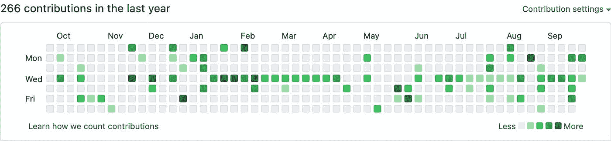

# 初学程序员应该什么时候在 GitHub 上注册？

> 原文：<https://javascript.plainenglish.io/when-should-i-register-on-github-as-a-beginner-programmer-646f75b06668?source=collection_archive---------12----------------------->

Illustration by the author

简短的回答是尽快。最理想的情况是，你已经有了一个 GitHub 账户。如果你不是这样的话——首先阅读这篇文章，然后在 GitHub 上注册。

# 什么是 GitHub

这是一个代码托管平台。GitHub 为公共和私有存储库提供免费托管——免费层对于学习目的和一些小项目来说足够慷慨。它拥有 8300 万用户，托管着超过 2 亿个存储库。

# 开源集线器

Github 上有大量开源项目:

*   [VueJS](https://github.com/vuejs/vue)
*   [网络包](https://github.com/webpack/webpack)
*   [棱角分明](https://github.com/angular/angular)
*   [做出反应](https://github.com/facebook/react)

许多项目使用它作为开发平台:他们跟踪问题并在那里讨论项目路线图。因此，无论你想如何参与——贡献代码、报告错误等等。-你需要一个 GitHub 账户。

# 社交网络编程

除了托管代码和项目相关的通信，GitHub 还是程序员的社交网络。您可以跟踪用户、项目和组织，以便随时了解他们的活动。

还有一点游戏化:他们有活动图表，上面有你活动的热图:

这有点像多林哥条纹，但更少的内疚之旅。

# 伟大的学习工具

这是学习编程的好地方。你可以找到其他人的项目，然后克隆它们，在你的机器上本地使用，或者转到你的账户上，与他人分享你的改变。当您认为您的更改会改进原始项目时，您可以将它们作为一个拉式请求提出来——也就是说，向项目维护者提出您的更改。

# 展示您作品的地方

你正在做的项目不需要完美到值得发表。编程对每个人来说都是一个漫长的旅程，很明显最初的几步会有点笨拙。你可以把你的作品公之于众，而不必太担心。不太可能有人会注意你的个人资料，除非你把它发给他们——例如，作为求职申请的一部分。到那时，你的项目会看起来更好。

# GitHub 替代品

还有其他公司提供类似的功能。例如:

*   [GitLab](https://about.gitlab.com/) ，
*   [比特桶](https://bitbucket.org/)。

主要区别在于他们的社区要小得多，因此，他们缺乏 GitHub 的网络效应。

# GitHub vs Git

作为一个简单的比较，您可以将 Git 视为一种类似协议的电子邮件。GitHub 是一个支持这种协议的主机提供商——如 Gmail、Outlook 等。如果你有兴趣阅读更多关于这两者的比较，你可以[在这里](https://www.cristina-padilla.com/gitvsgithub.html)阅读更多。

# 了解更多信息

Git 是每个程序员必不可少的工具。如果你有兴趣了解更多，在这里注册[来获取我的 Git 相关内容的更新。](https://how-to-dev.ck.page/e92d2eb5d7)

*最初发布于*[*https://how-to . dev*](https://how-to.dev/when-should-i-register-on-github-as-a-beginner-programmer)*。*

*更多内容看* [***说白了。报名参加我们的***](https://plainenglish.io/) **[***免费周报***](http://newsletter.plainenglish.io/) *。关注我们关于*[***Twitter***](https://twitter.com/inPlainEngHQ)，[***LinkedIn***](https://www.linkedin.com/company/inplainenglish/)*，*[***YouTube***](https://www.youtube.com/channel/UCtipWUghju290NWcn8jhyAw)*，以及* [***不和***](https://discord.gg/GtDtUAvyhW) *。对增长黑客感兴趣？检查出* [***电路***](https://circuit.ooo/) *。***