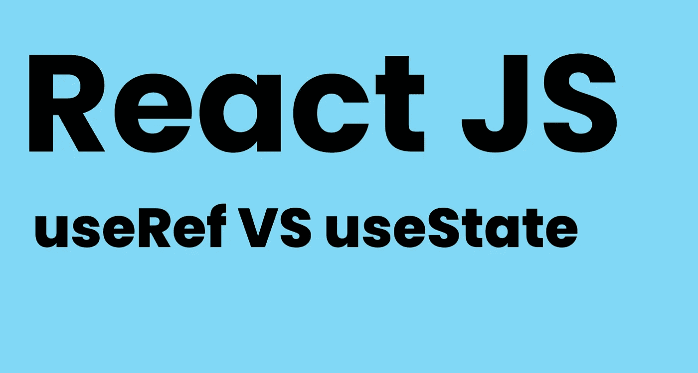

# 在 React 中，什么时候应该使用 useRef()而不是 useState()。

> 原文：<https://javascript.plainenglish.io/when-should-you-use-the-useref-over-usestate-in-react-2eb515b9643b?source=collection_archive---------6----------------------->

## 你知道吗？



Image made by author

## 使用 useRef()实际上可以做什么？让我们回顾一些使用 useRef()钩子的案例和好方法！

实际上`useRef()`可能很有用，在我知道它能用来做什么之前，我对它持怀疑态度。

让我们深入了解一下，`useRef()`是一个 React 钩子，它接受 1 个参数作为初始值，并返回一个`reference`，这是一个具有属性名为`current.`的对象

例如:

```
const ref = useRef(initialValue);
ref.current = 10
```

# 重新渲染

`useRef()`的酷之处在于它不会像`useState()`那样触发任何重新渲染，所以如果你痴迷于性能，有一个很好的使用`useRef()`而不是`useState()`的例子，那就是……用它来输入。是的。

每次我们在输入中输入内容时，组件都会重新呈现，所以*如果*我们在使用带有`useState()`的输入的组件树中处于较高的位置，那么这可能会导致重新呈现问题，因为每次我们在输入字段中输入内容时，组件都会更新，这将导致其下所有组件的一系列重新呈现。

更好的方法是使用它来关注输入字段，而不是根据状态是真还是假来激活`useState()`和不同的关注类，相反，我们可以像这样对输入使用`useRef()`:

```
const inputRef = useRef()
inputRef.current.focus()
<input ref={inputRef}/>
```

# 滚动到组件

`useRef()`是向下滚动到某个组件的好方法，而不是使用`useState()`和做一堆额外的逻辑。

**它是这样工作的:**

```
const componentSection3 = useRef(null);
const scrollToComponent = () => componentSection3.current.scrollIntoView({*behavior*:"smooth"});return (
<>
<Component1 />
<Component3 ref={componentSection}/>
<Component4 /></>
)
```

# 拖延的

我们可以使用`useRef()`来获得 HTML 元素的**位置**，并且我们可以操作它的位置。

例如，昨天我制作了一个自定义滑块，你可以不用鼠标滚动，也可以通过抓取项目来水平拖动。当你拖动的时候，我改变了它应该实时滚动的量，所以我得到了位置和`ref.current.scrollLeft = newPosition`

这是一个改变元素位置的超级简单的方法！

# 注意外面的咔哒声

我们可以使用`useRef()`来获取 HTML 元素，并将其与另一个 HTML 元素进行比较，然后决定它是否是您单击的正确 HTML 元素，并基于此执行一些操作。

我们当然可以用`useState()`对它进行硬编码，添加一个 HTML 元素拥有的默认标签，并对其进行比较，但是只使用`useRef()`这非常简单，只需将你的 HTML 元素存储在一个变量中，并与`useRef.current`进行比较！

# 你可能也会喜欢:

[](https://betterprogramming.pub/callbacks-vs-promises-vs-async-await-a-step-by-step-guide-f93d13447604) [## 回调 vs .承诺 vs .异步 Await:逐步指南

### 引擎盖下也有点。

better 编程. pub](https://betterprogramming.pub/callbacks-vs-promises-vs-async-await-a-step-by-step-guide-f93d13447604) [](/stop-learning-from-react-tutorials-that-suck-5e2031d9bdc7) [## 停止从糟糕的 React 教程中学习

### 不受欢迎的观点

javascript.plainenglish.io](/stop-learning-from-react-tutorials-that-suck-5e2031d9bdc7) 

*你好，如果你想体验中等的自己，请考虑* ***支持*** *我和其他所有的作家通过注册成为* [***会员***](https://medium.com/@anton.franzen/membership) *每月 5 美元来保持独立写作的活力，* [***在这里注册；)***](https://medium.com/@anton.franzen/membership)

除了支持他人，Medium 还可以通过写作和在这里找到家的强大、积极参与的社区来支持你。

*更多内容请看*[***plain English . io***](https://plainenglish.io/)*。报名参加我们的* [***免费每周简讯***](http://newsletter.plainenglish.io/) *。关注我们*[***Twitter***](https://twitter.com/inPlainEngHQ)*和*[***LinkedIn***](https://www.linkedin.com/company/inplainenglish/)*。加入我们的* [***社区不和谐***](https://discord.gg/GtDtUAvyhW) *。*