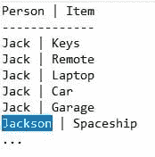
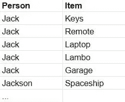
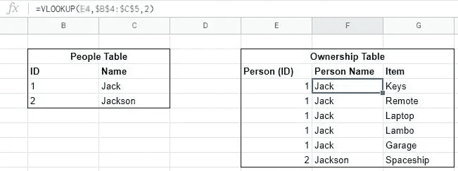
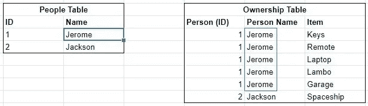
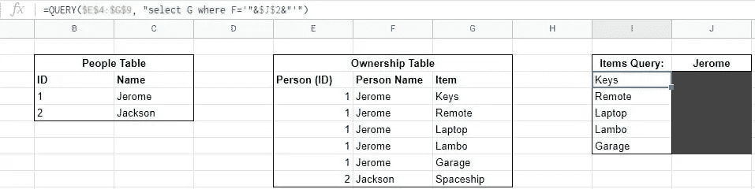
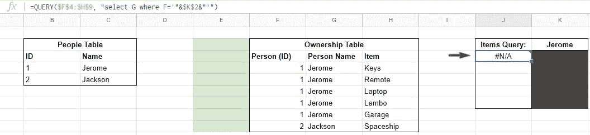
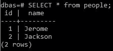
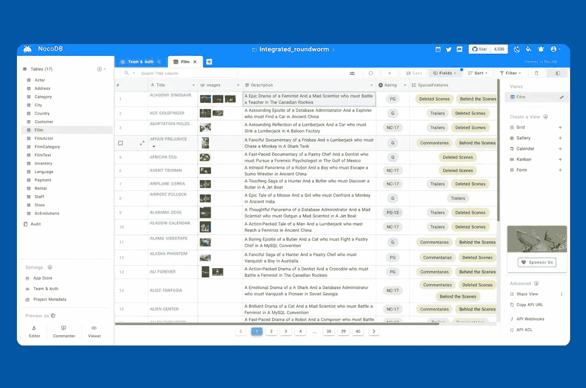

# 何时将数据库用作电子表格

> 原文：<https://javascript.plainenglish.io/when-to-use-a-database-as-a-spreadsheet-4336defa5689?source=collection_archive---------7----------------------->

Image by fullvector on Freepik

在存储和检索信息方面，纸质票据领先于分类账。分类账在电子表格之前。电子表格在数据库之前。在互联网上搜索，你会发现这些工具之间的无数比较，但哪一个是最适合你的呢？这是*要问的错误问题*。

所有这些工具都有一个共同点:**跟踪信息(数据)。**换句话说，这些工具帮助你存储和检索你在各种情况下使用的信息。专家们通过使用极端的词汇来证明他们工资单的存在，从而使这些工具的选择复杂化。真的没那么复杂…

**不要复制代表同一事物的数据。**记住这个规则。就这么简单。这就是你需要使用哪种工具来管理信息的答案。*“但是等等，规则不是工具！”你是对的。规则不是工具。但是，你需要使用的工具，一旦你遵循它，就会变得显而易见。让我们看看 **it** 的运行情况。*

# 大脑

你的大脑包含多达[2.5 Pb*(2560 TB)*](https://www.medanta.org/patient-education-blog/what-is-the-memory-capacity-of-a-human-brain/)的存储空间。然而，存在与存储信息相关的任意成本，并且不能保证信息被正确存储。这对你一生中遇到的很少相同的经历来说很好。对于记忆大量结构化信息来说就不那么好了。一如既往，使用合适的工具完成工作。

# 数字记事本

这个工具是纸张的数字等价物。它允许您在计算机的硬盘上存储尽可能多的字节——根据需要存储在尽可能多的文件中。有了这个工具，你可以在没有任何给定结构的情况下自由地输入信息字符。然而，大多数人最终使用线条和段落来组织他们的信息(数据)。虽然这对于一次性的待办事项列表和单次提交来说没什么问题，但是一旦你需要一次在两个地方更新一个角色时，这就没用了。

## 例子

你用记事本记录了人们的姓名和物品。虽然大多数人只保留一个条目，但“鲍勃”却写在 5 个不同的行上。当“鲍勃”决定把他的名字改成“吉姆”时，这就成了问题。现在，您必须手动更新所有 5 行的值。不幸的是，没有一种简单的方法可以一次在多个地方改变和更新一个单词*(没有潜在的问题)*。**该升级工具了。**

Search and Replace? Think again.

# **电子表格**

电子表格是结构化的文件。事实上，大多数电子表格都可以使用[逗号分隔值(CSV)](https://en.wikipedia.org/wiki/Comma-separated_values) 格式在纸上进行管理，这种格式指定了如何将纸张分割成单元格。人们使用这些细胞来存储信息，方法是将细胞组织成每张“纸”中的表格*。Excel 和 Google Sheets 等应用程序的开发甚至允许您从一个单元格引用另一个单元格。这是对查询和图表等其他功能的补充。*

## *例子*

*在前面的示例中，您使用文本行跟踪一个人的姓名和他拥有的物品。将这些信息按原样转移到电子表格中会产生以下结果。*

**

*以这种方式存储信息有很多好处。界面简单易懂。结构化格式使与其他人合作变得轻而易举。最重要的是，你*可以*将一个单元格引用到另一个单元格中的值。那是什么意思？使用另一个表*(一个人的名字)*，您可以更新一个“引用”单元格来改变所有权表中所有的“值”单元格。只需要几次查找！*

**

*Let’s change Jack’s name to Jerome.*

**

*Baller.*

# *问题是*

*上述格式一直有效，直到您需要添加一个“引用”到另一个“被引用”的单元格。在本例中，我们从 Items 查询表中引用所有权人员姓名列*(它引用人员表)*。这是它的样子。*

**

*此时，您正在使用一个查询*(即 QUERY)* 来引用一个公式*(即 VLOOKUP)* 来引用数据“值”*(表示相同的事物)*并跨表同步它们。嗯…差不多了。在电子表格中，“引用”只是将值*(被引用)*放在您指定的单元格中。换句话说，数据只是被复制过来。因此，当您决定在 VLOOKUP“reference”上使用查询“reference”时，查询是在复制的数据上执行的*(但不是实际的引用)*。这种细微的差别意味着您复制的是唯一的数据。你违反了规定。*

*与记事本类似，在您尝试修改数据之前，问题不会自己显露出来。提醒一下，当您需要一次更改多个“值”时，这个例子遇到了一个问题。由于无法创建引用文件*(也称为另一个字符)*中的位置的字符，更新一个人的名字将需要多次手动更改*(损害数据的一致性)。*电子表格提供了使用公式或查询将一个单元格“引用”到另一个单元格的选项，从而解决了这个问题。这在您开始创建间接引用之前非常有效；具体是从*项目查询表*中的一个查询*(在所有权表上)*到一个 VLOOKUP *(在人员表上)*。*

*公式或查询(引用)不能在电子表格中引用。*确定。*可以将 VLOOKUP 公式复制到查询公式中。但是，当您更改 VLOOKUP 公式中的一个参数时，您必须手动更新另一个参数。这导致了与记事本相同的问题，但是使用了公式而不是字符。这是因为电子表格中的间接引用(公式到公式)总是对复制的“值”的“引用”；不是实际参考。因此，您的数据可能在多个方面变得不一致。*

*你如何在实践中看到这个概念？当您以任何方式更改所有权表公式(引用)时，基础“值”将会更改，但**不会更改引用该公式的**查询。虽然这对于许多情况来说是好的，但是当您修改 VLOOKUP 公式并希望它与其他引用保持一致时，这就变得毫无意义了*(到那个公式)*。在这种情况下，简单地*移动*原始引用单元格的位置*(来自 VLOOKUP)* 会导致以下结果。*

**

*It’s over.*

*代表相同事物的值被复制。又到了升级的时候了。*

# *数据库*

*存储在电子表格中的信息的典型升级是[关系数据库](https://en.wikipedia.org/wiki/Relational_database)。关系数据库很常见，因为大多数人存储的信息都与其他信息相关。作为一个例子，这篇文章关注的是一个*项目*和一个*人*之间的*关系(所有权)*。然而，应该注意的是，数据库的类型不止一种；各有各的优缺点。尽管如此，这条规则仍然适用。*

***SQL(结构化查询语言)**是一种与多个数据库引擎 *(MySQL、PSQL 等)*协同工作的语言，提供结构化数据存储。您不用在工作表上创建表格，而是创建带有列*(表示属性)的表格*(表示对象)*；【有约束】)*。每行代表一个单独的对象*(来自各自的表)*，这导致[面向对象编程](https://en.wikipedia.org/wiki/Object-oriented_programming)。让我们不要操之过急…*

*电子表格的问题是引用不能被复制。关系数据库通过使用外键来解决这个问题，外键可以引用特定表中的特定列。这不仅可以提高数据的一致性，还可以让您始终遵守“规则”。事实上，这个规则变成了一个真正的概念，叫做[数据库规范化](https://en.wikipedia.org/wiki/Database_normalization)。*

*关系数据库可以毫无问题地存储数十亿行。这些工具针对查询进行了优化，这也很有帮助。从这个角度来看，数据库是 web 开发的一等公民；支持您使用的几乎所有 web 应用程序。唯一的缺点是数据库*“程序”*是通过命令行界面使用其语言来控制的(或者使用来自另一个应用程序的输入)。*

**

*WHAT THE F***!*

# *将数据库用作电子表格*

*已经进行了开发以进一步优化现代数据库的每个方面；尤其是用户界面。这导致了后端即服务应用的产生，如 **Supabase** ，它通过 web 应用*(而不是终端)*简化了数据库的管理。不幸的是，这些应用程序仍然依赖于通过最常见的情况*(代码)*来存储和检索数据。然而，最近的发展已经改变了这一点…*

**

*[NocoDB](https://medium.com/gitconnected/how-to-set-up-nocodb-with-ssl-ff96bd36d078) Database as a Spreadsheet Demo*

*乍一看，上面的图像看起来像一个电子表格。这是一个电子表格… **但是**它是由数据库驱动的。没错。您可以像处理电子表格一样使用数据库。因此，标题本身就显示了这一点:“什么时候我可以将数据库用作电子表格？”再次，错误的问题。相反，你应该问“为什么不两者都要呢？”然后遵守规则。你以后会感谢我的。*

**原载于 2022 年 10 月 20 日*[*https://switchupcb.com*](https://switchupcb.com/blog/when-to-use-a-database-as-a-spreadsheet/)*。**

**更内容于* [***普通英语***](https://plainenglish.io/) *。报名参加我们的* [***免费周报***](http://newsletter.plainenglish.io/) *。在*[***Twitter***](https://twitter.com/inPlainEngHQ)[***LinkedIn***](https://www.linkedin.com/company/inplainenglish/)*[***YouTube***](https://www.youtube.com/channel/UCtipWUghju290NWcn8jhyAw)*以及*[**T42 不和**](https://discord.gg/GtDtUAvyhW) *上跟随我们。对增长黑客感兴趣？查看* [***电路***](https://circuit.ooo/) *。***