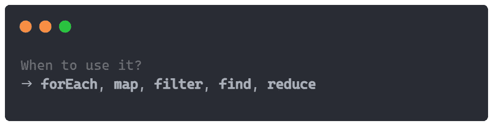
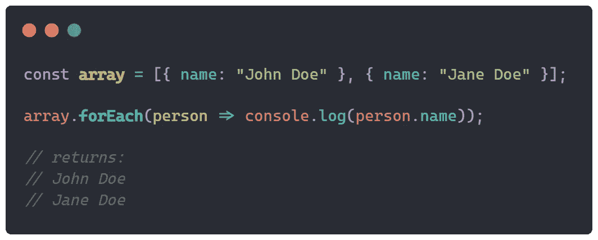
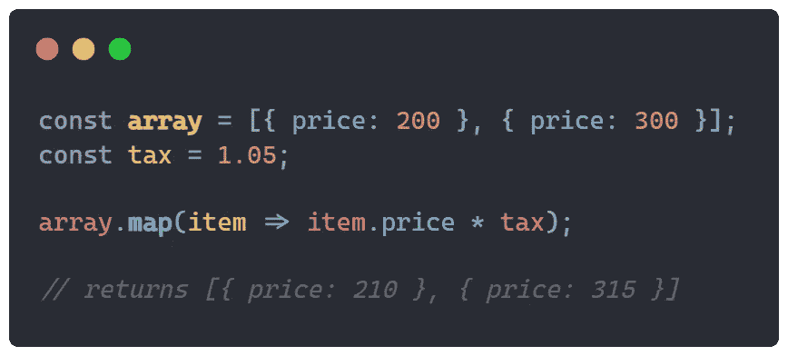
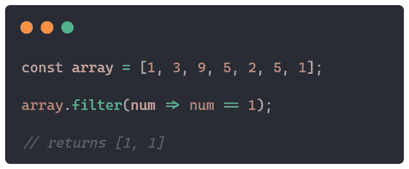
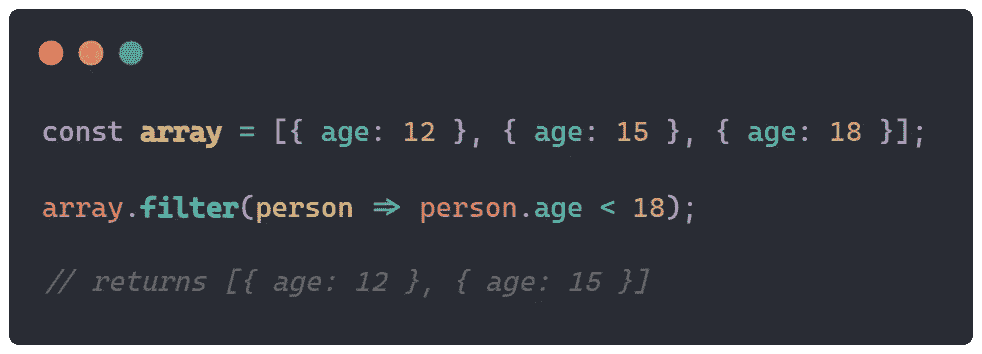
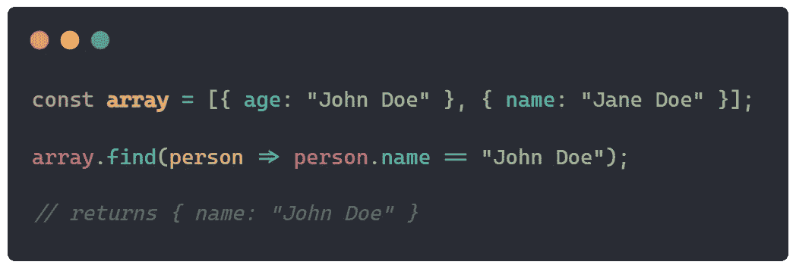
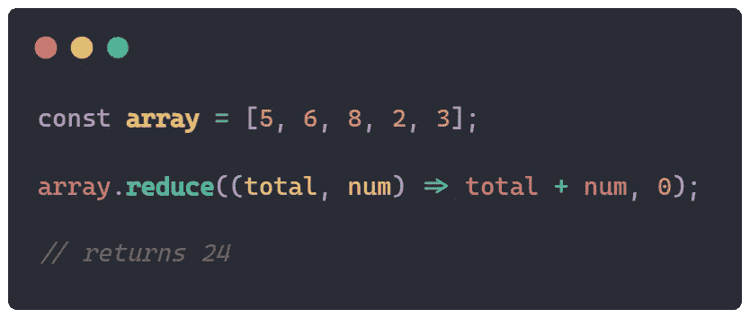
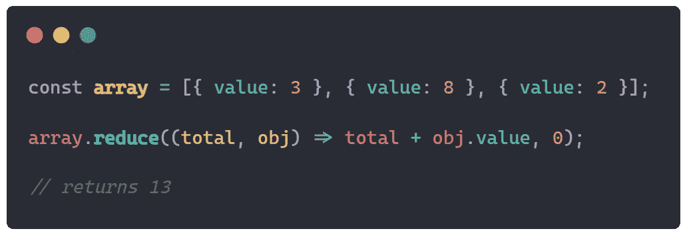

# 何时在 JavaScript 数组上使用 forEach()、map()、filter()、find()和 reduce()

> 原文：<https://javascript.plainenglish.io/when-to-use-foreach-map-filter-find-and-reduce-on-javascript-arrays-e0283ce8d24c?source=collection_archive---------2----------------------->

## Java Script 语言

## 开发人员使用 JavaScript 数组循环函数指南

数组函数可以帮助您在 JavaScript 中进行任何类型的操作或遍历一组项目。一些预构建的函数可以有彼此非常相似的用例，因此我创建了一个操作函数列表，列出了它们的外观和用例。

# 。forEach()

函数`.forEach()`是另一种形式的普通 for 循环，可用于遍历数组项。这种情况下的函数用于更复杂的数组，例如，包含大量条目的对象数组，而不仅仅是整数数组。

该函数带 1 个参数`.**forEach**(callback)`。参数`callback`最多可以带 3 个参数`element`、`index`、&、`array`(但只有`element`参数是必需的，其余是可选的)。

参数`element`将被用作存储数组中当前元素的变量。参数`index`指的是`element`在数组中的索引，参数`array`指向它被调用的数组。

我不得不说，在代码清晰度和性能方面，JavaScript 中新的预建循环`for..of`比`.forEach()`更有效。

## 例子

下面是一个循环遍历具有名称属性的对象数组并将每个名称记录到控制台的示例:

# 。地图()

函数`.map()`是一个操作函数，可以修改数组中每个元素的内容。这个函数返回一个带有修改值的新数组，它所调用的数组将保持不变。这个函数对于向一个已经存在的数组添加一点改变是有用的，例如向一个对象添加一个属性或者修改它。其结构和用途与之前的功能`.forEach()`相同，两者可以互换使用。

就像函数`.forEach()`一样，这个函数也只取 1 个参数`.**map**(callback)`。参数`callback`最多可以带 3 个参数`element`、`index`、&、`array`(但只有`element`参数是必需的，其余是可选的)。

## 例子

下面是一个循环遍历具有价格属性的对象数组并向其添加税收值`5%`的示例:

# 。过滤器()

函数`.filter()`是一个搜索函数，返回满足指定条件的所有元素。您可以通过简单的术语进行搜索，例如，元素等于某个整数，或者通过更高级的术语进行搜索，例如，搜索具有某个属性的对象，该属性等于某个值。这两个例子都是开发人员经常使用的。

这个函数返回找到的结果的数组，如果有的话，即使只找到 1 个匹配。如果一个函数没有找到任何匹配，它只是返回一个空数组。

就像函数`.forEach()`一样，这个函数也只取 1 个参数`.**filter**(callback)`。参数`callback`最多可以带 3 个参数`element`、`index`、&、`array`(但只有`element`参数是必需的，其余是可选的)。

## 例子

下面是一个例子，通过简单的术语搜索一个整数数组，并找出哪些元素等于值`1`:

下面是一个通过更高级的术语搜索对象数组并查找年龄属性小于`18`的对象的示例:

# 。查找()

函数`.find()`和前面的函数一样也是一个搜索函数，但是它们在一个小细节上有所不同——这个函数在一个数组中只返回一个匹配。如果数组中有多个结果，函数将返回第一个匹配的结果。

就像函数`.forEach()`一样，这个函数也只取 1 个参数`.**find**(callback)`。参数`callback`最多可以带 3 个参数`element`、`index`、&、`array`(但只有`element`参数是必需的，其余是可选的)。

## 例子

下面是一个在对象数组中通过更高级的术语进行搜索并找到一个属性名等于`John Doe`的对象的例子:

# 。减少()

函数`.reduce()`是一个累加函数，可以在一个数组中找到所有或选定值的总和。这个函数也用于这两个术语，因此支持对象解构。这个函数有两个参数— `.**reduce**(callback: (accumulator, current), default)`。

`.reduce()`的第一个参数是`callback`，它也有两个参数——`accumulator`和`current`。参数`accumulator`跟踪当前总数，而`current`将被用作存储数组中当前元素的变量。

`.reduce()`的第二个参数是`default`，这是该函数开始计数的默认值。

## 例子

下面是一个循环遍历整数数组并从`0`开始将每个值添加到总数中的例子:

下面是一个循环遍历具有值属性的对象数组并从`0`开始将每个值添加到总数中的示例:

## 结论

创建只运行一次的复杂函数并不是处理代码的最佳方式，相反，您可以使用这些更容易计算的数组函数。这些功能可以帮助你比输入不必要的代码更快，这些代码可以被简化。我希望你在下一个项目中作为开发人员明智地使用它们，只用一行代码就能更快地表达你的观点。

*更多内容请看*[***plain English . io***](https://plainenglish.io/)*。报名参加我们的**[***免费周报***](http://newsletter.plainenglish.io/) *。关注我们关于* [***推特***](https://twitter.com/inPlainEngHQ) *和**[***LinkedIn***](https://www.linkedin.com/company/inplainenglish/)*。加入我们的* [***社区***](https://discord.gg/GtDtUAvyhW) *。***