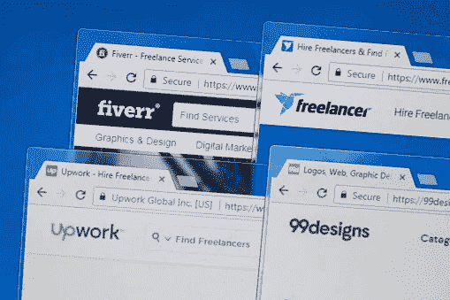

# 以你的 JavaScript 技能在哪里可以赚到 100 美元/周？

> 原文：<https://javascript.plainenglish.io/where-can-you-earn-100-week-with-your-javascript-skills-4f6f9be41ab8?source=collection_archive---------16----------------------->

你认为你的 JavaScript 技能有价值吗？你想通过建筑项目获得更多的经验吗？你想在学习的同时赚些钱吗？这是一件双重积极的事情，我们可以说你赚了两倍。所以，这是一笔大交易。但是，要做到这一点，你必须知道在哪里可以找到需要完成项目的人，而这些人可能没有技术技能或时间。

因此，在这篇文章中，我们将看到你可以在哪里找到这些机会，并试图赚一些额外的钱。

[**https://pythonistaplanet.com/how-to-make-money-with-javascript/**](https://pythonistaplanet.com/how-to-make-money-with-javascript/)

# 五个

最著名的自由职业平台是 sure Fiverr，所有的服务从 5 美元到更高的薪水不等。在这里，你可以创建你的演出，通知你你可以参与一些类型的项目。例如，你可以注明你有资格从事“Javascript 和网络相关项目”、“动态网站”或“敏捷 Javascript API”。

通过这些现场演出，人们知道你可以为他们工作。因此，当有人需要你的帮助时，会与你联系，这样你就可以为你要做的服务确定正确的价格。然后，确定最后期限和其他可能发生的事情。此时，一切都取决于您和您编写的代码。做出伟大的代码，你会有积极的修改，而更多的未来消费者，做出平庸的作品，会很难有别人给你回电话。所以，这是让你进一步提高技能的另一种方法。

这个平台是真正可定制的，你的计划是非常个性化的，非常简单。所以，你可以提出你认为正确的价格，也可以说你的水平是什么。它的收益也非常可观。一开始，也许你在寻找客户时会有一些困难，但是经过一段时间在其他平台上的自我推销，你会开始有所收获。

如果你打算做两个小项目或一个更大的项目，你可以期望赚到 500 美元，但你可能会在一个多星期内完成工作。记住，你不会一开始就有这个数，但是如果你工作方法正确，用不了多久。

如果你想尝试一下，可以点击这个链接查看:【http://www.fiverr.com/s2/d3cea6898e】

# ***向上工作***

*这是另一个非常受欢迎的地方，但也非常不同，在我看来，更适合初学者。在那里你可以找到为你工作的人，或者和某人一起工作。当你报名的时候，你把你的知识和你能做的事情。然后，一个相关工作的列表会出现在你面前，上面有相关的信息和每小时的报酬。*

*在这一点上，在一天的不同时间，你必须在那个列表中搜索一些符合你的知识和技能的工作，并申请其中的一些。招聘人员会审查你的申请，如果对他来说你是一个好的人选，就会雇用你。在这一点上，你会为你所做的工作得到报酬。*

*这个网站需要比 Fiverr 多一点的活动，这对于初学者和在网站上还没有名气的人来说是一个优势。对于更多的专业知识，one 也是一个非常好的平台，因为你可以选择关注什么:你喜欢的项目或金钱。由你决定。如果你积极主动，不断努力提升自己的形象、技能和声誉，你的平均工资可以达到每周 70 美元左右，但随着你工作时间的增长，这个数字很容易调整。*

# ***Freelancer.com***

*另一个真正有价值的平台可能是 Freelancer.com。它的工作原理与 Upwork 非常相似。你报名，你说你有什么技能和知识，你让他们知道你想做什么。然后，根据你的选择，你会有一个个性化的主页，在那里工作会出现。*

*你可以申请每一份工作，但是你有一个限制，你可以付钱来消除它。我建议你不要付钱，除非你已经是一个专家和公认的，你的收入足够高。否则，先把注意力更多地放在与你水平相当的工作上。就你的水平而言，我指的是适合你的技能和你在平台上的可信任度。如果你是初学者，这最后一个属性不会那么高。*

*在我看来，如果你是一个积极的人，可以把时间和精力放在平台和代码上，这可能是最好的选择。它是最有活力的，每天都有新的工作机会出现。也有可能你会从以前的工作提供者那里被召回，为他们做其他事情。所以，你可以建立你的声誉。收入比率真的很大，取决于你花在找工作上的时间，也取决于你被雇佣的数量，但 Javascript 开发人员的平均周薪约为 120 美元。*

# ***荣誉提名***

*这些网站显然不是市场上唯一的网站。还有很多其他有价值的平台，可能不那么有名，但可以给你带来很多经验和金钱方面的价值。这里有一些最值得信赖的:Toptal，专注于软件开发和财务咨询，PeoplePerHour 专为编程和新闻业设计，是最好和最有价值的服务之一，以及 Guru，专注于营销、编程和管理的服务，具有最好的安全性。这些是你开始从事自由职业 Javascript 能力的最佳选择。*

# ***结论***

*自由职业是一个增强你的 Javascript 知识的好机会，也是你作为开发人员赚第一笔钱的好机会。你的服务可以在这些平台中的每一个中变得有价值，但是你应该把更多的注意力放在更适合你的平台上。*

*如果你有非常具体的知识，我建议 Fiverr。如果你是一个刚刚起步的人，并且想要探索这种伟大语言的一些真实世界的应用，那么 Upwork 是你的选择。如果你至少在 Javascript 方面有不错的准备，并且你真的很灵活和活跃，试试 Freelancer.com 吧。*

*记住，你可以选择任何你想要的。这种体验最重要的是学习和享受即将到来的东西，最终，你会成为一名更好的开发人员。不要以金钱来衡量你的目标，而是以获得的经验来衡量。享受*

*希望你喜欢。如果您对更多 Javascript 相关内容感兴趣，请查看以下文章:*

*学习 JavaScript 的 YouTube 渠道:*

*[*https://JavaScript . plain English . io/best-YouTube-channels-to-learn-JavaScript-1422 F2 CB 71 ce*](/best-youtube-channels-to-learn-javascript-1422f2cb71ce)*

*10 万/年的 JavaScript 路线图:*

* [## 成为 10 万年薪开发者的 JavaScript 路线图

### 了解如何达到这个目标

javascript.plainenglish.io](/javascript-roadmap-to-becoming-a-100000k-year-developer-78cf3ec3d466) 

2022 年最佳 JavaScript IDE:

 [## 2022 年最佳 JavaScript IDE

### 找出 2022 年 JavaScript 的最佳 IDE。

javascript.plainenglish.io](/best-javascript-ide-in-2022-d8743f637a7e) 

反应与角度:

 [## 反应 VS 角度:前端巨人的冲突

### 发现关于这两个 JavaScript 前端巨头的最重要的事实。

javascript.plainenglish.io](/react-vs-angular-clash-of-the-frontend-giants-89289038e5e2) 

*更多内容看* [***说白了就是***](http://plainenglish.io/) *。报名参加我们的* [***免费周报***](http://newsletter.plainenglish.io/) *。在我们的* [***社区获得独家访问写作机会和建议***](https://discord.gg/GtDtUAvyhW) *。**