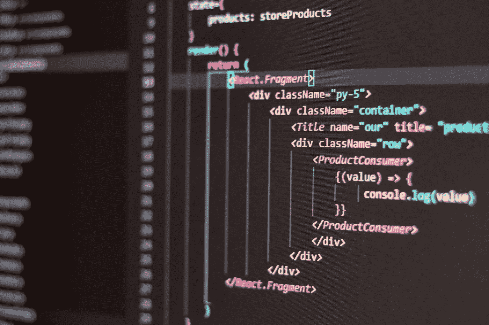

# 2022 年哪里学高级 React

> 原文：<https://javascript.plainenglish.io/where-to-learn-advanced-react-js-5fd494dbed6b?source=collection_archive---------4----------------------->

## 学习 React 的高级概念，让您的技能更上一层楼。

那里的大多数 **React** 资源仅仅是展示了如何构建小而琐碎的应用程序。虽然这样的项目对初学者来说可能是友好的，但是对于那些想要将他们的反应或前端开发技能提升到下一个水平的人来说，它们是没有帮助的。

实际上，构建一个生产级 **React 应用**需要应用几个**高级 React 概念**，这些概念在互联网上的许多教程中都没有讨论过。

然后，你可能想知道在哪里可以找到**有用的 React 学习资源**，这将帮助你成为一个更好、更自信的 **React 开发人员。**幸运的是，**官方** **React 网站**几乎包含了所有需要的内容。

这个 [*链接*](https://reactjs.org/docs/getting-started.html) 带你进入 **react 官方文档**的入门页面。入门页面上的信息由不同的部分组成，如**主要概念**、**高级指南**、 **API 参考**、**挂钩**、**测试**等。

如果您转到**高级指南**部分，您会发现一长串**反应**概念，其中每个概念都有很好的定义，并通过大量支持示例进行了详细讨论。

*   [无障碍](https://reactjs.org/docs/accessibility.html)
*   [代码分割](https://reactjs.org/docs/code-splitting.html)
*   [语境](https://reactjs.org/docs/context.html)
*   [误差边界](https://reactjs.org/docs/error-boundaries.html)
*   [转发参考文献](https://reactjs.org/docs/forwarding-refs.html)
*   [碎片](https://reactjs.org/docs/fragments.html)
*   [高阶组件](https://reactjs.org/docs/higher-order-components.html)
*   [与其他库集成](https://reactjs.org/docs/integrating-with-other-libraries.html)
*   [深入 JSX](https://reactjs.org/docs/jsx-in-depth.html)
*   [优化性能](https://reactjs.org/docs/optimizing-performance.html)
*   [传送门](https://reactjs.org/docs/portals.html)
*   [剖析器](https://reactjs.org/docs/profiler.html)
*   [无 ES6 反应](https://reactjs.org/docs/react-without-es6.html)
*   [没有 JSX 的反应](https://reactjs.org/docs/react-without-jsx.html)
*   [对账](https://reactjs.org/docs/reconciliation.html)
*   [参考文献和 DOM](https://reactjs.org/docs/refs-and-the-dom.html)
*   [渲染道具](https://reactjs.org/docs/render-props.html)
*   [静态类型检查](https://reactjs.org/docs/static-type-checking.html)
*   [严格模式](https://reactjs.org/docs/strict-mode.html)
*   [使用 PropTypes 进行类型检查](https://reactjs.org/docs/typechecking-with-proptypes.html)
*   [非受控组件](https://reactjs.org/docs/uncontrolled-components.html)
*   [网页组件](https://reactjs.org/docs/web-components.html)

与花几个小时在 Todo list 应用程序教程上相比，浏览上面的每一项都将是一种令人耳目一新的体验。你将能够学到很多起初对你来说似乎很陌生的概念。一个例子是**代码分割**部分，在这里你将有机会学习关于**捆绑**、**分割捆绑**和**延迟加载**的各种示例支持。

去看看吧。

也点击**关注**按钮从我这里获得更多类似的文章。

*更多内容请看*[***plain English . io***](https://plainenglish.io/)*。报名参加我们的* [***免费周报***](http://newsletter.plainenglish.io/) *。关注我们关于*[***Twitter***](https://twitter.com/inPlainEngHQ)*和*[***LinkedIn***](https://www.linkedin.com/company/inplainenglish/)*。加入我们的* [***社区不和谐***](https://discord.gg/GtDtUAvyhW) *。*